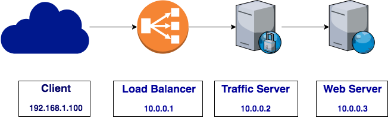

.. Licensed to the Apache Software Foundation (ASF) under one
   or more contributor license agreements.  See the NOTICE file
   distributed with this work for additional information
   regarding copyright ownership.  The ASF licenses this file
   to you under the Apache License, Version 2.0 (the
   "License"); you may not use this file except in compliance
   with the License.  You may obtain a copy of the License at

   http://www.apache.org/licenses/LICENSE-2.0

   Unless required by applicable law or agreed to in writing,
   software distributed under the License is distributed on an
   "AS IS" BASIS, WITHOUT WARRANTIES OR CONDITIONS OF ANY
   KIND, either express or implied.  See the License for the
   specific language governing permissions and limitations
   under the License.

.. include:: ../../common.defs

.. _proxy-protocol:

Proxy Protocol
****************

The `PROXY protocol <https://www.haproxy.com/blog/haproxy/proxy-protocol/>`_
provides a means of passing connection information between layers of the proxy
infrastructure.  Without the PROXY protocol, |TS| would only have connection
information from the previous hop connecting to |TS| and not the actual
originating client connection information.  This can be done over either HTTP or
TLS connections.

.. note::

    The current version only supports transforming client IP from PROXY Version 1
    header to the Forwarded: header.

In the current implementation, the client IP address in the PROXY protocol header
is passed to the origin server via an HTTP `Forwarded:
<https://tools.ietf.org/html/rfc7239>`_ header.

The Proxy Protocol must be enabled on each port.  See
:ts:cv:`proxy.config.http.server_ports` for information on how to enable the
Proxy Protocol on a port.  Once enabled, all incoming requests must be prefaced
with the PROXY v1 header.  Any request not preface by this header will be
dropped.

As a security measure, an optional whitelist of trusted IP addresses may be
configured with :ts:cv:`proxy.config.http.proxy_protocol_whitelist`.

   .. important::

       If the whitelist is configured, requests will only be accepted from these
       IP addressses and must be prefaced with the PROXY v1 header.

See :ts:cv:`proxy.config.http.insert_forwarded` for configuration information.
Detection of the PROXY protocol header is automatic.  If the PROXY header
precludes the request, it will automatically be parse and made available to the
Forwarded: request header sent to the origin server.

Example
-------

As an example, consider the following topology:

   PROXY protocol header flow

Without the PROXY protocol header, the client IP would only be reported
accurately to the Load Balancer.  |TS| would only see the connection from the
Load Balancer.  Similarly, the Web Server would only see the connection from
|TS|.  In the example above, if the client initiated a TLS connection, the Web
Server would see the connection originating from |TS| at ``10.0.0.2``:

.. code-block:: lua

    Forwarded: for=10.0.0.2;by=10.0.0.1;proto=https;host=test000001.com

If the Load Balancer has the Proxy Protocol enabled, requests sent through the
Load Balancer will be preceded with the PROXY header.  |TS| will detect the
PROXY header and transform that into the Forwarded: HTTP header if configured to
insert the Forwarded: header with the ``for`` paramter.  In the example above,
if the client initiated a TLS connection, the Web Server can use the Forwarded:
header to determine the TLS connection originated from the client at ``192.168.1.100``:

.. code-block:: lua

    Forwarded: for=192.168.2.100;by=10.0.0.2;proto=https;host=test000001.com

References
==========

-  `The PROXY protocol Versions 1 & 2
   <https://www.haproxy.org/download/1.8/doc/proxy-protocol.txt>`_

-  `Forwarded HTTP Extension
   <https://tools.ietf.org/html/rfc7239#page-6>`_
