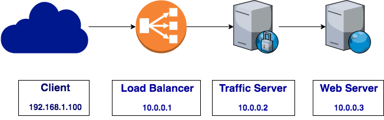

.. Licensed to the Apache Software Foundation (ASF) under one
   or more contributor license agreements.  See the NOTICE file
   distributed with this work for additional information
   regarding copyright ownership.  The ASF licenses this file
   to you under the Apache License, Version 2.0 (the
   "License"); you may not use this file except in compliance
   with the License.  You may obtain a copy of the License at

   http://www.apache.org/licenses/LICENSE-2.0

   Unless required by applicable law or agreed to in writing,
   software distributed under the License is distributed on an
   "AS IS" BASIS, WITHOUT WARRANTIES OR CONDITIONS OF ANY
   KIND, either express or implied.  See the License for the
   specific language governing permissions and limitations
   under the License.

.. include:: ../../common.defs

.. default-domain:: cpp

.. _proxy-protocol:

Proxy Protocol
****************

The `PROXY protocol <https://www.haproxy.com/blog/haproxy/proxy-protocol/>`_
provides a means of passing connection information between layers of the proxy
infrastructure.  Without the PROXY protocol, |TS| would only have connection
information from the previous hop connecting to |TS| and not the actual
originating client connection information.  This can be done over either HTTP or
TLS connections.

.. note::

    While |TS| supports receiving and processing TLV Version 2 formatted payloads,
    it does not support sending them.

The Proxy Protocol must be enabled on each port for which connections with the
Proxy Protocol header are expected.  See
:ts:cv:`proxy.config.http.server_ports` for information on how to enable the
Proxy Protocol on a port.  Once enabled, incoming requests may be prefaced with
either the PROXY v1 or v2 header. Any request not prefaced by this header will
be handled according to the other directives in the associated port
configuration.

As a security measure, an optional list of trusted IP addresses may be
configured with :ts:cv:`proxy.config.http.proxy_protocol_allowlist`.

   .. important::

       If the allowlist is configured, requests will only be accepted from these
       IP addresses for all ports designated for Proxy Protocol in the
       :ts:cv:`proxy.config.http.server_ports` configuration, regardless of whether
       the connections have the Proxy Protocol header.

By default, |TS| uses client's IP address that is from the peer when it applies ACL. If you configure a port to
enable PROXY protocol and want to apply ACL against the IP address delivered by PROXY protocol, you need to have ``PROXY`` in
:ts:cv:`proxy.config.acl.subjects`.

If you specify the server_ports flag `pp-clnt` then the client IP address used for the
transaction will be the one provided by proxy protocol.

The ``pp-clnt`` flag governs whether the operator-visible "client IP" is the
PROXY-Protocol source address rather than the immediate TCP peer for the
following surfaces:

* The squid log field ``%<chi>`` (and its derivatives ``%<chp>`` /
  ``%<chh>``).
* :func:`TSHttpTxnClientAddrGet`, :func:`TSHttpSsnClientAddrGet`, and
  :func:`TSNetVConnClientAddrGet` (the plugin-visible client address).
* SNI ACL evaluation, the HTTP/2 ``PEER`` ACL, SSL diagnostics, and
  client-certificate validation.
* Outbound transparency: when binding the proxy's outbound socket to the
  client's address (``addr_binding = FOREIGN_ADDR``), |TS| binds to the
  PROXY-Protocol source address only when ``pp-clnt`` is in effect.
* HostDB parent-selection affinity: the consistent-hash key that groups
  requests onto the same upstream peer is the PROXY-Protocol source only
  when ``pp-clnt`` is in effect; otherwise it is the immediate TCP peer.

The new log field ``%<rchi>`` (and its derivatives ``%<rchp>`` /
``%<rchh>``) always reports the immediate TCP peer regardless of
``pp-clnt``.

1. HTTP Forwarded Header

The client IP address in the PROXY protocol header is passed to the origin server via an HTTP `Forwarded:
<https://tools.ietf.org/html/rfc7239>`_ header. See :ts:cv:`proxy.config.http.insert_forwarded` for configuration information.
Detection of the PROXY protocol header is automatic.  If the PROXY header
precludes the request, it will automatically be parse and made available to the
Forwarded: request header sent to the origin server.

The legacy outbound headers ``Client-ip:``
(:ts:cv:`proxy.config.http.insert_client_ip`) and ``X-Forwarded-For:``
(:ts:cv:`proxy.config.http.insert_squid_x_forwarded_for`) likewise carry
the PROXY-Protocol source address whenever a PROXY-Protocol header is
present, mirroring the ``Forwarded: for=`` parameter. This behavior is
independent of the ``pp-clnt`` listener flag.

2. Outbound PROXY protocol

See :ts:cv:`proxy.config.http.proxy_protocol_out` for configuration information.

Example
-------

As an example, consider the following topology:

   PROXY protocol header flow

Without the PROXY protocol header, the client IP would only be reported
accurately to the Load Balancer.  |TS| would only see the connection from the
Load Balancer.  Similarly, the Web Server would only see the connection from
|TS|.  In the example above, if the client initiated a TLS connection, the Web
Server would see the connection originating from |TS| at ``10.0.0.2``:

.. code-block:: lua

    Forwarded: for=10.0.0.2;by=10.0.0.1;proto=https;host=test000001.com

If the Load Balancer has the Proxy Protocol enabled, requests sent through the
Load Balancer will be preceded with the PROXY header.  |TS| will detect the
PROXY header and transform that into the Forwarded: HTTP header if configured to
insert the Forwarded: header with the ``for`` parameter.  In the example above,
if the client initiated a TLS connection, the Web Server can use the Forwarded:
header to determine the TLS connection originated from the client at ``192.168.1.100``:

.. code-block:: lua

    Forwarded: for=192.168.2.100;by=10.0.0.2;proto=https;host=test000001.com

References
==========

-  `The PROXY protocol Versions 1 & 2
   <https://www.haproxy.org/download/1.8/doc/proxy-protocol.txt>`_

-  `Forwarded HTTP Extension
   <https://tools.ietf.org/html/rfc7239#page-6>`_
