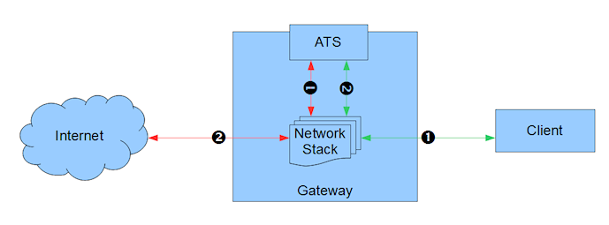

.. _transparent-proxy:

Transparent Proxying
********************

.. Licensed to the Apache Software Foundation (ASF) under one
   or more contributor license agreements.  See the NOTICE file
   distributed with this work for additional information
   regarding copyright ownership.  The ASF licenses this file
   to you under the Apache License, Version 2.0 (the
   "License"); you may not use this file except in compliance
   with the License.  You may obtain a copy of the License at

   http://www.apache.org/licenses/LICENSE-2.0

   Unless required by applicable law or agreed to in writing,
   software distributed under the License is distributed on an
   "AS IS" BASIS, WITHOUT WARRANTIES OR CONDITIONS OF ANY
   KIND, either express or implied.  See the License for the
   specific language governing permissions and limitations
   under the License.

.. toctree::
   :maxdepth: 2

   transparent-proxy/build.en
   transparent-proxy/bridge.en
   transparent-proxy/router-inline.en
   transparent-proxy/wccp-configuration.en
   transparent-proxy/wccp-service-config.en

Transparent Proxying is the ability of a proxy (such as ATS) to
intercept connections between clients and servers without being visible.

The general network structure that will be used in this documentation is
shown in the following figure.

   ATS basic traffic flow of Transparent Proxy

There must be a gateway device through which all network traffic passes
from the client to the Internet (or external cloud). The gateway is
responsible for effectively splicing ATS in to selected streams of that
traffic. Each traffic stream is split in two, with ATS terminating
both sides. That is, stream green-1, red-2, is split in to the green
connection and the red connection. Note that ATS may or may not be on
the gateway system, the redirected traffic can flow over other network
infrastructure.

Because ATS uses two connections, transparency can be set independently
on the client and origin server (Internet / external cloud) side. We
will define what is generally called "transparent proxy" as two aspects,
*inbound transparency* and *outbound transparency*.

Inbound transparency is a proxy that is transparent to connections that
are inbound to the proxy, i.e. a connection initiated by a client which
connects to the proxy (green-1). Similarly, outbound transparency is a
proxy that is transparent to connections that are outbound from the
proxy, i.e. a connection initiated by the proxy to an origin server
(red-2).

In most situations these two types of transparency are combined, but that is
not required. Traffic Server supports transparency independently on the two
sides. 

.. important::

    It is critical to note that any transparency requires specialized
    routing and cannot be done solely by configuring ATS. ATS transparency
    also requires support from the Linux kernel and therefore currently only
    works on sufficiently recent Linux kernels that support the following
    features:

    -  TPROXY
    -  POSIX capabilities

    In addition the specialized routing will require using ``iptables`` and
    in some cases ``ebtables``.

Standard build procedures should work for transparency support but if
not consult these :ref:`more detailed instructions <building-ats-for-transparency>`.

Transparency is configured per server port, not globally. This is done
via the configuration values :ts:cv:`proxy.config.http.server_ports`.
In addition, :ts:cv:`proxy.config.reverse_proxy.enabled` must be enabled if the
client side is transparent. That should be fixed in a future patch.

.. XXX has that been fixed?

.. XXX revisit section below

In the first case use the attribute character (replacing the default
'X')

**Attribute** **Transparency Style** **Reverse Proxy**

``=``
    Full transparency: either

``>``
    Inbound (client) transparency: enabled

``<``
    Outbound (origin server) transparency: either

In the outbound transparent case clients must connect directly to ATS
either through an explicit proxy mechanism or by advertising the IP
address of the ATS server via DNS as the origin server address.

Some tested scenarios --

-  :doc:`transparent-proxy/bridge.en`
-  :doc:`transparent-proxy/router-inline.en`
-  :doc:`transparent-proxy/wccp-configuration.en`

