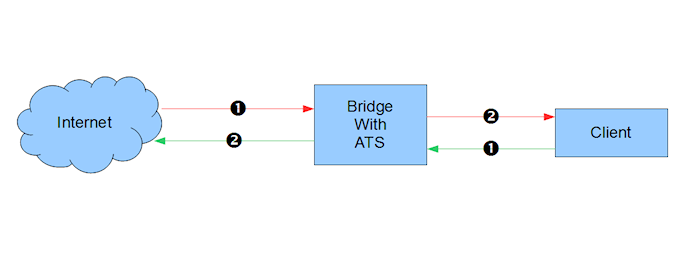

Inline on a Linux Bridge
************************

.. Licensed to the Apache Software Foundation (ASF) under one
   or more contributor license agreements.  See the NOTICE file
   distributed with this work for additional information
   regarding copyright ownership.  The ASF licenses this file
   to you under the Apache License, Version 2.0 (the
   "License"); you may not use this file except in compliance
   with the License.  You may obtain a copy of the License at

   http://www.apache.org/licenses/LICENSE-2.0

   Unless required by applicable law or agreed to in writing,
   software distributed under the License is distributed on an
   "AS IS" BASIS, WITHOUT WARRANTIES OR CONDITIONS OF ANY
   KIND, either express or implied.  See the License for the
   specific language governing permissions and limitations
   under the License.

A Linux can be configured to operate in `bridge mode <http://www.linuxfoundation.org/collaborate/workgroups/networking/bridge>`_.
Two or more physical interfaces are assigned to the bridge. A single IP
address is shared across the interfaces. By default any packet that
arrives on one interface is immediately routed out another bridge
interface.

Linux packages required:

-  bridge-utils
-  ebtables

In our example of setting up bridge mode we will use a local address of
192.168.1.11/24 and interfaces ``eth0`` and ``eth1`` as the bridge
interfaces (more detailed documentation is available
`here <http://www.tldp.org/HOWTO/BRIDGE-STP-HOWTO/preparing-the-bridge.html>`_).
You may omit the '#' character and everything after it. ::

   brctl addbr br0 # create bridge device
   brctl stp br0 off # Disable spanning tree protocol
   brctl addif br0 eth0 # Add eth0 to bridge
   brctl addif br0 eth1 # Add eth1 to bridge

   ifconfig eth0 0 0.0.0.0 # Get rid of interface IP addresses
   ifconfig eth1 0 0.0.0.0 # ditto # Set the bridge IP address and enable it
   ifconfig br0 192.168.1.11 netmask 255.255.255.0 up

If you have not already done so, remember to add a default route, such
as this one for a gateway of 192.168.1.1. ::

   ip route add default via 192.168.1.1

At this point it is a good idea to test connectivity to verify the basic
bridge is functional.

Once the bridge is verified to work, this is the basic traffic pattern
of interest.

   Picture of traffic flow through a bridge with ATS

The green arrows are packets originating from the client and the red
arrows are packets originating from the origin server. All traffic not
directed to the local address will pass through the bridge. We need to
break into some of the traffic and subject it to routing so that it can
be routed to ATS. This requires ``ebtables``. The flows we want to
intercept are green 1 (from client to bridge) and red 1 (origin server
to bridge).

In this example we will intercept port 80 (HTTP) traffic. We will use
the ``BROUTING`` chain because it is traversed only for packets that
originated externally and arrived on a (forwarding enabled) interface.
Although it looks like this will intercept all port 80 traffic it will
only affect the two flows described above. ``-j redirect`` marks the
packet as being diverted to the bridge and not forwarded, and the
``DROP`` target puts the packets in the normal ``iptables`` routing so
that we can use standard device tests on them [1]_. Although this
example handles only port 80, other ports are the same except for the
port value. Note also the port here is the port from the point of view
of the clients and origin servers, not the Traffic Server server port. ::

   ebtables -t broute -F # Flush the table
   # inbound traffic
   ebtables -t broute -A BROUTING -p IPv4 --ip-proto tcp --ip-dport 80 \
     -j redirect --redirect-target DROP
   # returning outbound traffic
   ebtables -t broute -A BROUTING -p IPv4 --ip-proto tcp --ip-sport 80 \
     -j redirect --redirect-target DROP

Traffic Server operates at layer 3 so we need to use ``iptables`` to
handle IP packets appropriately.::

   iptables -t mangle -A PREROUTING -i eth1 -p tcp -m tcp --dport 80 \
     -j TPROXY --on-ip 0.0.0.0 --on-port 8080 --tproxy-mark 1/1
   iptables -t mangle -A PREROUTING -i eth0 -p tcp -m tcp --sport 80 \
      -j MARK --set-mark 1/1

At this point the directionality of the interfaces matters. For the
example ``eth1`` is the inbound (client side) interface, while ``eth0``
is the outbound (origin server side) interface. We mark both flows of
packets so that we can use policy routing on them. For inbound packets
we need to use ``TPROXY`` to force acceptance of packets to foreign IP
addresses. For returning outbound packets there will be a socket open
bound to the foreign address, we need only force it to be delivered
locally. The value for ``--on-ip`` is 0 because the target port is
listening and not bound to a specific address. The value for
``--on-port`` must match the Traffic Server server port. Otherwise its
value is arbitrary. ``--dport`` and ``--sport`` specify the port from
the point of view of the clients and origin servers.

Once the flows are marked we can force them to be delivered locally via
the loopback interface via a policy routing table.::

   ip rule add fwmark 1/1 table 1
   ip route add local 0.0.0.0/0 dev lo table 1

The marking used is arbitrary but it must be consistent between
``iptables`` and the routing rule. The table number must be in the range
1..253.

To configure Traffic Server set the following values in
:file:`records.config`

- :ts:cv:`proxy.config.http.server_ports` *value from* ``--on-port`` (see below)

- :ts:cv:`proxy.config.reverse_proxy.enabled` ``1``

- :ts:cv:`proxy.config.url_remap.remap_required` ``0``

You may also need to set :ts:cv:`proxy.config.cluster.ethernet_interface` to
"br0" (the name of the bridge interface from the Bridge Commands).

Additional troubleshooting
~~~~~~~~~~~~~~~~~~~~~~~~~~

* Check to make sure that ``iptables`` is not filtering (blocking)
  incoming HTTP connections.

   It is frequently the case that the default tables prevent incoming HTTP. You can clear all filters with the
   commands::

      iptables -t filter --flush FORWARD
      iptables -t filter --flush INPUT

   That is a bit drastic and should only be used for testing / debugging. A
   live system will likely need some filters in place but that is beyond
   the scope of this document. If this fixes the problem, then your filter
   set is too restrictive.

   Note that this problem will prevent the basic bridge (without ATS) from
   allowing HTTP traffic through.

* Verify that IP packet forwarding is enabled.

   You can check this with::

      cat /proc/sys/net/ipv4/ip_forward

   The output should be a non-zero value (usually '1'). If it is zero, you
   can set it with::

      echo '1' > /proc/sys/net/ipv4/ip_forward

   This can setting can be persisted by putting it in ``/etc/sysctl.conf``: ::

      net/ipv4/ip_forward=1

.. rubric:: Footnotes

.. [1]
   The ``--redirect-target`` can be omitted, but then the ``iptables``
   rules would need to use ``--physdev`` instead of just ``-i``. The
   actual packet processing is identical.
