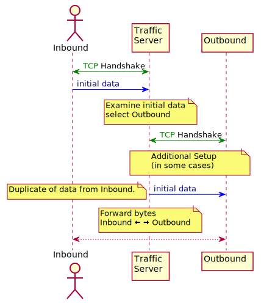
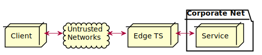
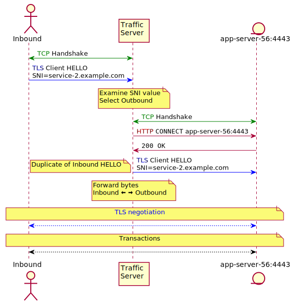

.. Licensed to the Apache Software Foundation (ASF) under one
   or more contributor license agreements.  See the NOTICE file
   distributed with this work for additional information
   regarding copyright ownership.  The ASF licenses this file
   to you under the Apache License, Version 2.0 (the
   "License"); you may not use this file except in compliance
   with the License.  You may obtain a copy of the License at

   http://www.apache.org/licenses/LICENSE-2.0

   Unless required by applicable law or agreed to in writing,
   software distributed under the License is distributed on an
   "AS IS" BASIS, WITHOUT WARRANTIES OR CONDITIONS OF ANY
   KIND, either express or implied.  See the License for the
   specific language governing permissions and limitations
   under the License.

.. include:: ../common.defs
.. default-domain:: c
.. _layer-4-routing:

Layer 4 Routing
**************************

|TS| supports a limited set of layer 4 routing options. In such use |TS| acts effectively as a
router, moving network data between two endpoints without modifying the data. The routing is
accomplished by examining the initial data from the inbound connection to decide the outbound
destination. The initial data is then sent to the destination and subsequently |TS| forwards all
data read on one connection to the other and vice versa.

In this way it acts similarly to `nc <https://linux.die.net/man/1/nc>`__.

The primary differences between different types of layer 4 routing is the mechanism by which |TS|
creates the outbound connection. This is described in detail in the type specific documentation.

Transparency
============

Transparency is in some sense layer 4 routing because the outbound connection is determined by
examining the destination address in the client TCP packets. This is discussed in detail
:ref:`elsewhere <transparent-proxy>`.

.. _sni-routing:

SNI Routing
===========

Currently the only directly supported layer 4 routing (as of version 8.0) is SNI based routing. This
imposes the requirement on the traffic that the inbound connection must be TLS.

SNI routing is configured by :file:`sni.yaml`.

If SNI Routing is enabled the initial "`CLIENT HELLO
<https://tools.ietf.org/html/rfc5246#section-7.4.1.2>`__" data of an inbound TLS connection is
examined to extract the "`SNI <https://tools.ietf.org/html/rfc3546#section-3.1>`__" value. This is
matched against the configuration data to select an action for the inbound connection. In this case
the option of interest is ``tunnel_route``. If this is set then |TS| synthesizes an HTTP ``CONNECT``
request to itself with the ``tunnel_route`` host and port as the upstream. That is, the inbound
connection is treated as if the user agent had sent a
``CONNECT`` to the upstream and forwards the "`CLIENT HELLO
<https://tools.ietf.org/html/rfc5246#section-7.4.1.2>`__" to it. In addition to the method appearing
as ``CONNECT``, be aware that logs printing the URL via the ``<%pquc>`` field format will show the
scheme in the URL as ``tunnel``. The scheme as printed via ``<%pqus>``, however, will show the
scheme used in the original client request.

Example
-------

Consider a Content Delivery Network (CDN) that has an edge layer of externally facing |TS|
instances. The goal is to enable external clients to connect to internal services and do their own
client certificate verification, possibly because distribution of private keys to the edge |TS|
instances is too difficult or too risky. To achieve this, the edge |TS| instances can be configured
to route inbound TLS connections with specific SNI values directly to the internal services without
TLS termination on the edge. This enables the edge to provide controlled external access to the
internal services without each internal service having to stand up its own edge. Note the services
do not require global routable addresses as long as the edge |TS| instances can route to the
services.

The basic set up is therefore

   A Client connects to an edge |TS| which forwards the connection to the internal Service.
   The Client then negotiates TLS with the Service.

For the example, let us define two services inside the corporate network of Example, Inc.
``service-1`` and ``service-2``. ``service-1`` is on port 443 on host ``app-server-29`` while
``service-2`` is on port 4443 on host ``app-server-56``. The SNI routing set up for this would be

========================== =====================================
SNI value                  Destination
========================== =====================================
service-1.example.com      app-server-29:443
service-2.example.com      app-server-56:4443
========================== =====================================

The :file:`sni.yaml` contents would be

.. code:: yaml

   sni:
   - tunnel_route: app-server-29:443
     fqdn: service-1.example.com

   - tunnel_route: app-server-56:4443
     fqdn: service-2.example.com

In addition to this, in the :file:`records.yaml` file, edit ``connect_ports`` like so:

   -  :ts:cv:`proxy.config.http.connect_ports`: ``443 4443`` to allow |TS| to connect
      to the destination port

The sequence of network activity for a Client connecting to ``service-2`` is

Note the destination for the outbound TCP connection and the HTTP ``CONNECT`` is the same. If this
is a problem (which it will be in general) a plugin is needed to change the URL in the ``CONNECT``.
In this case the proxy request is available in the :c:macro:`TS_HTTP_TXN_START_HOOK` hook. This
cannot be done using remap because for a ``CONNECT`` there is no remap phase. Note that for a
tunneled connection like this, the only transaction hooks that will be triggered are
:c:macro:`TS_HTTP_TXN_START_HOOK` and :c:macro:`TS_HTTP_TXN_CLOSE_HOOK`. In addition, because |TS|
does not terminate (and therefore does not decrypt) the connection, it cannot be cached or served from
cache.

.. _pre-warming-tls-tunnel:

Pre-warming TLS Tunnel
======================

Pre-warming TLS Tunnel reduces the latency of TLS connections (``forward_route`` and ``partial_blind_route`` type SNI
Routing). When this feature is enabled, each ET_NET thread makes TLS connections pool per routing type, SNI, and ALPN.

.. figure:: ../uml/images/l4-pre-warming-overview.svg
   :align: center

Stats for connection pools are registered dynamically on start up. Details in :ref:`pre-warming-tls-tunnel-stats`.

Examples
--------

.. code:: yaml

   sni:
   - fqdn: foo.com
     http2: off
     partial_blind_route: bar.com
     client_sni_policy: server_name
     tunnel_prewarm: true
     tunnel_prewarm_connect_timeout: 10
     tunnel_prewarm_inactive_timeout: 150
     tunnel_prewarm_max: 100
     tunnel_prewarm_min: 10
     tunnel_alpn:
       - h2

.. code::

  proxy.process.tunnel.prewarm.bar.com:443.tls.current_init 0
  proxy.process.tunnel.prewarm.bar.com:443.tls.current_open 10
  proxy.process.tunnel.prewarm.bar.com:443.tls.total_hit 0
  proxy.process.tunnel.prewarm.bar.com:443.tls.total_miss 0
  proxy.process.tunnel.prewarm.bar.com:443.tls.total_handshake_time 1106250000
  proxy.process.tunnel.prewarm.bar.com:443.tls.total_handshake_count 10
  proxy.process.tunnel.prewarm.bar.com:443.tls.total_retry 0
  proxy.process.tunnel.prewarm.bar.com:443.tls.http2.current_init 0
  proxy.process.tunnel.prewarm.bar.com:443.tls.http2.current_open 10
  proxy.process.tunnel.prewarm.bar.com:443.tls.http2.total_hit 0
  proxy.process.tunnel.prewarm.bar.com:443.tls.http2.total_miss 0
  proxy.process.tunnel.prewarm.bar.com:443.tls.http2.total_handshake_time 1142368000
  proxy.process.tunnel.prewarm.bar.com:443.tls.http2.total_handshake_count 10
  proxy.process.tunnel.prewarm.bar.com:443.tls.http2.total_retry 0
