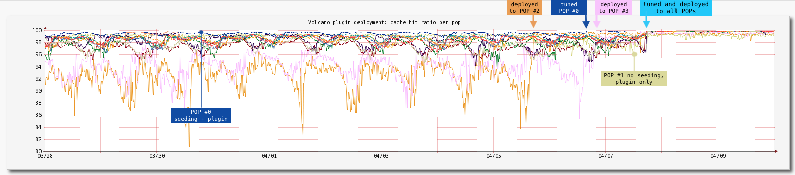

.. Licensed to the Apache Software Foundation (ASF) under one
   or more contributor license agreements.  See the NOTICE file
   distributed with this work for additional information
   regarding copyright ownership.  The ASF licenses this file
   to you under the Apache License, Version 2.0 (the
   "License"); you may not use this file except in compliance
   with the License.  You may obtain a copy of the License at

      http://www.apache.org/licenses/LICENSE-2.0

   Unless required by applicable law or agreed to in writing,
   software distributed under the License is distributed on an
   "AS IS" BASIS, WITHOUT WARRANTIES OR CONDITIONS OF ANY
   KIND, either express or implied.  See the License for the
   specific language governing permissions and limitations
   under the License.

.. include:: ../../common.defs

.. _admin-plugins-prefetch:

Prefetch Plugin
***************

Description
===========

The purpose of the plugin is to increase the cache-hit ratio for a sequence of
objects which URL paths follow a common pattern.

On every **incoming** URL request, the plugin can decide to pre-fetch the
**next object** or more objects based on the common URL path pattern and a
pre-defined pre-fetch policy.

Currently, most HLS video urls follow a predictable pattern, with most URLs
containing a segment number. Since the segments are ~10s of content, the normal
usage pattern is to fetch the incremental segment every few seconds. The CDN
has its best chance of delivering a good user experience if the requests are
served from cache. Since we can predict the **next object** fetched, we should be
able to dramatically increase the chance of it being a cache hit.

This is primarily useful for:

* less popular content. Popular movies' segments are constantly being refreshed
  in cache by user requests. Less popular content is less likely to be in cache.
* device failures. There can be a significant time gap between a seeding request
  and the user request. During this time, devices can fail, which cause cache
  misses. The time gap between the plugin's request and the user's request can be
  used to smooth over the failures.

Why do this? Isn't seeding sufficient?
--------------------------------------

In practice the cache hit rate for the user facing HLS video content is never perfect 100%.
This plugin should increase the cache hit rate.

* The caches will eventually wrap. The unpopular content/tiers will be evicted,
  and not repopulated.
* Disks fail. Content on these disk will become cache misses at least at that layer.
* Machines fail.
    * Content seeded on those machines will become misses
    * Content seeded while a machine is down will be seeded to the "wrong" machine
* Bugs.
    * The content is usually managed by another organization which could have
        * issues determining all the content (especially international)
        * issues getting every asset on the storage service (i.e. AWS S3)
        * issues sending us the assets in time
    * ATS has had 5xx errors preventing seeding of assets
* The process of seeding sometimes wastes significantly more resources then the normal usage.

How well it works
-----------------

The Prefetch plugin was initially designed to assist the seeding performed by a separate subsystem / process which suffered the problems mentioned above.

The initial Prefetch plugin deployment graph below shows the per-POP cache-hit-ratio before and after its full deployment.
It is worth mentioning that a small percentage of the requests did not follow a predictable pattern and were not handled by the plugin.

   Prefetch plugin initial deployment.

* All POPs were seeded periodically except for POP #1 and the plugin was deployed in the following order: POP #0, #1, #2, #3 and then to the rest at once.
* POP #0 was the first plugin deployment and was used to tune its configuration for better results.
* POP #1 was a "testing ground" for the “worst case” (no seeding at all, imperfect conditions like low traffic and poorer connectivity to origin) and relying only on the Prefetch plugin.
* POP #2 and POP #3 experienced seeding problems (at times it reached ~60%, not shown here).

How does it work?
-----------------

The primary use-case for the plugin is to work in a multi-tier (child-parent)
environment where a consistent hashing of the URI is used to choose the next
tier parent but a single-tier use case is also supported (should work w/o
any code changes).

When a request comes to the child (only), the url is checked in an LRU. If the
object exists in the LRU, we assume that we've pre-fetched the following object
recently, and thus do not need to take any further action. If, however, the
object is **not** found, we proceed with prefetching.

The plugin calculates the URI of the next segment, ATS performs the consistent
hash calculation on it to find the appropriate parent, and sends that parent
a request for it, including a special header. When the parent receives the
request, it will either find it in cache or begin the fetch from its next tier.
Since the request from the child has the special header, the parent will only
send the headers of the object back to the client, saving network and processing
bytes. The child thus does not cache the pre-fetched object which is ok since
the user may not hit that same child for the subsquent object.

Then, when the user makes their next request for the pre-fetched object, the
child that handles the request will perform the consistent-hash, find the
same parent that got the pre-fetch request, and be served from its cache.

Usage
-----

* Dual-tiered usage - the plugin runs in 2 modes (2 instances)
    * the **front-tier** instance decides if the "next" object needs prefetching
      based on the pre-fetch policy and only sends a signal to the **back-tier**
    * the **back-tier** instance responds quickly w/o returning any objects to
      the **front-tier** and actually performs the background fetch.
* Single-tier usage - the plugin runs on the first user facing tier.

How the "next" object path is calculated
----------------------------------------

* The cache key of an incoming URL is checked against the fetching policy defined by ``--fetch-policy``.
* If the **next object** is to be pre-fetched the ``--fetch-path-pattern=/regex/capture/`` is used to transform the **incoming** URL path into the **next**
* The number of prefetched objects is specified by ``—fetch-count``
* The hostname of the prefetch request can be replaced by using ``--replace-host``

Let say we have the following setup ::

  map http://example.com http://origin.com \
      @plugin=cachekey.so @pparam=--remove-all-params=true \
      @plugin=prefetch.so \
          @pparam=--fetch-policy=simple \
          @pparam=--fetch-path-pattern=/(.*-)(\d+)(.*)/$1{$2+2}$3/ \
          @pparam=--fetch-count=3 \
          @pparam=--replace-host=example-seed.com

If the "incoming" URL is ::

  http://example.com/path/file-104.mov?a=a&b=b

the the following URLs will be requested to be prefetched ::

  http://example-seed.com/path/file-106.mov?a=a&b=b
  http://example-seed.com/path/file-108.mov?a=a&b=b
  http://example-seed.com/path/file-110.mov?a=a&b=b

Note ``--fetch-path-pattern`` is a PCRE regex/capture pattern and
``{$2+2}`` is a mechanism to calculate the next path by adding or
subtracting integer numbers.

Overhead from **next object** prefetch
--------------------------------------

Consuming extra resources
^^^^^^^^^^^^^^^^^^^^^^^^^

The plugin uses more CDN resources to improve the user experience. The plugin
attempts to minimize the extraneous resources used.

* The prefetch policy (LRU) attempts to minimize the URLs fetched. The popular video segments
  (which represent the majority of the requests) will quickly populate the LRU,
  preventing their pre-fetching.
* If the original request is for the last segment in the video, the plugin will
  make our system have a frivolous request to origin for the next non-existent
  segment.
* If the user stops watching the video, the plugin may (if not popular) make a
  request for a single segment that goes un-requested.

Minimizing **next object** prefetch overhead
^^^^^^^^^^^^^^^^^^^^^^^^^^^^^^^^^^^^^^^^^^^^

The current implementation relies on the following assumptions and egnineering
compromises:

* **First match the next object pattern** defined by ``--fetch-path-pattern``
  plugin parameter, not matching requests are ignored (prefetch is never triggered)
* **Define a prefetch policy** which tries to suppress uneccessary **next object**
  prefetches for the most recently used requests which are assumed should be already
  in cache. Currently only ``lru:n`` policy is supported, it is using an URI-hash LRU
  cache which evicts the least recently used elements first. Every request's **cache key**
  is checked against it and if found the **next object** prefetch is skipped/cancelled.
  (**side note**: the ``lru:n`` **is not** the same as cache_promote plugin `lru`,
  the latter is rather a frequency divider for the most recently used URIs).
* **Always use request's cache key** instead of request's URI and also **remove
  the query parameters** from the key which guarantees that multiple different
  requests which would result in using the same **cache key** are not considered as
  separate requests (which could bloat/dilute the LRU cache
  if not normalized)
* **Check if the the fetch request is unique**. A ``simple`` prefetching policy is
  always used to make sure prefetches for the same object (same cache key) are
  never triggered simultaneously.
* **Check if already cached**. Before triggering the prefetch request to the
  next tier it is always checked if the **incoming** object is already cached,
  assuming that if already cached there is a good change the **next
  object** would be cached as well.
* **Don't fetch the response body** and **never cache** at the **front-tier**.
  The **front-tier** marks the prefetch request with a special API header defined
  by ``--api-header`` plugin parameter. When recieved the  **back-tier** responds
  right away before actually fetching the object (without a body), it just
  schedules the real prefetch at the **back-tier**. ``Cache-Control: no-store``
  is used to make sure the prefetch request response is never cached at the **front-tier**.
  In such a way resources are saved (time, memory, CPU, bandwidth, etc) and also
  unnecessary caching at the **front-tier** is avoided (where currently cache_promote
  plugin is already being used to alleviate the load on the disks).
* **Throttle the prefetch activity** - if necessary a limit can by imposed on the
  number of concurrent prefetch requests by using ``--fetch-max`` plugin parameter.

Plugin parameters
=================

* ``--front``
  - ``true`` - configures the plugin run on the **front-tier**,
  - ``false`` - to be run on the **back-tier**.
* ``--api-header`` - the header used by the plugin internally, also used to mark a prefetch request to the next tier in dual-tier usage.
* ``--fetch-policy`` - fetch policy
  - ``simple`` - this policy just makes sure there are no same concurrent prefetches triggered (default and always used in combination with any other policy)
  - ``lru:n`` - this policy uses LRU to identify “hot” objects and triggers prefetch if the object is not found. `n` is the size of the LRU
* ``--fetch-count`` - how many objects to be prefetched.
* ``--fetch-path-pattern`` - regex/capture pattern that would transform the **incoming** into the **next object** path.
* ``--fetch-max`` - maximum concurrent fetches allowed, this would allow to throttle the prefetch activity if necessary
* ``--replace-host`` - allows the prefetch requests to be forwarded to a different host or remap rule (replaces the host in the prefetch request)
* ``--name-space`` - by default all plugin instances used for all remap use a single background fetch state, this parameter allows to specify a separate state per remap rule of per group of remap rules.
* ``--metrics-prefix`` - prefix for the metrics generated by the plugin.
* ``--exact-match``
    * if ``false`` (default) the fetch policy would use the **incoming** URL's cache key to find out if the **next object** should be prefetched or not,
    * if ``true`` the fetch policy would use the **next** URL's cache key that to find out if the **next object** should be prefetched or not
* ``--log-name`` - specifies a custom log name (if not specified a log is not created)

Metrics
=======

The plugin maintains the following metrics:

* Prefetch request status related
    * ``fetch.active`` - number of currently active prefetch requests (counter)
    * ``fetch.completed``- number of succesfully completed prefetch requests (counter)
    * ``fetch.errors`` - number of failed prefetch requests (counter)
    * ``fetch.timeouts`` - number of timed-out prefetch requests (counter)
    * ``fetch.throttled`` - number of throttled prefetch requests (counter), throttle limit defined by ``--fetch-max``
    * ``fetch.total``- total number of prefetch requests (counter).
* Fetch policy related:
    * all **incoming** request URIs are first matched against the next object pattern defined in ``--fetch-path-pattern``
        * ``fetch.match.yes`` - number of requests matched the pattern (counter), eligible for triggering prefetch request
        * ``fetch.match.no`` - number of requests not matching the pattern (counter), ignored by the plugin, will never trigger prefetch request
    * prefetch policy related (i.e. ``--fetch-policy=lru:n``)
        * ``fetch.policy.yes`` - number of times (counter) the policy allowed scheduling of the prefetch request (for ``lru:n`` policy cachekey **was not** found in the LRU)
        * ``fetch.policy.no`` - number of times (counter) the policy disallowed scheduling of the prefetch request (for ``lru:n`` policy cachekey **was** found in the LRU)
        * ``fetch.policy.maxsize`` - size of the prefetch policy (gauge, i.e for ``lru:n`` policy the max size is ``n``)
        * ``fetch.policy.size`` - current size of the prefetch policy (gauge, i.e for ``lru:n`` policy the max size is a number <= ``n``)
    * before sending any new prefetch request plugin makes sure the object is not currently being prefetched (unique).
        * ``fetch.unique.yes`` - number of unique requests (counter), for which there are no current prefetch requests for the same object (cache key is used for this check).
        * ``fetch.unique.no`` - number of not unique request (counter), for which there is currently prefetch running for the same object (cache key is used for this check).
    * before sending any new prefetch request plugin makes sure the object is not already cached.
        * ``fetch.already_cached`` - number of prefetch requests not sent (cancelled) because the object was already in cache (likely no prefetch needed)

The exact metric name is defined by the following plugin parameters:

* ``—metrics-prefix=<sample-prefix>``
* ``—name-space=<sample-name-space>``

For instance the final ``fetch.active`` metric will be called ``<sample-prefix>.<sample-name-space>.fetch.active``
