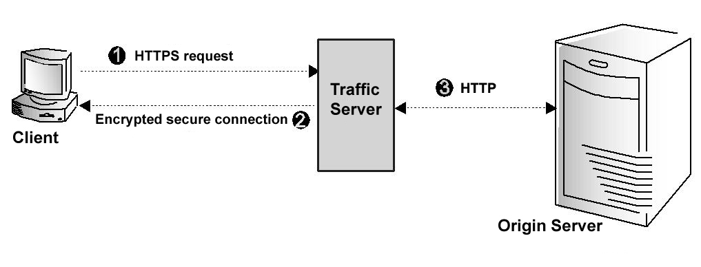

.. Licensed to the Apache Software Foundation (ASF) under one
   or more contributor license agreements.  See the NOTICE file
   distributed with this work for additional information
   regarding copyright ownership.  The ASF licenses this file
   to you under the Apache License, Version 2.0 (the
   "License"); you may not use this file except in compliance
   with the License.  You may obtain a copy of the License at

   http://www.apache.org/licenses/LICENSE-2.0

   Unless required by applicable law or agreed to in writing,
   software distributed under the License is distributed on an
   "AS IS" BASIS, WITHOUT WARRANTIES OR CONDITIONS OF ANY
   KIND, either express or implied.  See the License for the
   specific language governing permissions and limitations
   under the License.

.. include:: ../../common.defs

.. _admin-security:

Security
********

.. toctree::
   :maxdepth: 2

.. _admin-controlling-access:

Controlling Access
==================

Traffic Server can be configured to allow only certain clients to use
the proxy cache.

#. Add a line to :file:`ip_allow.yaml` for each IP address or
   range of IP addresses allowed to access Traffic Server.

#. Run the command :option:`traffic_ctl config reload` to apply the configuration
   changes.

.. _admin-ssl-termination:

SSL Termination
===============

The Traffic Server *SSL termination* option enables you to secure
connections in reverse proxy mode between a client and a Traffic Server
and/or Traffic Server and an origin server.

The following sections describe how to enable and configure the SSL
termination option.

-  Enable and configure SSL termination for client/Traffic Server
   connections: :ref:`client-and-traffic-server-connections`

-  Enable and configure SSL termination for Traffic Server/origin server
   connections: :ref:`traffic-server-and-origin-server-connections`

.. _client-and-traffic-server-connections:

Client and Traffic Server Connections
-------------------------------------

.. XXX sanity check/second opinions on example paths used for certs/keys below

The figure below illustrates communication between a client and Traffic
Server (and between Traffic Server and an origin server) when the SSL
termination option is enabled and configured for Client/Traffic
Server connections only.

   Client and Traffic Server communication using SSL termination

.. Manual list numbering below corresponds to figure markings above.

The figure above depicts the following:

#. The client sends an HTTPS request for content. Traffic Server receives the
   request and performs the SSL handshake to authenticate the client (depending
   on the authentication options configured) and determine the encryption
   method that will be used. If the client is allowed access, then Traffic
   Server checks its cache for the requested content.

#. If the request is a cache hit and the content is fresh, then Traffic Server
   encrypts the content and sends it to the client. The client decrypts the
   content (using the method determined during the handshake) and displays it.

#. If the request is a cache miss or cached content is stale, then Traffic
   Server communicates with the origin server via HTTP and obtains a plain text
   version of the content. Traffic Server saves the plain text version of the
   content in its cache, encrypts the content, and sends it to the client. The
   client decrypts and displays the content.

To configure Traffic Server to use the SSL termination option for
Client/Traffic Server connections, you must do the following:

#. Obtain and install an SSL server certificate from a recognized
   certificate authority. The SSL server certificate contains
   information that enables the client to authenticate Traffic Server
   and exchange encryption keys.

#. Set the port number used for SSL communication using
   :ts:cv:`proxy.config.http.server_ports` in :file:`records.config`.

#. Set the appropriate base path for your SSL certificates and private keys
   in :file:`records.config`. ::

        CONFIG proxy.config.ssl.server.cert.path STRING /opt/ts/etc/ssl/certs/
        CONFIG proxy.config.ssl.server.private_key.path STRING /opt/ts/etc/ssl/keys/

#. Add an entry to :file:`ssl_multicert.config` for each certificate and key
   which your Traffic Server system will be using to terminate SSL connections
   with clients. ::

        dest_ip=1.2.3.4 ssl_cert_name=example.com.pem
        dest_ip=* ssl_cert_name=default.pem

#. *Optional*: Configure the use of client certificates using the variable
   :ts:cv:`proxy.config.ssl.client.certification_level` in :file:`records.config`.
   If you configure Traffic Server to require client certificates, then Traffic
   Server verifies the client certificate during the SSL handshake that
   authenticates the client. If you configure Traffic Server to not require
   client certificates, or if you configure certificates to be optional and the
   connecting client does not present one, then access to Traffic Server is
   managed through other Traffic Server options that have been set (such as
   rules in :file:`ip_allow.yaml`). ::

        CONFIG proxy.config.ssl.client.certification_level INT 0

   This variable permits one of the following values to be set:

   ===== =======================================================================
   Value Description
   ===== =======================================================================
   ``0`` Client certificates not required.
   ``1`` Client certificates optional. If present, will be used to validate.
   ``2`` Client certificates required, and must validate based on configured CAs.
   ===== =======================================================================

#. *Optional*: Configure the use of Certification Authorities (CAs). CAs add
   security by verifying the identity of the person requesting a certificate.
   The list of acceptable CA signers is configured with
   :ts:cv:`proxy.config.ssl.CA.cert.path` in :file:`records.config`. ::

        CONFIG proxy.config.ssl.CA.cert.path STRING /opt/CA/certs/private-ca.pem

#. Run the command :option:`traffic_ctl server restart` to restart Traffic Server.

.. _traffic-server-and-origin-server-connections:

Traffic Server and Origin Server Connections
--------------------------------------------

.. XXX sanity check/second opinions on example paths used for certs/keys below

The figure below illustrates communication between Traffic Server and an
origin server when the SSL termination option is enabled for Traffic
Server/origin server connections.

.. figure:: ../../static/images/admin/ssl_os.jpg
   :align: center
   :alt: Traffic Server and origin server communication using SSL termination

   Traffic Server and origin server communication using SSL termination

.. Manual list numbering below corresponds to figure markings above.

The figure above depicts the following:

#. If a client request is a cache miss or is stale, then Traffic Server sends
   an HTTPS request for the content to the origin server. The origin server
   receives the request and performs the SSL handshake to authenticate Traffic
   Server and determine the encryption method to be used.

#. If Traffic Server is allowed access, then the origin server encrypts the
   content and sends it to Traffic Server, where it is decrypted (using the
   method determined during the handshake). A plain text version of the content
   is saved in the cache, if Traffic Server deems the content cacheable.

#. If SSL termination is enabled for Client/Traffic Server connections, then
   Traffic Server re-encrypts the content and sends it to the client via HTTPS,
   where it is decrypted and displayed. If SSL termination is not enabled for
   Client/Traffic Server connections, then Traffic Server sends the plain text
   version of the content to the client via HTTP.

To configure Traffic Server to use the SSL termination option for Traffic Server
and origin server connections, you must do the following:

#. Ensure first that your origin server responds properly to SSL requests, and
   configure it for client certificate validation if you intend to use that as
   part of your access control scheme.

   Refer to your origin server's documentation for details. If your origin
   server is another Traffic Server system, then you may follow the steps
   outlined in `Client and Traffic Server Connections`_ for configuring the
   origin server to validate client certificates.

#. *Optional*: Obtain and install an SSL client certificate from a recognized
   certificate authority, if your origin server requires client certificate
   validation for access control. Your client certificate must be signed by a
   Certificate Authority recognized by your origin server.

   If you are using a client certificate, you must add its location to
   :file:`records.config` in the setting :ts:cv:`proxy.config.ssl.client.cert.path`
   and :ts:cv:`proxy.config.ssl.client.cert.filename`. ::

        CONFIG proxy.config.ssl.client.cert.path STRING /opt/ts/etc/ssl/certs/
        CONFIG proxy.config.ssl.client.cert.filename STRING client.pem

   You must also provide the paths to the private key for this certificate,
   unless the key is contained within the same file as the certificate, using
   :ts:cv:`proxy.config.ssl.client.private_key.path` and
   :ts:cv:`proxy.config.ssl.client.private_key.filename`. ::

        CONFIG proxy.config.ssl.client.private_key.path STRING /opt/ts/etc/ssl/keys/
        CONFIG proxy.config.ssl.client.private_key.filename STRING client.pem

#. Enable or disable, per your security policy, server SSL certificate
   verification using :ts:cv:`proxy.config.ssl.client.verify.server.policy` in
   :file:`records.config`. ::

        CONFIG proxy.config.ssl.client.verify.server.policy STRING ENFORCED

#. Add the collection of authorized Certificate Authorities to the Traffic
   Server configuration in :file:`records.config` using the settings
   :ts:cv:`proxy.config.ssl.client.CA.cert.path` and
   :ts:cv:`proxy.config.ssl.client.CA.cert.filename`. ::

        CONFIG proxy.config.ssl.client.CA.cert.path STRING /opt/ts/etc/ssl/certs/
        CONFIG proxy.config.ssl.client.CA.cert.filename STRING CAs.pem

#. Run the command :option:`traffic_ctl server restart` to restart Traffic Server.

.. _admin-rotating-tls-session-ticket-keys:

Rotating TLS Session Ticket Keys
================================

TLS sessions can be resumed through session tickets which are encrypted with
a session ticket key and stored on clients. For better security, the ticket keys
can be rotated periodically, say, every 24 hours. The ticket keys are stored in
a ticket key file as a reverse queue in 48-byte chunks.

#. Generate a new ticket key and push it to the beginning of the ticket key file.

#. *Optional*: Delete the last ticket key from the ticket key file.

#. Touch :file:`ssl_multicert.config` to indicate that the SSL configuration is stale.

#. Run the command :option:`traffic_ctl config reload` to apply the new ticket key.

.. _admin-ocsp-stapling:

OCSP Stapling
=============

OCSP Stapling is an alternative approach to checking the revocation
status of an SSL certificate using the Online Certificate Status
Protocol.

Under the original OCSP implementation, clients requested a
certificate's revocation status directly from the Certificate
Authority (CA) that issued the certificate.  This could cause
significant load on the CA servers since they were required to
provide a response to every client of a given certificate in real
time.

Enabling OCSP Stapling instructs Traffic Server to retrieve and cache the
revocation status of all configured SSL certificates, and present them to the
client when the client requests the status.  Traffic Server will automatically
query the OCSP responder specified in the SSL certificate to gather the latest
revocation status.  Traffic Server will then cache the results for each
configured certificate.  The location of the OCSP responder is taken from the
Authority Information Access field of the signed certificate. For example::

    Authority Information Access:
                OCSP - URI:http://ocsp.digicert.com
                CA Issuers - URI:http://cacerts.digicert.com/DigiCertSHA2SecureServerCA.crt

Traffic Server can also use prefetched OCSP stapling responses if ssl_ocsp_name parameter
is used in :file:`ssl_multicert.config`. Take into account that when using prefetched
OCSP stapling responses traffic server will not refresh them and it should be done
externally. This can be done using openssl::

    $ openssl ocsp -issuer ca.crt -cert cert.crt -host ocsp.digicert.com:80 \
    -header "Host=ocsp.digicert.com" -respout /var/cache/ocsp/cert.ocsp

Support for OCSP Stapling can be tested using the -status option of the OpenSSL client::

    $ openssl s_client -connect mozillalabs.com:443 -status
    ...
    ======================================
    OCSP Response Data:
        OCSP Response Status: successful (0x0)
        Response Type: Basic OCSP Response
        Version: 1 (0x0)
    ...

Details of the OCSP Stapling TLS extension can be found in :rfc:`6961`.

To configure Traffic Server to use OCSP Stapling, edit the following variables
in :file:`records.config` file:

* :ts:cv:`proxy.config.ssl.ocsp.enabled`
* :ts:cv:`proxy.config.ssl.ocsp.cache_timeout`
* :ts:cv:`proxy.config.ssl.ocsp.request_timeout`
* :ts:cv:`proxy.config.ssl.ocsp.update_period`
* :ts:cv:`proxy.config.ssl.ocsp.response.path`

.. _admin-split-dns:

Split DNS
=========

The *Split DNS* option enables you to configure Traffic Server to use
multiple DNS servers, as dictated by your security requirements. For
example, you might configure Traffic Server to use one set of DNS
servers to resolve hostnames on your internal network, while allowing
DNS servers outside the firewall to resolve hosts on the Internet. This
maintains the security of your intranet, while continuing to provide
direct access to sites outside your organization.

To configure Split DNS:

#. Specify the rules for performing DNS server selection based on the
   destination domain, the destination host, or a URL regular expression.
   These rules are located in :file:`splitdns.config`.

#. Enable the *Split DNS* option by adjusting :ts:cv:`proxy.config.dns.splitDNS.enabled`
   in :file:`records.config`. ::

        CONFIG proxy.config.dns.splitDNS.enabled INT 1

#. Run the command :option:`traffic_ctl config reload` to apply the configuration changes.

