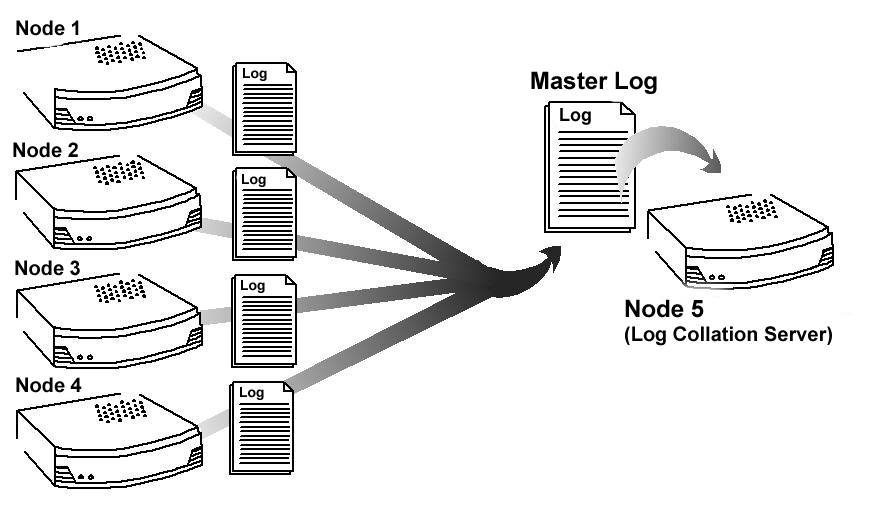
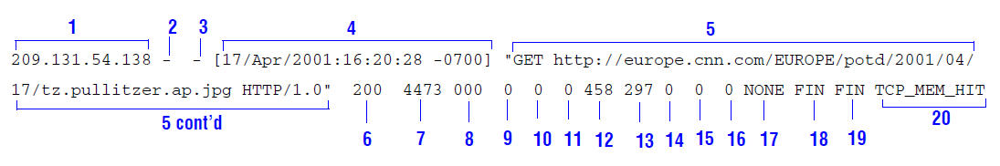

.. _working-with-log-files:

Working with Log Files
**********************

.. Licensed to the Apache Software Foundation (ASF) under one
   or more contributor license agreements.  See the NOTICE file
   distributed with this work for additional information
   regarding copyright ownership.  The ASF licenses this file
   to you under the Apache License, Version 2.0 (the
   "License"); you may not use this file except in compliance
   with the License.  You may obtain a copy of the License at

   http://www.apache.org/licenses/LICENSE-2.0

   Unless required by applicable law or agreed to in writing,
   software distributed under the License is distributed on an
   "AS IS" BASIS, WITHOUT WARRANTIES OR CONDITIONS OF ANY
   KIND, either express or implied.  See the License for the
   specific language governing permissions and limitations
   under the License.

Traffic Server generates log files that contain information about every
request it receives and every error it detects. This chapter will examine the
various log features, the configuration formats and also examine the various
pre-defined log formats that are available.

.. _understanding-traffic-server-log-files:

Understanding Traffic Server Log Files
======================================

Traffic Server records information about every transaction (or request)
it processes and every error it detects in log files. Traffic Server
keeps three types of log files:

-  *Error log files* record information about why a particular
   transaction was in error.

-  *Event log files* (also called *access log files*) record
   information about the state of each transaction Traffic Server
   processes.

-  *System log files* record system information, including messages
   about the state of Traffic Server and errors/warnings it produces.
   This kind of information might include a note that event log files
   were rolled, a warning that cluster communication timed out, or an
   error indicating that Traffic Server was restarted.

   All system information messages are logged with the system-wide
   logging facility :manpage:`syslog` under the daemon facility. The
   :manpage:`syslog.conf(5)` configuration file (stored in the ``/etc`` directory)
   specifies where these messages are logged. A typical location is
   ``/var/log/messages`` (Linux).

   The :manpage:`syslog(8)` process works on a system-wide basis, so it serves as
   the single repository for messages from all Traffic Server processes
   (including :program:`traffic_server`, :program:`traffic_manager`, and
   :program:`traffic_cop`).

   System information logs observe a static format. Each log entry in
   the log contains information about the date and time the error was
   logged, the hostname of the Traffic Server that reported the error,
   and a description of the error or warning.

   Refer to :ref:`traffic-server-error-messages` for a list of the
   messages logged by Traffic Server.

By default, Traffic Server creates both error and event log files and
records system information in system log files. You can disable event
logging and/or error logging by setting the configuration variable
:ts:cv:`proxy.config.log.logging_enabled` in :file:`records.config`
to one of the following values:

======= =================================================
Value   Description
======= =================================================
``0``   Disable both event and error logging.
``1``   Enable error logging only.
``2``   Enable event logging only.
``3``   Enable both event and error logging.
======= =================================================

Understanding Event Log Files
=============================

Event log files record information about every request that Traffic
Server processes. By analyzing the log files, you can determine how many
people use the Traffic Server cache, how much information each person
requested, what pages are most popular, and so on. Traffic Server
supports several standard log file formats, such as Squid and Netscape,
as well as user-defined custom formats. You can analyze the standard
format log files with off-the-shelf analysis packages. To help with log
file analysis, you can separate log files so they contain information
specific to protocol or hosts. You can also configure Traffic Server to
roll log files automatically at specific intervals during the day or
when they reach a certain size.

The following sections describe the Traffic Server logging system
features and discuss how to:

*Manage your event log files*
   You can choose a central location for storing log files, set how much
   disk space to use for log files, and set how and when to roll log
   files. Refer to `Managing Event Log Files`_.

*Choose different event log file formats*
   You can choose which standard log file formats you want to use for
   traffic analysis, such as Squid or Netscape. Alternatively, you can
   use the Traffic Server custom format, which is XML-based and enables
   you to institute more control over the type of information recorded
   in log files. Refer to `Choosing Event Log File Formats`_.

*Roll event log files automatically*
   Configure Traffic Server to roll event log files at specific
   intervals during the day or when they reach a certain size. This
   enables you to identify and manipulate log files that are no longer
   active. Refer to `Rolling Event Log Files`_.

*Separate log files according to protocols and hosts*
   Configure Traffic Server to create separate log files for different
   protocols. You can also configure Traffic Server to generate separate
   log files for requests served by different hosts. Refer to `Splitting Event Log Files`_.

*Collate log files from different Traffic Server nodes*
   Designate one or more nodes on the network to serve as log collation
   servers. These servers, which might be standalone or part of Traffic
   Server, enable you to keep all logged information in well-defined
   locations. Refer to `Collating Event Log Files`_.

*View statistics about the logging system*
   Traffic Server provides statistics about the logging system; you can
   access these statistics via Traffic Line. Refer to `Viewing Logging Statistics`_.

*Interpret log file entries for the log file formats*
   Refer to `Example Event Log File Entries`_.

Managing Event Log Files
------------------------

Traffic Server enables you to control where event log files are located
and how much space they can consume. Additionally, you can specify how to
handle low disk space in the logging directory.

Choosing the Logging Directory
------------------------------

By default, Traffic Server writes all event log files in the ``logs``
directory located in the directory where you installed Traffic Server.
To use a different directory, refer to `Setting Log File Management Options`_.

Controlling Logging Space
-------------------------

Traffic Server enables you to control the amount of disk space that the
logging directory can consume. This allows the system to operate
smoothly within a specified space window for a long period of time.
After you establish a space limit, Traffic Server continues to monitor
the space in the logging directory. When the free space dwindles to the
headroom limit (see `Setting Log File Management Options`_), it enters
a low space state and takes the following actions:

-  If the autodelete option (discussed in `Rolling Event Log Files`_)
   is *enabled*, then Traffic Server
   identifies previously-rolled log files (log files with the
   ``.old`` extension). It starts deleting files one by one, beginning
   with the oldest file, until it emerges from the low state. Traffic
   Server logs a record of all deleted files in the system error log.

-  If the autodelete option is *disabled* or there are not enough old
   log files to delete for the system to emerge from its low space
   state, then Traffic Server issues a warning and continues logging
   until space is exhausted. When available space is consumed, event
   logging stops. Traffic Server resumes event logging when enough space
   becomes available for it to exit the low space state. To make space
   available, either explicitly increase the logging space limit or
   remove files from the logging directory manually.

You can run a :manpage:`cron(8)` script in conjunction with Traffic Server to
automatically remove old log files from the logging directory before
Traffic Server enters the low space state. Relocate the old log files to
a temporary partition, where you can run a variety of log analysis
scripts. Following analysis, either compress the logs and move to an
archive location, or simply delete them.

Setting Log File Management Options
-----------------------------------

To set log management options, follow the steps below:

#. In the :file:`records.config` file, edit the following variables

   -  :ts:cv:`proxy.config.log.logfile_dir`
   -  :ts:cv:`proxy.config.log.max_space_mb_for_logs`
   -  :ts:cv:`proxy.config.log.max_space_mb_headroom`

#. Run the command :option:`traffic_line -x` to apply the configuration
   changes.

Choosing Event Log File Formats
-------------------------------

Traffic Server supports the following log file formats:

-  Standard formats, such as Squid or Netscape. Refer to `Using Standard Formats`_.
-  The Traffic Server custom format. Refer to `Using the Custom Format`_.

In addition to the standard and custom log file format, you can choose
whether to save log files in binary or ASCII. Refer to `Choosing Binary or ASCII`_
for more details on the benefits and drawbacks of the two storage formats.

Event log files consume substantial disk space. Creating log entries in
multiple formats at the same time can consume disk resources very
quickly and adversely impact Traffic Server performance.

Using Standard Formats
~~~~~~~~~~~~~~~~~~~~~~

The standard log formats include Squid, Netscape Common, Netscape
extended, and Netscape Extended-2. The standard log file formats can be
analyzed with a wide variety of off-the-shelf log-analysis packages. You
should use one of the standard event log formats unless you need
information that these formats do not provide. Refer to `Using the Custom Format`_.

Set standard log file format options by following the steps below:

#. In the :file:`records.config` file, edit the following variables

#. Edit the following variables to use the Squid format:

   -  :ts:cv:`proxy.config.log.squid_log_enabled`
   -  :ts:cv:`proxy.config.log.squid_log_is_ascii`
   -  :ts:cv:`proxy.config.log.squid_log_name`
   -  :ts:cv:`proxy.config.log.squid_log_header`

#. To use the Netscape Common format, edit the following variables:

   -  :ts:cv:`proxy.config.log.common_log_enabled`
   -  :ts:cv:`proxy.config.log.common_log_is_ascii`
   -  :ts:cv:`proxy.config.log.common_log_name`
   -  :ts:cv:`proxy.config.log.common_log_header`

#. To use the Netscape Extended format, edit the following variables:

   -  :ts:cv:`proxy.config.log.extended_log_enabled`
   -  :ts:cv:`proxy.config.log.extended_log_is_ascii`
   -  :ts:cv:`proxy.config.log.extended_log_name`
   -  :ts:cv:`proxy.config.log.extended_log_header`

#. To use the Netscape Extended-2 format, edit the following variables:

   -  :ts:cv:`proxy.config.log.extended2_log_enabled`
   -  :ts:cv:`proxy.config.log.extended2_log_is_ascii`
   -  :ts:cv:`proxy.config.log.extended2_log_name`
   -  :ts:cv:`proxy.config.log.extended2_log_header`

#. Run the command :option:`traffic_line -x` to apply the configuration
   changes.

.. _using-custom-log-formats:

Using the Custom Format
~~~~~~~~~~~~~~~~~~~~~~~

The XML-based custom log format is more flexible than the standard log
file formats and gives you more control over the type of information
recorded in log files. You should create a custom log format if you need
data for analysis that's not available in the standard formats. You can
decide what information to record for each Traffic Server transaction
and create filters that specify which transactions to log.

The heart of the XML-based custom logging feature is the XML-based
logging configuration file (:file:`logs_xml.config`) that enables you to
create very modular descriptions of logging objects. The
:file:`logs_xml.config` file uses three types of objects to create custom
log files, as detailed below. To generate a custom log format, you must
specify at least one ``LogObject`` definition (one log file is produced
for each ``LogObject`` definition).

:ref:`LogFormat`
    Defines the content of the log file using printf-style format strings.

:ref:`LogFilter`
    Defines a filter so that you include or exclude certain information from
    the log file.

:ref:`LogObject`
    Specifies all the information needed to produce a log file:

    - The name of the log file. *Required*.

    - The format to be used. This can be a standard format (Squid or Netscape)
      or a previously-defined custom format (a :ref:`LogFormat`). *Required*.

    - The file mode: ``ASCII``, ``Binary``, or ``ASCII_PIPE``. The
      default is ``ASCII``. Refer to `ASCII_PIPE File Mode`_ for more details
      on sending entries to a named pipe.

    - Any filters you want to use (:ref:`LogFilter` objects).

    - The collation servers that are to receive the log files.

    - The protocols you want to log. If the ``protocols`` tag is used, then
      Traffic Server will only log transactions from the protocols
      listed; otherwise, all transactions for all protocols are logged.

    - The origin servers you want to log. If the ``servers`` tag is
      used, then Traffic Server will only log transactions for the
      origin servers listed; otherwise, transactions for all origin
      servers are logged.

    - The header text you want the log files to contain. The header text
      appears at the beginning of the log file, just before the first
      record.

    - The log file rolling options.

In order to accomplish this, we:

#. Enable :ts:cv:`proxy.config.log.custom_logs_enabled` in
   :file:`records.config`. ::

        CONFIG proxy.config.log.custom_logs_enabled INT 1

#. Add :ref:`LogFormat`, :ref:`LogFilter`, and :ref:`LogObject`
   specifications to the configuration file :file:`logs_xml.config`.

#. Run the command :option:`traffic_line -x` to apply your configuration
   changes.

ASCII_PIPE File Mode
~~~~~~~~~~~~~~~~~~~~

In addition to ``ASCII`` and ``BINARY`` file modes for custom log formats, Traffic
Server can output log entries in ``ASCII_PIPE`` mode. This mode writes the log
entries to a UNIX named pipe (a buffer in memory). Other processes may read
from this named pipe using standard I/O functions.

The advantage of this mode is that Traffic Server does not need to write the
entries to disk, which frees disk space and bandwidth for other tasks. When the
buffer is full, Traffic Server drops log entries and issues an error message
indicating how many entries were dropped. Because Traffic Server only writes
complete log entries to the pipe, only full records are dropped.

Creating Summary Log Files
~~~~~~~~~~~~~~~~~~~~~~~~~~

Due to the speed and efficiency of Traffic Server, a heavily-loaded node will
generate many events and the event logs can quickly grow to very large sizes.
Using SQL-like aggregate operators, you can configure Traffic Server to create
summary log files that summarize a set of log entries over a specified period
of time. This can significantly reduce the size of the log files generated.

To generate a summary log file, create a :ref:`LogFormat` object in the
XML-based logging configuration file (:file:`logs_xml.config`) using the
SQL-like aggregate operators below. You can apply each of these operators to
specific fields, over a specified interval.

-  ``COUNT``
-  ``SUM``
-  ``AVERAGE``
-  ``FIRST``
-  ``LAST``

To create a summary log file format:

#. Define the format of the log file in :file:`logs_xml.config` as follows:

   .. code-block:: xml

       <LogFormat>
         <Name = "summary"/>
         <Format = "%<operator(field)> : %<operator(field)>"/>
         <Interval = "n"/>
       </LogFormat>

   Where ``operator`` is one of the five aggregate operators (``COUNT``,
   ``SUM``, ``AVERAGE``, ``FIRST``, ``LAST``); ``field`` is the logging field
   you want to aggregate; and ``n`` is the interval (in seconds) between
   summary log entries.

   You can specify more than one ``operator`` in the format line. For more
   information, refer to :file:`logs_xml.config`.

#. Run the command :option:`traffic_line -x` to apply configuration changes .

The following example format generates one entry every 10 seconds. Each entry
contains the timestamp of the last entry of the interval, a count of the number
of entries seen within that 10-second interval, and the sum of all bytes sent
to the client:

.. code-block:: xml

    <LogFormat>
      <Name = "summary"/>
      <Format = "%<LAST(cqts)> : %<COUNT(*)> : %<SUM(psql)>"/>
      <Interval = "10"/>
    </LogFormat>

.. important::

    You cannot create a format specification that contains
    both aggregate operators and regular fields. For example, the following
    specification would be invalid: ::

        <Format = "%<LAST(cqts)> : %<COUNT(*)> : %<SUM(psql)> : %<cqu>"/>

Choosing Binary or ASCII
~~~~~~~~~~~~~~~~~~~~~~~~

You can configure Traffic Server to create event log files in either of
the following:

ASCII
   These files are human-readable and can be processed using standard,
   off-the-shelf log analysis tools. However, Traffic Server must
   perform additional processing to create the files in ASCII, which
   mildly impacts system overhead. ASCII files also tend to be larger
   than the equivalent binary files. By default, ASCII log files have a
   ``.log`` filename extension.

Binary
   These files generate lower system overhead and generally occupy less
   space on the disk than ASCII files (depending on the type of
   information being logged). However, you must use a converter
   application before you can read or analyze binary files via standard
   tools. By default, binary log files use a ``.blog`` filename
   extension.

While binary log files typically require less disk space, there are
exceptions.

For example, the value ``0`` (zero) requires only one byte to store in
ASCII, but requires four bytes when stored as a binary integer.
Conversely, if you define a custom format that logs IP addresses, then a
binary log file would only require four bytes of storage per 32-bit
address. However, the same IP address stored in dot notation would
require around 15 characters (bytes) in an ASCII log file.

It is wise to consider the type of data that will be logged before you
select ASCII or binary for your log files, if your decision is being driven by
storage space concerns. For example, you might try logging for one day using
ASCII and then another day using binary. If the number of requests is roughly
the same for both days, then you can calculate a rough metric that compares
the two formats.

For standard log formats, select Binary or ASCII (refer to
`Using Standard Formats`_). For the custom log
format, specify ASCII or Binary mode in the :ref:`LogObject`
(refer to :ref:`using-custom-log-formats`). In addition
to the ASCII and binary options, you can also write custom log entries
to a UNIX-named pipe (a buffer in memory) with the `ASCII_PIPE File Mode`_
setting.

Rolling Event Log Files
-----------------------

Traffic Server provides automatic log file rolling. At specific intervals
during the day or when log files reach a certain size, Traffic Server closes
its current set of log files and opens new log files. Depending on the amount
of traffic your servers are exposed to, you may find that increasing the
frequency of log rolling is beneficial, or even necessary, to maintain
manageable log file sets. Traffic Server nodes processing moderately high
levels of traffic may want to start by rolling logs every six hours, and
adjusting from there.

Log file rolling offers the following benefits:

-  It defines an consistent interval over which log analysis can be performed.

-  It keeps any single log file from becoming too large and helps to
   keep the logging system within the specified space limits.

-  It provides an easy way to identify files that are no longer being
   used so that an automated script can clean the logging directory and
   run log analysis programs.

Rolled Log Filename Format
~~~~~~~~~~~~~~~~~~~~~~~~~~

Traffic Server provides a consistent naming scheme for rolled log files
that enables you to easily identify log files. When Traffic Server rolls
a log file, it saves and closes the old file before it starts a new
file. Traffic Server renames the old file to include the following
information:

-  The format of the file (such as ``squid.log``).

-  The hostname of the Traffic Server that generated the log file.

-  Two timestamps separated by a hyphen (``-``). The first timestamp is
   a *lower bound* for the timestamp of the first record in the log
   file. The lower bound is the time when the new buffer for log records
   is created. Under low load, the first timestamp in the filename can
   be different from the timestamp of the first entry. Under normal
   load, the first timestamp in the filename and the timestamp of the
   first entry are similar. The second timestamp is an *upper bound*
   for the timestamp of the last record in the log file (this is
   normally the rolling time).

-  The suffix ``.old``, which makes it easy for automated scripts to
   find rolled log files.

Timestamps have the following format: ::

    %Y%M%D.%Hh%Mm%Ss-%Y%M%D.%Hh%Mm%Ss

The following table describes the format:

====== ================================================== ==============
Format Description                                        Sample
====== ================================================== ==============
``%Y`` The year in four-digit format.                     2000
``%M`` The month in two-digit format, from 01-12.         07
``%D`` The day in two-digit format, from 01-31.           19
``%H`` The hour in two-digit format, from 00-23.          21
``%M`` The minute in two-digit format, from 00-59.        52
``%S`` The second in two-digit format, from 00-59.        36
====== ================================================== ==============

.. XXX can %S ever be 60, on account of leap seconds, or does ATS have leap-second related issues that otherwise interfere?

The following is an example of a rolled log filename: ::

     squid.log.mymachine.20110912.12h00m00s-20000913.12h00m00s.old

The logging system buffers log records before writing them to disk. When
a log file is rolled, the log buffer might be partially full. If it is,
then the first entry in the new log file will have a timestamp earlier
than the time of rolling. When the new log file is rolled, its first
timestamp will be a lower bound for the timestamp of the first entry.

For example, suppose logs are rolled every three hours, and the first
rolled log file is: ::

    squid.log.mymachine.20110912.12h00m00s-19980912.03h00m00s.old

If the lower bound for the first entry in the log buffer at 3:00:00 is
2:59:47, then the next log file will have the following timestamp when
rolled: ::

    squid.log.mymachine.20110912.02h59m47s-19980912.06h00m00s.old

The contents of a log file are always between the two timestamps. Log
files do not contain overlapping entries, even if successive timestamps
appear to overlap.

Rolling Intervals
~~~~~~~~~~~~~~~~~

Log files are rolled at specific intervals relative to a given hour of
the day. Two options control when log files are rolled:

-  The offset hour, which is an hour between ``0`` (midnight) and ``23``.

-  The rolling interval.

Both the offset hour and the rolling interval determine when log file
rolling starts. Rolling occurs every rolling interval and at the offset
hour. For example, if the rolling interval is six hours and the offset
hour is 0 (midnight), then the logs will roll at midnight (00:00),
06:00, 12:00, and 18:00 each day. If the rolling interval is 12 hours
and the offset hour is 3, then logs will roll at 03:00 and 15:00 each
day.

Setting Log File Rolling Options
~~~~~~~~~~~~~~~~~~~~~~~~~~~~~~~~

To set log file rolling options and/or configure Traffic Server to roll
log files when they reach a certain size, adjust the following setting in
:file:`records.config`:

#. Enable log rolling with :ts:cv:`proxy.config.log.rolling_enabled`. ::

    CONFIG proxy.config.log.rolling_enabled INT 1

#. Configure the upper limit on log file size with
   :ts:cv:`proxy.config.log.rolling_size_mb`. ::

    CONFIG proxy.config.log.rolling_size_mb INT 1024

#. Set the offset hour with :ts:cv:`proxy.config.log.rolling_offset_hr`. ::

    CONFIG proxy.config.log.rolling_offset_hr INT 0

#. Set the interval (in seconds) with
   :ts:cv:`proxy.config.log.rolling_interval_sec`. ::

    CONFIG proxy.config.log.rolling_interval_sec INT 21600

#. Run the command :option:`traffic_line -x` to apply the configuration
   changes.

You can fine-tune log file rolling settings for a custom log file in the
:ref:`LogObject` specification in :file:`logs_xml.config`. The custom log file
uses the rolling settings in its :ref:`LogObject`, which override the default
settings you specify in Traffic Manager or :file:`records.config` described
above.

Splitting Event Log Files
-------------------------

By default, Traffic Server uses standard log formats and generates log
files that contain HTTP & ICP transactions in the same file. However,
you can enable log splitting if you prefer to log transactions for
different protocols in separate log files.

ICP Log Splitting
~~~~~~~~~~~~~~~~~

When ICP log splitting is enabled, Traffic Server records ICP transactions in a
separate log file with a name that contains ``icp``. For example, if you enable
the Squid format, then all ICP transactions are recorded in the
``squid-icp.log`` file. When you disable ICP log splitting, Traffic Server
records all ICP transactions in the same log file as HTTP transactions.

.. _httphostlogsplitting:

HTTP Host Log Splitting
~~~~~~~~~~~~~~~~~~~~~~~

HTTP host log splitting enables you to record HTTP transactions for
different origin servers in separate log files. When HTTP host log
splitting is enabled, Traffic Server creates a separate log file for
each origin server that's listed in :file:`log_hosts.config`.
When both ICP and HTTP host log splitting are enabled, Traffic Server generates
separate log files for HTTP transactions (based on the origin server)
and places all ICP transactions in their own respective log files. For
example, if :file:`log_hosts.config` contains the two origin
servers ``uni.edu`` and ``company.com`` and Squid format is enabled,
then Traffic Server generates the following log files:

=========================== ============================================
Log File                    Contents
=========================== ============================================
``squid-uni.edu.log``       All HTTP transactions for ``uni.edu``.
``squid-company.com.log``   All HTTP transactions for ``company.com``.
``squid-icp.log``           All ICP transactions for all hosts.
``squid.log``               All HTTP transactions for other hosts.
=========================== ============================================

If you disable ICP log splitting, then ICP transactions are placed in
the same log file as HTTP transactions. Using the hosts and log format
from the previous example, Traffic Server generates the log files below:

=========================== ============================================
Log File                    Contents
=========================== ============================================
``squid-uni.edu.log``       All entries for ``uni.edu``.
``squid-company.com.log``   All entries for ``company.com``.
``squid.log``               All other entries.
=========================== ============================================

Traffic Server also enables you to create XML-based
:ref:`Custom Log Formats <using-custom-log-formats>` that offer even greater
control over log file generation.

Setting Log Splitting Options
~~~~~~~~~~~~~~~~~~~~~~~~~~~~~

To set log splitting options, follow the steps below:

#. In the :file:`records.config` file, edit the following variables

   -  :ts:cv:`proxy.config.log.separate_icp_logs`
   -  :ts:cv:`proxy.config.log.separate_host_logs`

#. Run the command :option:`traffic_line -x` to apply the configuration
   changes.

Editing the log_hosts.config File
~~~~~~~~~~~~~~~~~~~~~~~~~~~~~~~~~

The default :file:`log_hosts.config` file is located in the Traffic Server
``config`` directory. To record HTTP transactions for different origin
servers in separate log files, you must specify the hostname of each
origin server on a separate line in :file:`log_hosts.config`. For
example, if you specify the keyword ``sports``, then Traffic Server records
all HTTP transactions from ``sports.yahoo.com`` and
``www.foxsports.com`` in a log file called ``squid-sports.log`` (if the
Squid format is enabled).

.. note::

    If Traffic Server is clustered and you enable log file
    collation, then you should use the same :file:`log_hosts.config` file on
    every Traffic Server node in the cluster.

To edit the log hosts list:

#. Enter the hostname of each origin server on a separate line in
   :file:`log_hosts.config`. ::

       webserver1
       webserver2
       webserver3

#. Run the command :option:`traffic_line -x` to apply the configuration
   changes.

Collating Event Log Files
-------------------------

You can use the Traffic Server log file collation feature to collect all
logged information in one place. Log collation enables you to analyze a
set of Traffic Server clustered nodes as a whole (rather than as
individual nodes) and to use a large disk that might only be located on
one of the nodes in the cluster. Traffic Server collates log files by
using one or more nodes as log collation servers and all remaining nodes
as log collation clients. When a Traffic Server node generates a buffer
of event log entries, it first determines if it is the collation server
or a collation client. The collation server node writes all log buffers
to its local disk, just as it would if log collation was not enabled.
Log collation servers can be standalone or they can be part of a node
running Traffic Server.

The collation client nodes prepare their log buffers for transfer across
the network and send the buffers to the log collation server. When the
log collation server receives a log buffer from a client, it writes it
to its own log file as if it was generated locally. For a visual
representation of this, see the figure below.

   Log collation

If log clients cannot contact their log collation server, then they
write their log buffers to their local disks, into *orphan* log files.
Orphan log files require manual collation.

.. note::

    Log collation can have an impact on network performance.
    Because all nodes are forwarding their log data buffers to the single
    collation server, a bottleneck can occur. In addition, collated log
    files contain timestamp information for each entry, but entries in the
    files do not appear in strict chronological order. You may want to sort
    collated log files before doing analysis.

To configure Traffic Server to collate event log files, you must perform
the following tasks:

-  Either :ref:`admin-configuring-traffic-server-to-be-a-collation-server` or install
   and configure a :ref:`admin-using-a-standalone-collator:`.

-  :ref:`admin-configuring-traffic-server-to-be-a-collation-server`

-  Add an attribute to the :ref:`LogObject` specification in
   :file:`logs_xml.config` if you are using custom log file formats. Refer to
   `Collating Custom Event Log Files`_.

.. _admin-configuring-traffic-server-to-be-a-collation-server:

Configuring Traffic Server to Be a Collation Server
~~~~~~~~~~~~~~~~~~~~~~~~~~~~~~~~~~~~~~~~~~~~~~~~~~~

To configure a Traffic Server node to be a collation server, perform the
following configuration adjustments in :file:`records.config`:

#. Set :ts:cv:`proxy.local.log.collation_mode` to ``1`` to indicate this node
   will be a server. ::

        CONFIG proxy.local.log.collation_mode INT 1

#. Configure the port on which the server will listen to incoming collation
   transfers from clients, using :ts:cv:`proxy.config.log.collation_port`. If
   omitted, this defaults to port ``8085``. ::

        CONFIG proxy.config.log.collation_port INT 8085

#. Configure the shared secret (password) used by collation clients to authenticate
   their sessions, using :ts:cv:`proxy.config.log.collation_secret`. ::

        CONFIG proxy.config.log.collation_secret STRING "seekrit"

#. Run the command :option:`traffic_line -x` to apply the configuration
   changes.

.. note::

    If you modify the ``collation_port`` or ``secret`` after
    connections between the collation server and collation clients have been
    established, then you must restart Traffic Server.

.. _admin-using-a-standalone-collator:

Using a Standalone Collator
~~~~~~~~~~~~~~~~~~~~~~~~~~~

If you do not want the log collation server to be a Traffic Server node,
then you can install and configure a standalone collator (SAC) that will
dedicate more of its power to collecting, processing, and writing log
files.

To install and configure a standalone collator:

#. Configure your Traffic Server nodes as log collation clients. Refer
   to `Configuring Traffic Server to Be a Collation Client`_.

#. Copy the :program:`traffic_sac` binary from the Traffic Server ``bin``
   directory, and place in a suitable location on the system that will
   act as the standalone collator.

#. Copy the ``libtsutil.so`` libraries from the Traffic Server ``lib``
   directory to the machine serving as the standalone collator.

#. Create a directory called ``config`` in the directory that contains
   the :program:`traffic_sac` binary.

#. Create a directory called ``internal`` in the ``config`` directory
   you created above. This directory is used internally by the standalone
   collator to store lock files.

#. Copy the :file:`records.config` file from a Traffic Server node
   configured to be a log collation client to the ``config`` directory
   you created on the standalone collator.

   The :file:`records.config` file contains the log collation secret and
   the port you specified when configuring Traffic Server nodes to be
   collation clients. The collation port and secret must be the same for
   all collation clients and servers.

#. Edit :ts:cv:`proxy.config.log.logfile_dir` in :file:`records.config` to
   specify a location on your standalone collator where the collected log files
   should be stored. ::

        CONFIG proxy.config.log.logfile_dir STRING "/var/log/trafficserver/"

#. Enter the following command to start the standalone collator process::

      traffic_sac -c config

You will likely want to configure this program to run at server startup, as
well as configure a service monitor in the event the process terminates
abnormally. Please consult your operating system's documentation for how to
achieve this.

Configuring Traffic Server to Be a Collation Client
~~~~~~~~~~~~~~~~~~~~~~~~~~~~~~~~~~~~~~~~~~~~~~~~~~~

To configure a Traffic Server node to be a collation client, follow the
steps below. If you modify the ``collation_port`` or ``secret`` after
connections between the collation clients and the collation server have
been established, then you must restart Traffic Server.

#. In the :file:`records.config` file, edit the following variables:

   -  :ts:cv:`proxy.local.log.collation_mode`: ``2`` to configure this node as log collation client and send
      standard formatted log entries to the collation server.
      For XML-based formatted log entries, see :file:`logs_xml.config`
      file; refer to :ref:`Using the Custom Format <using-custom-log-formats>`.
   -  :ts:cv:`proxy.config.log.collation_host`
   -  :ts:cv:`proxy.config.log.collation_port`
   -  :ts:cv:`proxy.config.log.collation_secret`
   -  :ts:cv:`proxy.config.log.collation_host_tagged`
   -  :ts:cv:`proxy.config.log.max_space_mb_for_orphan_logs`

#. Run the command :option:`traffic_line -x` to apply the configuration
   changes.

Collating Custom Event Log Files
~~~~~~~~~~~~~~~~~~~~~~~~~~~~~~~~

If you use custom event log files, then you must edit :file:`logs_xml.config`,
in addition to configuring a collation server and collation clients.

To collate custom event log files:

#. On each collation client, edit :file:`logs_xml.config` and add the
   :ref:`CollationHosts <logs-xml-logobject-collationhost>` attribute to the
   :ref:`LogObject` specification:

   .. code-block:: xml

       <LogObject>
         <Format = "squid"/>
         <Filename = "squid"/>
         <CollationHosts="ipaddress:port"/>
       </LogObject>

   Where ``ipaddress`` is the hostname or IP address of the collation
   server to which all log entries (for this object) are forwarded, and
   ``port`` is the port number for communication between the collation
   server and collation clients.

#. Run the command :option:`traffic_line -L` to restart Traffic Server on the
   local node or :option:`traffic_line -M` to restart Traffic Server on all
   the nodes in a cluster.

Viewing Logging Statistics
==========================

Traffic Server generates logging statistics that enable you to see the
following information:

-  How many log files (formats) are currently being written.

-  The current amount of space used by the logging directory, which
   contains all event and error logs.

-  The number of access events written to log files since Traffic Server
   installation. This counter represents one entry in one file. If
   multiple formats are being written, then a single event creates
   multiple event log entries.

-  The number of access events skipped (because they were filtered)
   since Traffic Server installation.

-  The number of access events written to the event error log since
   Traffic Server installation.

You can retrieve the statistics via the Traffic Line command-line
interface. Refer to :doc:`Monitoring Traffic <monitoring-traffic.en>`.

Viewing Log Files
=================

You can view the system, event, and error log files Traffic Server
creates. You can also delete a log file or copy it to your local system
if you have the correct user permissions. Traffic Server displays only
one MB of information in the log file. If the log file you select to
view is bigger than 1MB, then Traffic Server truncates the file and
displays a warning message indicating that the file is too big.

Online Event Log XML Builder
============================

If you need any assistance building your event log, you can try out our
`online log builder <http://trafficserver.apache.org/logbuilder/>`_. This is a
work in progress, so any comments, critique or suggestions are most welcome.

Example Event Log File Entries
==============================

This section shows an example log file entry in each of the standard log
formats supported by Traffic Server: Squid, Netscape Common, Netscape Extended,
and Netscape Extended-2.

.. _log-formats-squid-format:

Squid Log File Format
---------------------

The following figure shows a sample log entry in a ``squid.log`` file.

.. figure:: ../static/images/admin/squid_format.jpg
   :align: center
   :alt: Sample log entry in squid.log

   Sample log entry in squid.log

====== ========= =============================================================================
Field  Symbol    Description
====== ========= =============================================================================
1      cqtq      The client request timestamp in Squid format. The time of the client
                 request in seconds since January 1, 1970 UTC (with millisecond resolution).
2      ttms      The time Traffic Server spent processing the client request. The
                 number of milliseconds between the time the client established the
                 connection with Traffic Server and the time Traffic Server sent the
                 last byte of the response back to the client.
3      chi       The IP address of the client’s host machine.
4      crc/pssc  The cache result code; how the cache responded to the request:
                 ``HIT``, ``MISS``, and so on. Cache result codes are described in
                 :ref:`<squid-netscape-result-codes>`.
                 The proxy response status code (the HTTP response status code from
                 Traffic Server to client).
5      psql      The length of the Traffic Server response to the client in bytes,
                 including headers and content.
6      cqhm      The client request method: ``GET``, ``POST``, and so on.
7      cauc      The client request canonical URL; blanks and other characters that
                 might not be parsed by log analysis tools are replaced by escape
                 sequences. The escape sequence is a percentage sign followed by the
                 ASCII code number of the replaced character in hex.
8      caun      The username of the authenticated client. A hyphen (``-``) means
                 that no authentication was required.
9      phr/pqsn  The proxy hierarchy route. The route Traffic Server used to retrieve
                 the object.
10     psct      The proxy response content type. The object content type taken from
                 the Traffic Server response header.
====== ========= =============================================================================

Squid log in XML
~~~~~~~~~~~~~~~~

This is the equivalent XML configuration for the log above::

    <LogFormat>
      <Name = "squid"/>
      <Format = "%<cqtq> %<ttms> %<chi> %<crc>/%<pssc> %<psql> %<cqhm> %<cquc>
                 %<caun> %<phr>/%<pqsn> %<psct>"/>
    </LogFormat>

Netscape Common
---------------

.. figure:: ../static/images/admin/netscape_common_format.jpg
   :align: center
   :alt: Sample log entry in common.log

   Sample log entry in common.log

====== ========= =============================================================================
Field  Symbol    Description
====== ========= =============================================================================
1      chi       The IP address of the client's host machine.
2      --        This hyphen (``-``) is always present in Netscape log entries.
3      caun      The authenticated client username. A hyphen (``-``) means no
                 authentication was required.
4      cqtd      The date and time of the client request, enclosed in brackets.
5      cqtx      The request line, enclosed in quotes.
6      pssc      The proxy response status code (HTTP reply code).
7      pscl      The length of the Traffic Server response to the client in bytes.
====== ========= =============================================================================

Netscape Common in XML
~~~~~~~~~~~~~~~~~~~~~~

This is the equivalent XML configuration for the log above::

    <LogFormat>
      <Name = "common"/>
      <Format = "%<chi> - %<caun> [%<cqtn>] \"%<cqtx>\" %<pssc> %<pscl>"/>
    </LogFormat>

Netscape Extended
-----------------

.. figure:: ../static/images/admin/netscape_extended_format.jpg
   :align: center
   :alt: Sample log entry in extended.log

   Sample log entry in extended.log

In addition to field 1-7 from the Netscape Common log format above, the Extended format also adds
the following fields:

====== ========= =============================================================================
Field  Symbol    Description
====== ========= =============================================================================
8      sssc      The origin server response status code.
9      sshl      The server response transfer length; the body length in the origin
                 server response to Traffic Server, in bytes.
10     cqbl      The client request transfer length; the body length in the client
                 request to Traffic Server, in bytes.
11     pqbl      The proxy request transfer length; the body length in the Traffic
                 Server request to the origin server.
12     cqhl      The client request header length; the header length in the client
                 request to Traffic Server.
13     pshl      The proxy response header length; the header length in the Traffic
                 Server response to the client.
14     pqhl      The proxy request header length; the header length in Traffic Server
                 request to the origin server.
15     sshl      The server response header length; the header length in the origin
                 server response to Traffic Server.
16     tts       The time Traffic Server spent processing the client request; the
                 number of seconds between the time that the client established the
                 connection with Traffic Server and the time that Traffic Server sent
                 the last byte of the response back to the client.
====== ========= =============================================================================

Netscape Extended in XML
~~~~~~~~~~~~~~~~~~~~~~~~

This is the equivalent XML configuration for the log above::

    <LogFormat>
      <Name = "extended"/>
      <Format = "%<chi> - %<caun> [%<cqtn>] \"%<cqtx>\" %<pssc> %<pscl> 
         %<sssc> %<sscl> %<cqbl> %<pqbl> %<cqhl> %<pshl> %<pqhl> %<sshl> %<tts>"/>
    </LogFormat>

Netscape Extended2
------------------

   Sample log entry in extended2.log

In addition to field 1-16 from the log formats above, the Extended2 format also adds
the following fields:

====== ========= =============================================================================
Field  Symbol    Description
====== ========= =============================================================================
17     phr       The proxy hierarchy route; the route Traffic Server used to retrieve
                 the object.
18     cfsc      The client finish status code: ``FIN`` if the client request
                 completed successfully or ``INTR`` if the client request was
                 interrupted.
19     pfsc      The proxy finish status code: ``FIN`` if the Traffic Server request
                 to the origin server completed successfully or ``INTR`` if the
                 request was interrupted.
20     crc       The cache result code; how the Traffic Server cache responded to the
                 request: HIT, MISS, and so on. Cache result codes are described
                 :ref:`here <squid-netscape-result-codes>`.
====== ========= =============================================================================

Netscape Extended2 in XML
~~~~~~~~~~~~~~~~~~~~~~~~~

This is the equivalent XML configuration for the log above::

    <LogFormat>
      <Name = "extended2"/>
      <Format = "%<chi> - %<caun> [%<cqtn>] \"%<cqtx>\" %<pssc> %<pscl> 
                 %<sssc> %<sscl> %<cqbl> %<pqbl> %<cqhl> %<pshl> %<pqhl> %<sshl> %<tts> %<phr> %<cfsc> %<pfsc> %<crc>"/>
    </LogFormat>

.. _squid-netscape-result-codes:

Squid- and Netscape-format: Cache Result Codes
==============================================

The following table describes the cache result codes in Squid and
Netscape log files.

``TCP_HIT``
    A valid copy of the requested object was in the cache and Traffic
    Server sent the object to the client.

``TCP_MISS``
    The requested object was not in cache, so Traffic Server retrieved
    the object from the origin server (or a parent proxy) and sent it to
    the client.

``TCP_REFRESH_HIT``
    The object was in the cache, but it was stale. Traffic Server made an
    ``if-modified-since`` request to the origin server and the
    origin server sent a ``304`` not-modified response. Traffic
    Server sent the cached object to the client.

``TCP_REF_FAIL_HIT``
    The object was in the cache but was stale. Traffic Server made an
    ``if-modified-since`` request to the origin server but the server
    did not respond. Traffic Server sent the cached object to the
    client.

``TCP_REFRESH_MISS``
    The object was in the cache but was stale. Traffic Server made an
    ``if-modified-since`` request to the origin server and the server
    returned a new object. Traffic Server served the new object to the
    client.

``TCP_CLIENT_REFRESH``
    The client issued a request with a ``no-cache`` header. Traffic
    Server obtained the requested object from the origin server and sent
    a copy to the client. Traffic Server deleted the previous copy of
    the object from cache.

``TCP_IMS_HIT``
    The client issued an ``if-modified-since`` request and the object
    was in cache and fresher than the IMS date, or an
    ``if-modified-since`` request to the origin server revealed the
    cached object was fresh. Traffic Server served the cached object to
    the client.

``TCP_IMS_MISS``
    The client issued an
    ``if-modified-since request`` and the object was either not in
    cache or was stale in cache. Traffic Server sent an
    ``if-modified-since request`` to the origin server and received the
    new object. Traffic Server sent the updated object to the client.

``TCP_SWAPFAIL``
    The object was in the cache but could not be accessed. The client
    did not receive the object.

``ERR_CLIENT_ABORT``
    The client disconnected before the complete object was sent.

``ERR_CONNECT_FAIL``
    Traffic Server could not reach the origin server.

``ERR_DNS_FAIL``
    The Domain Name Server (DNS) could not resolve the origin server
    name, or no DNS could be reached.

``ERR_INVALID_REQ``
    The client HTTP request was invalid. (Traffic Server forwards
    requests with unknown methods to the origin server.)

``ERR_READ_TIMEOUT``
    The origin server did not respond to Traffic Server's request within
    the timeout interval.

``ERR_PROXY_DENIED``
    Client service was denied.

``ERR_UNKNOWN``
    The client connected, but subsequently disconnected without sending
    a request.
