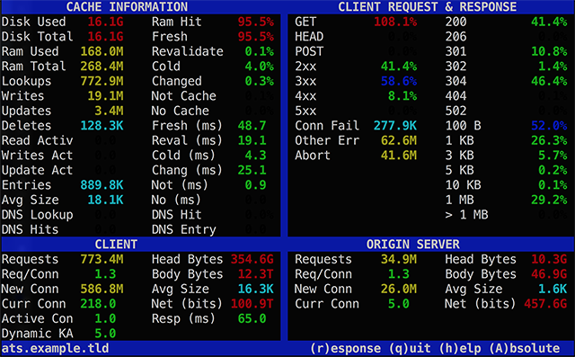

.. Licensed to the Apache Software Foundation (ASF) under one
   or more contributor license agreements.  See the NOTICE file
   distributed with this work for additional information
   regarding copyright ownership.  The ASF licenses this file
   to you under the Apache License, Version 2.0 (the
   "License"); you may not use this file except in compliance
   with the License.  You may obtain a copy of the License at

   http://www.apache.org/licenses/LICENSE-2.0

   Unless required by applicable law or agreed to in writing,
   software distributed under the License is distributed on an
   "AS IS" BASIS, WITHOUT WARRANTIES OR CONDITIONS OF ANY
   KIND, either express or implied.  See the License for the
   specific language governing permissions and limitations
   under the License.

.. include:: ../../common.defs

.. _traffic_top:

traffic_top
***********

Description
===========

The :program:`traffic_top` program provides a simple CLI view of your |TS|
statistics, reminiscent of programs like :manpage:`top(1)` and :manpage:`nmon(1)`
for system processes and statistics.

Options
=======

.. program:: traffic_top

.. option:: -s COUNT

   Number of seconds in between each polling of the |TS| statistics API. The
   default is 5 seconds.

.. option:: URL|hostname|hostname:port

   Location at which the JSON output of |TS| statistics are accessible.

Requirements
============

The :program:`traffic_top` program requires that your |TS| nodes are running
the :ref:`Stats Over HTTP plugin <admin-plugins-stats-over-http>` and that the
machine from which you run :program:`traffic_top` is able to access the HTTP(S)
end point for the plugin.

If, for example, you have the following entry in your :file:`plugin.config` to
enable the plugin::

    stats_over_http.so statistics

And your |TS| node is accessible using the hostname ``ats.example.tld``
(listening on port 80), then you would run :program:`traffic_top` as follows::

    traffic_top http://ats.example.tld/statistics

The hostname, port, and path to the :ref:`Stats Over HTTP plugin
<admin-plugins-stats-over-http>` JSON output should be adjusted as necessary to
match your environment.

.. important::

   The statistics provided by |TS| (through :program:`traffic_ctl` and
   :ref:`admin-plugins-stats-over-http`) expose quite a bit about the inner
   workings of your |TS| cache. While consumers of the JSON statistics endpoint
   won't be able to see or modify the raw contents of your cache, it is still
   very strongly advised to limit access to this URL.

Interface
=========

Upon startup (and successful connection to the
:ref:`admin-plugins-stats-over-http` endpoint), you will be presented with a
curses interface that looks like:

   Main interface for the traffic_top command line program.

Each area of the main interface is explained in the following sections.

Cache Information
-----------------

Disk Used
~~~~~~~~~

The amount of disk space currently in use by the |TS| cache. This number will
never exceed `Disk Total`_.

Statistic: :ts:stat:`proxy.process.cache.bytes_used`.

Disk Total
~~~~~~~~~~

Total disk space allocated for |TS| cache.

Statistic: :ts:stat:`proxy.process.cache.bytes_total`.

Ram Used
~~~~~~~~

Current amount of RAM Cache occupied by objects. Objects located and served
from the |TS| RAM Cache avoid the much slower disk I/O necessary to serve from
spinning rust.

Statistic: :ts:stat:`proxy.process.cache.ram_cache.bytes_used`

Ram Total
~~~~~~~~~

Total space allocated for used by the |TS| RAM Cache.

Statistic: :ts:stat:`proxy.process.cache.ram_cache.total_bytes`

Lookups
~~~~~~~

Total cache object lookups performed, including disk and RAM caches.

Statistic: :ts:stat:`proxy.process.http.cache_lookups`

Writes
~~~~~~

Total number of object writes to the |TS| cache.

Statistic: :ts:stat:`proxy.process.http.cache_writes`.

Updates
~~~~~~~

Total number of existing cache objects which have been updated with new content
from the origin server (i.e. existing cache object was stale, so |TS| revalidated
against the origin and received a new object).

Statistic: :ts:stat:`proxy.process.http.cache_updates`.

Deletes
~~~~~~~

Total number of |TS| cache objects which have been deleted (generally through a
PURGE request).

Statistic: :ts:stat:`proxy.process.http.cache_deletes`.

Read Activ
~~~~~~~~~~

Current number of active cache reads.

Statistic: :ts:stat:`proxy.process.cache.read.active`.

Writes Act
~~~~~~~~~~

Current number of active cache writes.

Statistic: :ts:stat:`proxy.process.cache.write.active`.

Update Act
~~~~~~~~~~

Current number of active cache updates.

Statistic: :ts:stat:`proxy.process.cache.update.active`.

Entries
~~~~~~~

The current number of cache directory entries in use.

Statistic: :ts:stat:`proxy.process.cache.direntries.used`.

Avg Size
~~~~~~~~

The average size of current in the cache directory. This is calculated by
dividing `Entries`_ into `Disk Used`_.

Statistics: :ts:stat:`proxy.process.cache.bytes_used`,
:ts:stat:`proxy.process.cache.direntries.used`.

DNS Lookup
~~~~~~~~~~

Total number of DNS lookups performed by |TS|, regardless of whether they were
full DNS queries or were satisfied by entries in the HostDB cache. If you are
not operating a forward proxy and if none of your origin servers are mapped by
hostnames, then it is normal for your HostDB cache to be empty.

Statistic: :ts:stat:`proxy.process.hostdb.total_lookups`.

DNS Hits
~~~~~~~~

Total number of DNS lookups which were successfully served from the HostDB
cache.

Statistic: :ts:stat:`proxy.process.hostdb.total_hits`.

Ram Hit
~~~~~~~

The percentage of cache lookups which were served successfully from the RAM
Cache (thus avoiding slower I/O from the disk cache, or even slower network I/O
to the origin server). This is calculated as a ratio from the two RAM Cache
statistics for hits and misses.

Statistics: :ts:stat:`proxy.process.cache.ram_cache.hits`,
:ts:stat:`proxy.process.cache.ram_cache.misses`.

Fresh
~~~~~

The percentage of cache lookups which located a fresh cache object (i.e. an
object not in need of any revalidation). These transactions are served directly
from the cache to the client without any need to contact origin servers or
spend time updating the cache. An effective |TS| cache will have a very high
Fresh percentage, as these are the fastest responses to clients.

Statistic: :ts:stat:`proxy.process.http.transaction_counts.hit_fresh`.

Revalidate
~~~~~~~~~~

The percentage of cache lookups which located a stale cache object, but for
which the origin server did not return new data when |TS| revalidated the
object. Revalidated objects don't incur cache update performance hits, but they
do still lead to (what ends up being unnecessary) network traffic with origin
servers.

A high percentage of revalidated cache lookups may indicate that |TS| is being
too aggressive with its object staleness heuristics.

Statistic: :ts:stat:`proxy.process.http.transaction_counts.hit_revalidated`.

Cold
~~~~

The percentage of cache lookups which located an expired cache object. These
were requests which located a matching object in the cache, but it had already
been expired fully and a new copy was retrieved from the origin server.
Unfortunately, the new copy from the origin server ended up being the unchanged
from what had been marked expired in the cache.

A high percentage of cold misses indicates that your origin servers are setting
expirations on their responses which are too short, as compared to the actual
lifetime of the content in those responses.

Statistic: :ts:stat:`proxy.process.http.transaction_counts.miss_cold`.

Changed
~~~~~~~

The percentage of cache lookups which located an expired cache object and which
resulted in new data being retrieved from the origin server.

Statistic: :ts:stat:`proxy.process.http.transaction_counts.miss_changed`.

Not Cache
~~~~~~~~~

The percentage of requests for which the requested object was marked not
cacheable by the origin server. A high percentage of uncacheable objects may
indicate that either your origin servers simply contain a large amount of
dynamic, uncacheable data, or that they are not properly setting cache control
headers in their responses.

Statistic: :ts:stat:`proxy.process.http.transaction_counts.miss_not_cacheable`.

No Cache
~~~~~~~~

The percentage of requests for which the client indicated that the cache should
not be used (e.g. a ``Cache-Control: no-cache`` request header was present).

A high percentage of these requests may indicate possible client-side abuse of
your proxy, in which a disproportionate number of client connections are
attempting to force their way past your |TS| cache.

Statistic: :ts:stat:`proxy.process.http.transaction_counts.miss_client_no_cache`.

Fresh (ms)
~~~~~~~~~~

The average amount of time per lookup (in milliseconds) spent serving requests
which were served by fresh cache lookups. Note that the underlying statistic is
the total amount of time |TS| has spent serving these requests since startup,
whereas :program:`traffic_top` is displaying the number averaged by the total
`Fresh`_ requests.

Statistic: :ts:stat:`proxy.process.http.transaction_totaltime.hit_fresh`.

Reval (ms)
~~~~~~~~~~

The average amount of time per lookup (in milliseconds) spent serving requests
which involved revalidating a stale object for which the origin server did not
return new data. Note that the underlying statistic is the total amount of time
|TS| has spent serving these requests since startup, whereas
:program:`traffic_top` is displaying the number averaged by the total
`Revalidate`_ requests.

Statistic: :ts:stat:`proxy.process.http.transaction_totaltime.hit_revalidated`.

Cold (ms)
~~~~~~~~~

The average amount of time per lookup (in milliseconds) spent serving requests
which involved expired cache objects. Note that the underlying statistic is the
total amount of time |TS| has spent serving these requests since startup,
whereas :program:`traffic_top` is displaying the number averaged by the total
`Cold`_ requests.

Statistic: :ts:stat:`proxy.process.http.transaction_totaltime.miss_cold`.

Chang (ms)
~~~~~~~~~~

The average amount of time per lookup (in milliseconds) spent serving requests
which were served by |TS| with new data obtained from an origin server. Note
that the underlying statistic is the total amount of time |TS| has spent
serving these requests since startup, whereas :program:`traffic_top` is
displaying the number averaged by the total `Changed`_ requests.

Statistic: :ts:stat:`proxy.process.http.transaction_totaltime.miss_changed`.

Not (ms)
~~~~~~~~

The average amount of time per lookup (in milliseconds) spent serving requests
which were served from the origin server because it had marked the object as
uncacheable. Note that the underlying statistic is the total amount of time
|TS| has spent serving these requests since startup, whereas
:program:`traffic_top` is displaying the number averaged by the total `Not
Cache`_ requests.

Statistic: :ts:stat:`proxy.process.http.transaction_totaltime.miss_not_cacheable`.

No (ms)
~~~~~~~

The average amount of time per lookup (in milliseconds) spent serving requests
which were served by the origin server because the client had requested that
the |TS| cache be bypassed. Note that the underlying statistic is the total
amount of time |TS| has spent serving these requests since startup, whereas
:program:`traffic_top` is displaying the number averaged by the total `No
Cache`_ requests.

Statistic: :ts:stat:`proxy.process.http.transaction_totaltime.miss_client_no_cache`.

DNS Hit
~~~~~~~

The percentage of DNS lookups which were served from the HostDB cache, rather
than requiring full DNS queries.

Statistics: :ts:stat:`proxy.process.hostdb.total_hits`,
:ts:stat:`proxy.process.hostdb.total_lookups`.

DNS Entry
~~~~~~~~~

The total number of entries in the HostDB lookup cache. If you are not operating
a forward proxy and if none of your origin servers are mapped by hostnames,
then it is normal for your HostDB cache to be empty.

Statistic: :ts:stat:`proxy.process.hostdb.cache.current_items`.

Client Request & Response
-------------------------

GET, HEAD, POST
~~~~~~~~~~~~~~~

Each of these display the percentage of total requests by clients to |TS| which
used the given HTTP method.

Statistics: :ts:stat:`proxy.process.http.get_requests`,
:ts:stat:`proxy.process.http.head_requests`,
:ts:stat:`proxy.process.http.post_requests`.

2xx
~~~

Percentage of all requests made to |TS| which resulted in an HTTP response code
between 200 and 299 (inclusive) being sent back to the client. 2xx response
codes all indicate some form of successful transaction with content delivered.

Statistic: :ts:stat:`proxy.process.http.2xx_responses`.

3xx
~~~

Percentage of all requests made to |TS| which resulted in an HTTP response code
between 300 and 399 (inclusive) being sent back to the client. 3xx response
codes indicate non-error conditions; most commonly redirects or IMS not-modified
responses that did not deliver content (because they did not need to).

Statistic: :ts:stat:`proxy.process.http.3xx_responses`.

4xx
~~~

Percentage of all requests made to |TS| which resulted in an HTTP response code
between 400 and 499 (inclusive) being sent back to the client. 4xx response
codes are used for requests which included a client-side error. Most frequently
these responses are for invalid URLs (e.g. 404 Not Found), but also include
authentication failures (e.g. 403 Forbidden). In short, |TS| refused to fulfill
the request because the client sent invalid or incorrect information.

Statistic: :ts:stat:`proxy.process.http.4xx_responses`.

5xx
~~~

Percentage of all requests made to |TS| which resulted in an HTTP response code
between 500 and 599 (inclusive) being sent back to the client. 5xx response
code indicate a server-side error. For a caching proxy like |TS|, these are
likely to be most often returned for gateway errors; e.g. 502 Bad Gateway (the
origin server address was invalid or a connection could not be established at
all due to system or network failures) and 504 Gateway Timeout (the origin
server was contacted, but did not return data in the time allowed).

Statistic: :ts:stat:`proxy.process.http.5xx_responses`.

Conn Fail
~~~~~~~~~

The total number of connections to |TS| which failed to connect properly.

Statistic: :ts:stat:`proxy.process.http.transaction_counts.errors.connect_failed`.

Other Err
~~~~~~~~~

The total number of |TS| transactions which experienced an error not covered by
`Conn Fail`_ and `Abort`_.

Statistic: :ts:stat:`proxy.process.http.transaction_counts.errors.other`.

Abort
~~~~~

The total number of |TS| transactions which were prematurely ended (connection
was closed before all data had been received and/or sent).

Statistic: :ts:stat:`proxy.process.http.transaction_counts.errors.aborts`.

200, 206, 301, 302, 304, 404, 502
~~~~~~~~~~~~~~~~~~~~~~~~~~~~~~~~~

The percentage of total |TS| transactions which resulted in the specified HTTP
response code. For details on the meaning of individual status codes, please
refer to :ref:`appendix-http-status-codes`.

Statistics:
:ts:stat:`proxy.process.http.200_responses`,
:ts:stat:`proxy.process.http.206_responses`,
:ts:stat:`proxy.process.http.301_responses`,
:ts:stat:`proxy.process.http.302_responses`,
:ts:stat:`proxy.process.http.304_responses`,
:ts:stat:`proxy.process.http.404_responses`,
:ts:stat:`proxy.process.http.502_responses`.

.. note::

   |TS| also provides statistics for every other response code. The keen observer
   will have hopefully already recognized the pattern in statistic names.

100 B, 1 KB, 3 KB, 5 KB, 10 KB, 1 MB, > 1 MB
~~~~~~~~~~~~~~~~~~~~~~~~~~~~~~~~~~~~~~~~~~~~

Each of these fields indicates the percentage of responses from |TS| which fell
within a particular size (document body size, excluding response headers). The
individual fields are the upper bounds of exclusive *buckets*, meaning that a
response with a document body of 4,500 bytes will be counted in the ``5 KB``
field, but not in any of the smaller sizes.

Statistics:
:ts:stat:`proxy.process.http.response_document_size_100`,
:ts:stat:`proxy.process.http.response_document_size_1K`,
:ts:stat:`proxy.process.http.response_document_size_3K`,
:ts:stat:`proxy.process.http.response_document_size_5K`,
:ts:stat:`proxy.process.http.response_document_size_10K`,
:ts:stat:`proxy.process.http.response_document_size_1M`,
:ts:stat:`proxy.process.http.response_document_size_inf`.

Client
------

Requests
~~~~~~~~

Total number of client requests serviced by |TS|. This includes both successful
content-bearing responses as well as errors, redirects, and not-modified IMS
responses. Additionally, this number includes requests which were serviced from
the |TS| cache as well as through proxied origin connections.

Statistic: :ts:stat:`proxy.process.http.incoming_requests`.

Req/Conn
~~~~~~~~

The average number of requests made per client connection. When Keep-Alive
support is enabled in |TS| and clients make use of it, they are able to submit
multiple document requests over a single connection in some situations. This
number is calculated from the total number of client requests divided by the
total number of new connections that have been created.

Statistics:
:ts:stat:`proxy.process.http.incoming_requests`,
:ts:stat:`proxy.process.http.total_client_connections`.

New Conn
~~~~~~~~

The total number of new HTTP connections from clients which have been created
over the lifetime of the |TS| process.

Statistic: :ts:stat:`proxy.process.http.total_client_connections`.

Curr Conn
~~~~~~~~~

The number of currently-open HTTP connections from clients with |TS|.

Statistic: :ts:stat:`proxy.process.http.current_client_connections`.

Active Con
~~~~~~~~~~

The number of currently active client connection threads (requests in the
process of being fulfilled when the statistics snapshot was taken).

Statistic: :ts:stat:`proxy.process.http.current_active_client_connections`.

Dynamic KA
~~~~~~~~~~

Statistics:
:ts:stat:`proxy.process.net.dynamic_keep_alive_timeout_in_total`,
:ts:stat:`proxy.process.net.dynamic_keep_alive_timeout_in_count`.

Head Bytes
~~~~~~~~~~

The total bytes consumed by outgoing server response headers from |TS| to
clients.

Statistic: :ts:stat:`proxy.process.http.user_agent_response_header_total_size`.

Body Bytes
~~~~~~~~~~

The total bytes consumed by outgoing document bodies in responses from |TS| to
clients.

Statistic: :ts:stat:`proxy.process.http.user_agent_response_document_total_size`.

Avg Size
~~~~~~~~

Average size in bytes of combined headers and document bodies for |TS|
responses to clients.

Statistics:
:ts:stat:`proxy.process.http.user_agent_response_header_total_size`,
:ts:stat:`proxy.process.http.user_agent_response_document_total_size`,
:ts:stat:`proxy.process.http.incoming_requests`.

Net (bits)
~~~~~~~~~~

The summed bits (not bytes) of all |TS| responses to clients, whether served
from the |TS| or through a proxied connection to an origin server.

Statistics:
:ts:stat:`proxy.process.http.user_agent_response_header_total_size`,
:ts:stat:`proxy.process.http.user_agent_response_document_total_size`.

Resp (ms)
~~~~~~~~~

The average response time by |TS| across all client requests. Response time is
measured from the moment a client connection is established, until the moment
the last byte of the response is delivered. This field is simply the result of
dividing the total time spent by |TS| servicing client requests by the total
number of those requests.

Statistics: :ts:stat:`proxy.process.http.total_transactions_time`,
:ts:stat:`proxy.process.http.incoming_requests`.

Origin Server
-------------

Requests
~~~~~~~~

The total number of requests made by |TS| to origin servers, because client
requests could not be fulfilled by the |TS| cache (for any reason, whether it
was not present in the cache, was stale or expired, or not cacheable).

Statistic: :ts:stat:`proxy.process.http.outgoing_requests`.

Req/Conn
~~~~~~~~

The average number of requests made to origin servers by |TS| per connection.
This field is simply the result of dividing the total number of requests made
by the total number of connections that have ever been opened.

Statistics:
:ts:stat:`proxy.process.http.outgoing_requests`,
:ts:stat:`proxy.process.http.total_server_connections`.

New Conn
~~~~~~~~

The total number of new HTTP connections from |TS| to origin servers that have
been created during the lifetime of the |TS| process.

Statistic: :ts:stat:`proxy.process.http.total_server_connections`.

Curr Conn
~~~~~~~~~

The number of HTTP connections currently open from |TS| to origin servers. Note
that |TS| maintains a configurable number of origin server connections open at
all times, whether there are requests being proxied or not, when configured as
a reverse proxy to a known list of origin servers. This is not the case for
forward proxy configurations, however, as |TS| has no foreknowledge of the
servers to which clients may try to connect.

Statistic: :ts:stat:`proxy.process.http.current_server_connections`.

Head Bytes
~~~~~~~~~~

The total bytes delivered as headers in responses from origin servers to |TS|.

Statistic: :ts:stat:`proxy.process.http.origin_server_response_header_total_size`.

Body Bytes
~~~~~~~~~~

The total bytes delivered as document bodies in responses from origin servers
to |TS|.

Statistic: :ts:stat:`proxy.process.http.origin_server_response_document_total_size`.

Avg Size
~~~~~~~~

The average size of the combined header and document body responses from origin
servers to |TS|.

Statistics:
:ts:stat:`proxy.process.http.origin_server_response_header_total_size`,
:ts:stat:`proxy.process.http.origin_server_response_document_total_size`,
:ts:stat:`proxy.process.http.outgoing_requests`.

Net (bits)
~~~~~~~~~~

The total bits (not bytes) transferred from origin servers to |TS| for proxied
requests not fulfilled by the |TS| cache.

Statistics:
:ts:stat:`proxy.process.http.origin_server_response_header_total_size`,
:ts:stat:`proxy.process.http.origin_server_response_document_total_size`.
