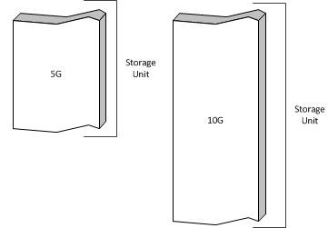
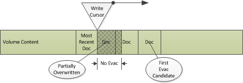
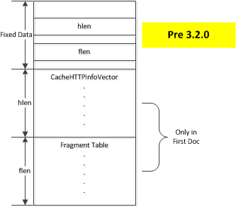
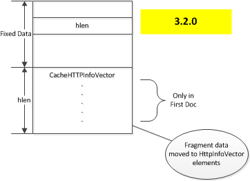

.. Licensed to the Apache Software Foundation (ASF) under one
   or more contributor license agreements.  See the NOTICE file
   distributed with this work for additional information
   regarding copyright ownership.  The ASF licenses this file
   to you under the Apache License, Version 2.0 (the
   "License"); you may not use this file except in compliance
   with the License.  You may obtain a copy of the License at

   http://www.apache.org/licenses/LICENSE-2.0

   Unless required by applicable law or agreed to in writing,
   software distributed under the License is distributed on an
   "AS IS" BASIS, WITHOUT WARRANTIES OR CONDITIONS OF ANY
   KIND, either express or implied.  See the License for the
   specific language governing permissions and limitations
   under the License.

Cache Architecture
******************

.. include:: common.defs

Introduction
~~~~~~~~~~~~

In addition to an HTTP proxy, |ATS| is also an HTTP cache. |TS| can cache any octet stream although it currently supports only those octet streams delivered by the HTTP protocol. When such a stream is cached it is termed an *object* in the cache. The server from which the content was retrieved is called the *origin server*. A stored object contains the octet stream content and the HTTP request and response headers. Each object is identified by a globally unique value called a *cache key*. By default this is generated by taking the `MD5 hash <http://www.openssl.org/docs/crypto/md5.html>`_ of the URI used to retrieve the content from the origin server.

The purpose of this document is to provide implementation details of the |TS| cache. Configuration of the cache will be discussed only to the extent needed to understand the internal mechanisms. This documeint will be useful primarily to |TS| developers working on the |TS| codebase or plugins for |TS|. It is assumed the reader is already familiar with the :ref:`admin-guide` and specifically with :ref:`http-proxy-caching` and :ref:`configuring-the-cache`, along with the associated configuration files and values.

Cache Layout
~~~~~~~~~~~~

The first step in understanding cache operations is to understand the data structures and layout of the cache.

Cache storage
=============

The raw storage for the |TS| cache is configured in :file:`storage.config`. This defines the "storage units" used by the cache. The storage units are treated as undifferentiated byte ranges.

   Example cache storage units

This storage is used by defining *volumes* in :file:`volume.config`. Volumes can be defined by a percentage of the total storage or an absolute amount of storage. Each volume is striped across the storage units so that every volume will be on every storage unit for robustness and performance.

If the volumes for the example storage units were defined as

.. image:: images/ats-cache-volume-definition.png
   :align: center

then the actual layout would look like

.. image:: images/ats-cache-volume-layout.png
   :align: center

A cached object is stored entirely in a single volume and a single storage unit, objects are never split across volumes. The storage that holds a single object is called a *document*. Objects are assigned to volumes automatically based on a hash of the URI used to retrieve the object from the origin server. It is possible to configure this to a limited extent in :file:`hosting.config` which supports content from specific host or domain to be stored on specific volumes.

Volume Structure
================

Volumes are treated as an undifferentiated span of bytes. Internally each stripe on each storage unit is treated almost entirely independently. The data structures described in this section are duplicated for each volume stripe, the part of a volume that resides in a single storage unit. This is how the term "volume" and :cpp:class:`Vol` are used inside the code. What a user thinks of as a volume of the cache is stored in the little used :cpp:class:`CacheVol`.

.. index: write cursor
.. _write-cursor:

Each storage unit in a volume is divided in to two areas -- content and directory. The directory area is used to maintain disk backups of the :ref:`in memory directory <volume-directory>`. The content area stores the actual objects and is used as a circular buffer where new documents overwrite the least recently cached documents. In particular no operating system file structure is present inside a cache volume. The location in a volume where new cache data is written is called the *write cursor*. This means that objects can be de facto evicted from cache even if they have not expired if the data is overwritten by the write cursor.

   The write cursor and documents in the cache.

.. index:: volume directory
.. _volume-directory:

To find objects each volume has a directory of all documents in that volume. This directory is kept memory resident which means cache misses do not cause disk I/O. A side effect of this is that increasing the size of the cache (not storing more objects) increases the memory footprint of Traffic Server. Every document consumes at least one directory entry, although larger documents can require more entries.

.. index:: cache key
.. _cache-key:

The directory is a hash table with a 128 bit key. This kind of key is referred to as a *cache key*. The cache key for an object is used to locate the corresponding directory entry after volume assignment [#]_. This entry in turn references a span in the volume content area which contains the object header and possibly the object as well. The size stored in the directory entry is an :ref:`approximate size <dir-size>` which is at least as big as the actual data on disk. The document header on disk contains metadata for the document including the exact size of the entire document, and the HTTP headers associated with the object.

.. note:: Data in HTTP headers cannot be examined without disk I/O. This includes the original URL for the object, as only the cache key (possibly) derived from it is stored in memory.

For persistence the directory is stored on disk in copies (A and B), one of which is "clean" and the other of which is being written from memory. These are stored in the directory section of the volume.

.. figure:: images/ats-cache-volume-directory.png
   :align: center

   Volume directory structure

The total size of the directory (the number of entries) is computed by taking the size of the volume and dividing by the average object size. The directory always consumes this amount of memory which has the effect that if cache size is increased so is the memory requirement for |TS|. The average object size defaults to 8000 bytes but can be configured using the value::

   proxy.config.cache.min_average_object_size

in :file:`records.config`. Increasing the average object size will reduce the memory footprint of the directory at the expense of reducing the number of distinct objects that can be stored in the cache [#]_.

.. note:: Cache data on disk is never updated.

This is a key thing to keep in mind. What appear to be updates (such as doing a refresh on stale content and getting back a 304) are actually new copies of data being written at the write cursor. The originals are left as "dead" space which will be consumed when the write cursor arrives at that disk location. Once the volume directory is updated (in memory!) the original object in the cache is effectively destroyed. This is the general space management techinque used in other cases as well. If an object needs to removed from cache, only its volume directory entry is changed. No other work (and *particulary* no disk I/O) needs to be done.

.. [#] Because each storage unit in each volume has a separate directory, the assignment must be done before the directory lookup.

.. [#] An interesting potential optimization would be configuring average object size per cache volume.

Object Structure
================

Objects are stored as two types of data, metadata and content data. Metadata is all the data about the object and the content and includes the HTTP headers.  The content data is the content of the object, the actual data delivered to the client as the object.

Objects are rooted in a :cpp:class:Doc structure stored in the cache. This is termed the "first ``Doc``" and always contains the metadata. It is always accessed first for any object. This ``Doc`` is located by doing a lookup of the corresponding cache key in the volume directory which specifies the location and approximate size of the ``Doc``. The ``Doc`` itself has fully accurate size data of both that specific ``Doc`` and the object.

.. index:: alternate

|TS| supports `varying content <http://www.w3.org/Protocols/rfc2616/rfc2616-sec14.html#sec14.44>`_ for objects. These are called *alternates*. All metadata for all alternates is stored in the first ``Doc`` including the set of alternates and the HTTP headers for them. This enables `alternate selection <http://trafficserver.apache.org/docs/trunk/sdk/http-hooks-and-transactions/http-alternate-selection.en.html>`_ to be done after the initial read from disk. An object that has more than one alternate will have the alternate content stored separately from the first ``Doc``. For objects with only one alternate the content may or may not be in the same (first) fragment as the metadata. Each separate alternate content is allocated a volume directory entry and the key for that entry is stored in the first ``Doc`` metadata.

Prior to version 3.2.0 the header data was stored in the :cpp:class:`CacheHTTPInfoVector` class which was marshaled to a variable length area of the on disk image.

   ``Doc`` layout, pre 3.2.0

This had the problem that with only one fragment table it could not be reliable accurate for objects with more than one alternate [#]_. Therefore the fragment data was moved from being a separate variable length section of the metadata to being directly incorporated in to the :cpp:class:`CacheHTTPInfoVector`, yielding a layout of the following form.

   ``Doc`` layout, 3.2.0

Each element in the vector contains for each alternate, in addition to the HTTP headers and the fragment table (if any), a cache key. This cache key identifies a volume directory entry that is referred to as the "earliest ``Doc``". This is the location where the content for the alternate begins.

When the object is first cached, it will have a single alternate and that will be stored (if not too large) in first ``Doc``. This is termed a *resident alternate* in the code. Resident alternates are not liked and the next time the header information is updated the object content will be separated.

.. note:: The :cpp:class:`CacheHTTPInfoVector` is stored only in the first ``Doc``. Subsequent ``Doc`` instances will have an ``hlen`` of zero.

Large objects are split in to *fragments* when written to the cache. Each fragment has its own entry in the volume directory. This is indicated by a total document length that is longer than the content in first ``Doc`` or an earliest ``Doc``. In such a case a fragment offset table is stored. This contains the byte offset in the object content of the first byte of content data for each fragment past the first (as the offset for the first is always zero). This allows range requests to be serviced much more efficiently for large objects, as intermediate fragments can be skipped the first fragment with relevant data loaded next after the first/earliest ``Doc``.  The last fragment in the sequence is detected by the fragment size and offset reaching the end of the total size of the object, there is no explicit end mark. Each fragment is computationally chained from the previous in that the cache key for fragment N is computed by::

   key_for_N_plus_one = next_key(key_for_N);

where ``next_key`` is a global function that deterministically computes a new cache key from an existing cache key.

Objects with multiple fragments are laid out such that the data fragments (including the earliest ``Doc``) are written first and the first ``Doc`` is written last. When read from disk, both the first and earliest ``Doc`` are validated (tested to ensure that they haven't been overwritten by the write cursor) to verify that the entire document is present on disk (as they bookend the other fragments - the write cursor cannot overwrite them without overwriting at leastone of the verified ``Doc`` instances). Note that while the fragments of a single object are ordered they are not necessarily contiguous as data from different objects are interleaved as the data arrives in |TS|.

.. index:: pinned

Documents which are "pinned" into the cache must not be overwritten so they are "evacuated" from in front of the write cursor. Each fragment is read and rewritten. There is a special lookup mechanism for objects that are being evacuated so that they can be found in memory rather than the potentially unreliable disk regions. The cache scans ahead of the write cursor to discover pinned objects as there is a dead zone immediately before the write cursor from which data cannot be evacuated. Evacuated data is read from disk and placed in the write queue and written as its turn comes up.

It appears that objects can only be pinned via the :file:`cache.config` file and if the value::

   proxy.config.cache.permit.pinning

is set to non-zero (it is zero by default). Objects which are in use when the write cursor is near use the same underlying evacuation mechanism but are handled automatically and not via the explicit ``pinned`` bit in :cpp:class:`Dir`.

.. [#] It could, under certain circumstances, be accurate for none of the alternates.

Additional Notes
====================

Some general observations on the data structures.

Cyclone buffer
--------------

Because the cache is a cyclone cache objects are not preserved for an indefinite time. Even if the object is not stale it can be overwritten as the cache cycles through its volume. Marking an object as ``pinned`` preserves the object through the passage of the write cursor but this is done by copying the object across the gap, in effect re-storing it in the cache. Pinning large objects or a large number objects can lead to a excessive disk activity. The original purpose of pinning seems to have been for small, frequently used objects explicitly marked by the administrator.

This means the purpose of expiration data on objects is simply to prevent them from being served to clients. They are not in the standard sense deleted or cleaned up. The space can't be immediately reclaimed in any event because writing only happens at the write cursor. Deleting an object consists only of removing the directory entries in the volume directory which suffices to (eventually) free the space and render the document inaccessible.

Historically the cache is designed this way because web content was relatively small and not particularly consistent. The design also provides high performance and low consistency requirements. There are no fragmentation issues for the storage, and both cache misses and object deletions require no disk I/O. It does not deal particularly well with long term storage of large objects. See the :ref:`volume tagging` appendix for details on some work in this area.

Disk Failure
------------

The cache is designed to be relatively resistant to disk failures. Because each storage unit in each volume is mostly independent the loss of a disk simply means that the corresponding :cpp:class:`Vol` instances (one per cache volume that uses the storage unit) becomes unusable. The primary issue is updating the volume assignment table to both preserve assignments for objects on still operational volumes while distributing the assignments from the failed disk to those operational volumes. This mostly done in::

   AIO_Callback_handler::handle_disk_failure

Restoring a disk to active duty is quite a bit more difficult task. Changing the volume assignment of a cache key renders any currently cached data inaccessible. This is obviouly not a problem when a disk has failed, but is a bit trickier to decide which cached objects are to be de facto evicted if a new storage unit is added to a running system. The mechanism for this, if any, is still under investigation.

Implementation Details
======================

Volume Directory
----------------

.. _directory-entry:

The in memory volume directory entries are defined as described below.

.. cpp:class:: Dir

   Defined in |P-CacheDir.h|_.

   =========== =================== ===================================================
   Name        Type                Use
   =========== =================== ===================================================
   offset      unsigned int:24     Offset of first byte of metadata (volume relative)
   big         unsigned in:2       Offset multiplier
   size        unsigned int:6      Size
   tag         unsigned int:12     Partial key (fast collision check)
   phase       unsigned int:1      Unknown
   head        unsigned int:1      Flag: first segment in a document
   pinned      unsigned int:1      Flag: document is pinned
   token       unsigned int:1      Flag: Unknown
   next        unsigned int:16     Segment local index of next entry.
   offset_high inku16              High order offset bits
   =========== =================== ===================================================

   The volume directory is an array of ``Dir`` instances. Each entry refers to a span in the volume which contains a cached object. Because every object in the cache has at least one directory entry this data has been made as small as possible.

   The offset value is the starting byte of the object in the volume. It is 40 bits long split between the *offset* (lower 24 bits) and *offset_high* (upper 16 bits) members. Note that since there is a directory for every storage unit in a cache volume, this is the offset in to the slice of a storage unit attached to that volume.

.. _dir-size:

   The *size* and *big* values are used to calculate the approximate size of the span which contains the object. This value is used as the number of bytes to read from storage at the offset value. The exact size is contained in the object metadata in :cpp:class:`Doc` which is consulted once the read has completed. For this reason the approximate size needs to be at least as large as the actual size but can be larger, at the cost of reading the extraneous bytes.

   The computation of the approximate size of the fragment is defined as::

      ( *size* + 1 ) * 2 ^ ( ``CACHE_BLOCK_SHIFT`` + 3 * *big* )

   where ``CACHE_BLOCK_SHIFT`` is the bit width of the size of a basic cache block (9, corresponding to a sector size of 512). Therefore the value with current defines is::

      ( *size* + 1 ) * 2 ^ (9 + 3 * *big*)

   Because *big* is 2 bits the values for the multiplier of *size* are

   .. _big-mult:

   ===== ===============   ===============
   *big* Multiplier        Maximum Size
   ===== ===============   ===============
     0   512 (2^9)         32768 (2^15)
     1   4096 (2^12)       262144 (2^18)
     2   32768 (2^15)      2097152 (2^21)
     3   262144 (2^18)     16777216 (2^24)
   ===== ===============   ===============

   Note also that *size* is effectively offset by one, so a value of 0 indicates a single unit of the multiplier.

.. _target-fragment-size:

The target fragment size can set with the :file:`records.config` value

   ``proxy.config.cache.target_fragment_size``

This value should be chosen so that it is a multiple of a :ref:`cache entry multiplier <big-mult>`. It is not necessary to make it a power of 2 [#]_. Larger fragments increase I/O efficiency but lead to more wasted space. The default size (1M, 2^20) is a reasonable choice in most circumstances altough in very specific cases there can be benefit from tuning this parameter. |TS| imposes an internal maximum of a 4194232 bytes which is 4M (2^22) less the size of a struct :cpp:class:`Doc`. In practice then the largest reasonable target fragment size is 4M - 262144 = 3932160.

When a fragment is stored to disk the size data in the cache index entry is set to the finest granularity permitted by the size of the fragment. To determine this consult the :ref:`cache entry multipler <big-mult>` table, find the smallest maximum size that is at least as large as the fragment. That will indicate the value of *big* selected and therefore the granularity of the approximate size. That represents the largest possible amount of wasted disk I/O when the fragment is read from disk.

.. note:: The cache index entry size is used only for reading the fragment from disk. The actual size on disk, and the amount of cache space consumed, is the actual size of the content rounded up to the disk sector size (default 512 bytes).

.. index:: DIR_DEPTH, index segment, index buckets

The set of index entries for a volume are grouped in to *segments*. The number of segments for an index is selected so that there are as few segments as possible such that no segment has more than 2^16 entries.  Intra-segment references can therefore use a 16 bit value to refer to any other entry in the segment.

Index entries in a segment are grouped *buckets* each of ``DIR_DEPTH`` (currently 4) entries. These are handled in the standard hash table way, giving somewhat less than 2^14 buckets per segment.

Object Metadata
---------------

The metadata for an object is stored in a :cpp:class:`Doc`.

.. [#] The comment in :file:`records.config` is simply wrong.

----------------
Cache Operations
----------------

Cache activity starts after the HTTP request header has been parsed and remapped. Tunneled transactions do not interact with the cache because the headers are never parsed.

To understand the logic we must introduce the term "cache valid" which means something that is directly related to an object that is valid to be put in the cache (e.g. a ``DELETE`` which refers to a URL that is cache valid but cannot be cached itself). This is important because |TS| computes cache validity several times during a transaction and only performs cache operations for cache valid results. The criteria used changes during the course of the transaction as well. This is done to avoid the cost of cache activity for objects that cannot be in the cache.

The three basic cache operations are lookup, read, and write. We will take deleting entries as a special case of writing where only the volume directory is updated.

After the client request header is parsed and is determined to be potentially cacheable, a `cache lookup`_ is done. If successful a `cache read`_ is attempted. If either the lookup or the read fails and the content is considered cacheable then a `cache write`_ is attempted.

Cacheability
============

The first thing done with a request with respect to cache is to determine whether it is potentially a valid object for the cache. After initial parsing and remapping this check is done primarily to detect a negative result because if so all further cache processing is skipped -- it will not be put in to the cache nor will a cache lookup be done. There are a number of prerequisites along with configuration options to change them. Additional cacheability checks are done later in the process when more is known about the transaction (such as plugin operations and the origin server response). Those checks are described as appropriate in the sections on the relevant operations.

The set of things which can affect cacheability are

* Built in constraints
* Settings in :file:`records.config`
* Settings in :file:`cache.config`
* Plugin operations

The initial internal checks, along with their :file:`records.config` overrides[#]_, are done in::

   HttpTransact::is_request_cache_lookupable

The checks that are done are

   Cacheable Method
      The request must be one of ``GET``, ``HEAD``, ``POST``, ``DELETE``, ``PUT``.

      See ``HttpTransact::is_method_cache_lookupable()``.

   Dynamic URL
      |TS| tries to avoid caching dynamic content because it's dynamic. A URL is considered dynamic if it

      *  is not ``HTTP`` or ``HTTPS``
      *  has query parameters
      *  ends in ``asp``
      *  has ``cgi`` in the path

      This check can be disabled by setting a non-zero value for::

         proxy.config.http.cache.cache_urls_that_look_dynamic

      In addition if a TTL is set for rule that matches in :file:`cache.config` then this check is not done.

   Range Request
      Cache valid only if :ts:cv:`proxy.config.http.cache.range.lookup` in :file:`records.config` is non-zero. This does not mean the range request can be cached, only that it might be satisfiable from the cache.

A plugin can call :c:func:`TSHttpTxnReqCacheableSet()` to force the request to be viewed as cache valid.

.. [#] The code appears to check :file:`cache.config` in this logic by setting the ``does_config_permit_lookup`` in the ``cache_info.directives`` of the state machine instance but I can find no place where the value is used. The directive ``does_config_permit_storing`` is set and later checked so the directive (from the administrator point of view) is effective in preventing caching of the object.

Cache Lookup
============

If the initial request is not determined to be cache invalid then a lookup is done. Cache lookup determines if an object is in the cache and if so, where it is located. In some cases the lookup proceeds to read the first ``Doc`` from disk to verify the object is still present in the cache.

There are three basic steps to a cache lookup.

#. The cache key is computed.

   This is normally computed using the request URL but it can be overridden :ref:`by a plugin <cache-key>` . As far as I can tell the cache index string is not stored anywhere, it presumed computable from the client request header.

#. The cache volume is determined (based on the cache key).

   The cache key is used as a hash key in to an array of :cpp:class:`Vol` instances. The construction and arrangement of this array is the essence of how volumes are assigned.

#. The cache volume directory is probed using the index key computed from the cache key.

   Various other lookaside directories are checked as well, such as the :ref:`aggregation buffer <aggregation-buffer>`.

#. If the directory entry is found the first ``Doc`` is read from disk and checked for validity.

   This is done in :cpp:func:`CacheVC::openReadStartHead()` or :cpp:func:`CacheVC::openReadStartEarliest()` which are tightly coupled methods.

If the lookup succeeds then a more detailed directory entry (struct :cpp:class:`OpenDir`) is created. Note that the directory probe includes a check for an already extant ``OpenDir`` which if found is returned without additional work.

Cache Read
==========

Cache read starts after a successful `cache lookup`_. At this point the first ``Doc`` has been loaded in to memory and can be consulted for additional information. This will always contain the HTTP headers for all alternates of the object.

.. sidebar:: Read while write

   There is provision in the code to support "read while write", that is serving an object from cache in one transaction while it is being written in another. It is unclear to me if this actually works. It must specifically enabled in :file:`records.config` and if not, a cache read will fail if the object is currently be written or updated.

At this point an alternate for the object is selected. This is done by comparing the client request to the stored response headers, but it can be controlled by a plugin using ``TS_HTTP_ALT_SELECT_HOOK``.

The content can now be checked to see if it is stale by calculating the "freshness" of the object. This is essential checking how old the object is by looking at the headers and possibly other metadata (note the headers can't be checked until we've selected an alternate).

Most of this work is done in::

   HttpTransact::what_is_document_freshness

First the TTL (time to live) value which can be set in:file:`cache.config` is checked if the request matches the configuration file line. This is done based on when the object was placed in cache, not on any data in the headers.

Next an internal flag ("needs-revalidate-once") is checked if the :file:`cache.config` value "revalidate-after" is not set, and if set the object is marked "stale".

After these checks the object age is calculated by::

   HttpTransactHeaders::calculate_document_age

and then any configured fuzzing is applied. The limits to this age based on available data is calculated by::

   HttpTransact::calculate_document_freshness_limit

How this age is used is determined by the :file:`records.config` value::

   proxy.config.http.cache.when_to_revalidate

If this is zero then the built caclulations are used which compare the freshness limits with document age, modified by any of the client supplied cache control values ``max-age``, ``min-fresh``, ``max-stale`` unless explicitly overridden in :file:`cache.config`.

If the object is not stale then it is served to the client. If stale the client request may be changed to an ``If Modified Since`` request to revalidate.

The request is served using a standard virtual connection tunnel (``HttpTunnel``) with the :cpp:class:`CacheVC` acting as the producer and the client ``NetVC`` acting as the sink. If the request is a range request this can be modified with a transform to select the appropriate parts of the object or, if the request contains a single range, it can use the range acceleration.

Range acceleration is done by consulting a fragment offset table attached to the earliest ``Doc`` which contains offsets for all fragments past the first. This allows loading the fragment containing the first requested byte immediately rather than performing reads on the intermediate fragments.

Cache Write
===========

Writing to cache is handled by an instance of the class :cpp:class:`CacheVC`. This is a virtual connection which receives data and writes it to cache, acting as a sink. For a standard transaction data transfers between virtual connections (*VConns*) are handled by :ccp:class:HttpTunnel. Writing to cache is done by attaching a ``CacheVC`` instance as a tunnel consumer. It therefore operates in parallel with the virtual connection that transfers data to the client. The data does not flow to the cache and then to the client, it is split and goes both directions in parallel. This avoids any data synchronization issues between the two.

.. sidebar:: Writing to disk

   The actual write to disk is handled in a separate thread dedicated to I/O operations, the AIO threads. The cache logic marshals the data and then hands the operation off to the AIO thread which signals back once the operation completes.

While each ``CacheVC`` handles its transactions independently, they do interact at the volume level as each ``CacheVC`` makes calls to the volume object to write its data to the volume content. The ``CacheVC`` accumulates data internally until either the transaction is complete or the amount of data to write exceeds the target fragment size. In the former case the entire object is submitted to the volume to be written. In the latter case a target fragment size amount of data is submitted and the ``CacheVC`` continues to operate on subsequent data. The volume in turn places these write requests in an holding area called the `aggregation buffer`_.

For objects under the target fragment size there is no consideration of order, the object is simply written to the volume content. For larger objects the earliest ``Doc`` is written first and the first ``Doc`` written last. This provides some detection ability should the object be overwritten. Because of the nature of the write cursor no fragment after the first fragment (in the earliest ``Doc``) can be overwritten without also overwriting that first fragment (since we know at the time the object was finalized in the cache the write cursor was at the position of the first ``Doc``).

.. note:: It is the responsibility of the ``CacheVC`` to not submit writes that exceed the target fragment size.

.. how does the write logic know if it's an original object write or an update to an existing object?

Update
------

Cache write also covers the case where an existing object in the cache is modified. This occurs when

* A conditional request is made to the origin server and a ``304 - Not Modified`` response is received.
* An alternate of the object is retrieved from an origin server and added to the object.
* An alternate of the object is removed (e.g., due to a ``DELETE`` request).

In every case the metadata for the object must be modified. Because |TS| never updates data already in the cache this means the first ``Doc`` will be written to the cache again and the volume directory entry updated. Because a client request has already been processed the first ``Doc`` has been read from cache and is in memory. The alternate vector is updated as appropriate (an entry added or removed, or changed to contain the new HTTP headers), and then written to disk. It is possible for multiple alternates to be updated by different ``CacheVC`` instances at the same time. The only contention is the first ``Doc``, the rest of the data for each alternate is completely independent.

.. _aggregation-buffer:

Aggregation Buffer
------------------

Disk writes to cache are handled through an *aggregation buffer*. There is one for each :cpp:class:`Vol` instance.
To minimize the number of system calls data is written to disk in units of roughly :ref:`target fragment size <target-fragment-size>` bytes. The algorithm used is simple - data is piled up in the aggregation buffer until no more will fit without going over the targer fragment size, at which point the buffer is written to disk and the volume directory entries for objects with data in the buffer are updated with the actual disk locations for those objects (which are determined by the write to disk action). After the buffer is written it is cleared and process repeats. There is a special lookup table for the aggregation buffer so that object lookup can find cache data in that memory.

Because data in the aggregation buffer is visible to other parts of the cache, particularly `cache lookup`_, there is no need to push a partial filled aggregation buffer to disk. In effect any such data is effectively memory cached until enough additional cache content arrives to fill the buffer.

The target fragment size has little effect on small objects because the fragment sized is used only to parcel out disk write operations. For larger objects the effect very significant as it causes those objects to be broken up in to fragments at different locations on in the volume. Each fragment write has its own entry in the volume directory which are computational chained (each cache key is computed from the previous one). If possible a fragment table is accumulated in the earliest ``Doc`` which has the offsets of the first byte for each fragment.

Evacuation
----------

By default the write cursor will overwrite (de facto evict from cache) objects as it proceeds once it has gone around the volume content at least once. In some cases this is not acceptable and the object is *evacuated* by reading it from the cache and then writing it back to cache which moves the physical storage of the object from in front of the write cursor to behind the write cursor. Objects that are evacuated are those that are active in either a read or write operation, or objects that are pinned [#]_.

Evacuation starts by dividing up the volume content in to a set of regions of ``EVACUATION_BUCKET_SIZE`` bytes. The :cpp:member:`Vol::evacuate` member is an array with an element for each region. Each element is a doubly linked list of :cpp:class:`EvacuationBlock` instances. Each instance contains a :cpp:class:`Dir` that specifies the document to evacuate. Objects to be evacuated are descrinbed in an ``EvacuationBlock`` which is put in to an evacuation bucket based on the offset of the storage location.

There are two types of evacuations, reader based and forced. The ``EvacuationBlock`` has a reader count to track this. If the reader count is zero, then it is a forced evacuation and the the target, if it exists, will be evacuated when the write cursor gets close. If the reader value is non-zero then it is a count of entities that are currently expecting to be able to read the object. Readers increment the count when they require read access to the object, or create the ``EvacuationBlock`` with a count of 1. When a reader is finished with the object it decrements the count and removes the ``EvacuationBlock`` if the count goes to zero. If the ``EvacuationBlock`` already exists with a count of zero, the count is not modified and the number of readers is not tracked, so the evacuation be valid as long as the object exists.

Objects are evacuated as the write cursor approaches. The volume calculates the current amount of

Before doing a write, the method :cpp:func:`Vol::evac_range()` is called to start an evacuation. If an eva

.. [#] `Work is under way <https://issues.apache.org/jira/browse/TS-2020>`_ on extending this to include objects that are in the ram cache.
