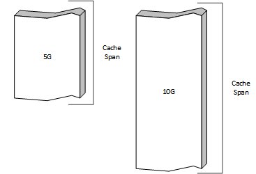
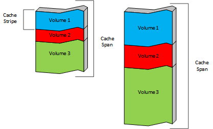
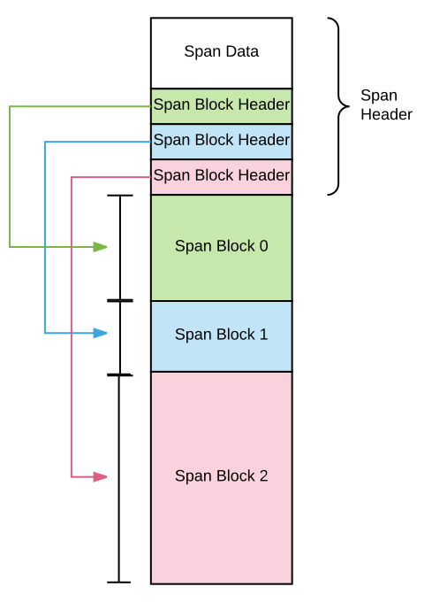
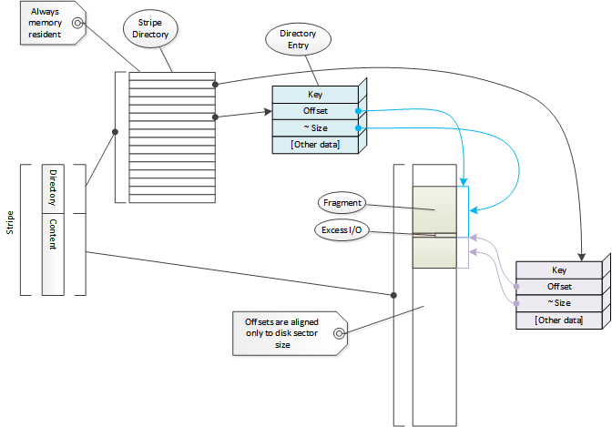
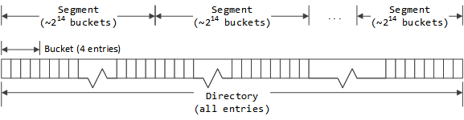
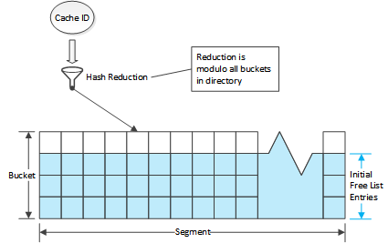
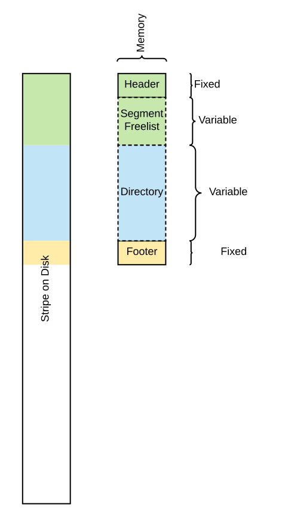
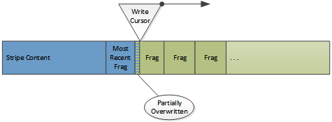
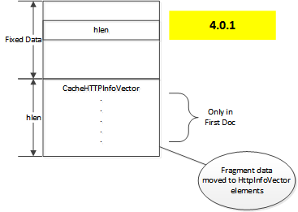

.. Licensed to the Apache Software Foundation (ASF) under one
   or more contributor license agreements.  See the NOTICE file
   distributed with this work for additional information
   regarding copyright ownership.  The ASF licenses this file
   to you under the Apache License, Version 2.0 (the
   "License"); you may not use this file except in compliance
   with the License.  You may obtain a copy of the License at

   http://www.apache.org/licenses/LICENSE-2.0

   Unless required by applicable law or agreed to in writing,
   software distributed under the License is distributed on an
   "AS IS" BASIS, WITHOUT WARRANTIES OR CONDITIONS OF ANY
   KIND, either express or implied.  See the License for the
   specific language governing permissions and limitations
   under the License.

.. include:: ../../common.defs

.. default-domain:: cpp

.. _developer-cache-architecture:

Cache Architecture
******************

Introduction
============

In addition to being an HTTP proxy, |ATS| is also an HTTP cache. |TS| can cache
any octet stream, although it currently supports only those octet streams
delivered by the HTTP protocol. When such a stream is cached (along with the
HTTP protocol headers) it is termed an :term:`object <cache object>` in the
cache. Each object is identified by a globally unique value called a
:term:`cache key`.

The purpose of this document is to describe the basic structure and
implementation details of the |TS| cache. Configuration of the cache will be
discussed only to the extent needed to understand the internal mechanisms. This
document will be useful primarily to |TS| developers working on the |TS|
codebase or plugins for |TS|. It is assumed the reader is already familiar with
the :ref:`admin-guide` and specifically with :ref:`http-proxy-caching` and
:ref:`admin-configuration` along with the associated :ref:`configuration files
<admin-configuration-files>`.

Unfortunately, the internal terminology is not particularly consistent, so this
document will frequently use terms in different ways than they are used in the
code in an attempt to create some consistency.

Cache Layout
============

The following sections describe how persistent cache data is structured. |TS|
treats its persistent storage as an undifferentiated collection of bytes,
assuming no other structure to it. In particular, it does not use the file
system of the host operating system. If a file is used it is used only to mark
out the set of bytes to be used.

Cache storage
-------------

The raw storage for the |TS| cache is configured in :file:`storage.config`. Each
line in the file defines a :term:`cache span` which is treated as a uniform
persistent store.

   Two cache spans

This storage organized into a set of administrative units which are called :term:`cache volumes
<cache volume>`. These are defined in :file:`volume.config`. Cache volumes can be assigned
different properties in :file:`hosting.config`.

Cache volumes can be defined by a percentage of the total storage or as an absolute amount of
storage. By default, each cache volume is spread across all of the cache spans for robustness. The
intersection of a cache volume and a cache span is a :term:`cache stripe`. Each cache span is
divided into cache stripes and each cache volume is a collection of those stripes. Every cache
stripe is in a single cache span and part of a single cache volume.

If the cache volumes for the example cache spans were defined as:

.. figure:: images/ats-cache-volume-definition.png
   :align: center

Then the actual layout would look like:

Cache stripes are the fundamental unit of cache for the implementation. A
cached object is stored entirely in a single stripe, and therefore in a single
cache span. Objects are never split across cache spans or volumes. Objects are
assigned to a stripe (and in turn to a cache volume) automatically based on a
hash of the URI used to retrieve the object from the :term:`origin server`. It
is possible to configure this to a limited extent in :file:`hosting.config`,
which supports content from specific hosts or domain to be stored on specific
cache volumes. As of version 4.0.1 it is also possible to control which cache
spans (and hence, which cache stripes) are contained in a specific cache volume.

The layout and structure of the cache spans, the cache volumes, and the cache
stripes that compose them are derived entirely from :file:`storage.config` and
:file:`cache.config` and is recomputed from scratch when the
:program:`traffic_server` is started. Therefore, any change to those files can
(and almost always will) invalidate the existing cache in its entirety.

Span Structure
--------------

Each cache span is marked at the front with a span header of type :class:`DiskHeader`. Each span is
divided in to *span blocks*. These can be thought of similarly to normal disk partitions, marking
out blocks of storage. Span blocks can v ary in size, subject only to being a multiple of the
*volume block size* which is currently 128MB and, of course, being no larger than the span. The
relationship between a span block and a cache stripe is the same as between a disk partition and a
file system. A cache stripe is structured data contained in a span block and always occupies the
entire span block.

Stripe Structure
----------------

|TS| treats the storage associated with a cache stripe as an undifferentiated
span of bytes. Internally each stripe is treated almost entirely independently.
The data structures described in this section are duplicated for each stripe.

Internally the term *volume* is used for these stripes and implemented primarily
in :cpp:class:`Vol`. What a user thinks of as a volume (and what this document
calls a *cache volume*) is represented by :cpp:class:`CacheVol`.

.. note::

   Stripe assignment must be done before working with an object because the
   directory is local to the stripe. Any cached objects for which the stripe
   assignment is changed are effectively lost as their directory data will not
   be found in the new stripe.

.. index:: cache directory
.. _cache-directory:

Cache Directory
---------------

.. index:: directory entry
.. index:: fragment
.. index:: cache ID

.. _fragment:

Content in a stripe is tracked via a directory. Each element of the directory
is a :term:`directory entry` and is represented by :cpp:class:`Dir`. Each entry
refers to a chunk of contiguous storage in the cache. These are referred to
variously as *fragments*, *segments*, *docs*, *documents*, and a few other
things. This document will use the term *fragment* as that is the most common
reference in the code. The term *Doc* (for :cpp:class:`Doc`) will be used to
refer to the header data for a fragment. Overall, the directory is treated as a
hash with the :term:`cache ID` as the key. See
:ref:`directory probing <cache-directory-probe>` for how the cache ID is used
to locate a directory entry. The cache ID is in turn computed from a
:term:`cache key` which by default is the URL of the content.

The directory is used as a memory resident structure, which means a directory
entry is as small as possible (currently 10 bytes). This forces some
compromises on the data that can be stored there. On the other hand this means
that most cache misses do not require disk I/O, which has a large performance
benefit.

The directory is always fully sized; once a stripe is initialized the directory
size is fixed and never changed. This size is related (roughly linearly) to the
size of the stripe. It is for this reason the memory footprint of |TS| depends
strongly on the size of the disk cache. Because the directory size does not
change, neither does this memory requirement, so |TS| does not consume more
memory as more content is stored in the cache. If there is enough memory to run
|TS| with an empty cache there is enough to run it with a full cache.

Each entry stores an offset in the stripe and a size. The size stored in the
directory entry is an :ref:`approximate size <dir-size>` which is at least as
big as the actual data in the fragment. Exact size data is stored in the
fragment header on disk.

.. note::

   Data in HTTP headers cannot be examined without disk I/O. This includes the
   original URL for the object. The cache key is not stored explicitly and
   therefore cannot be reliably retrieved.

The directory is a hash table that uses `chaining
<http://en.wikibooks.org/wiki/Data_Structures/Hash_Tables#Collision_resolution>`_
for collision resolution. Because each entry is small they are used directly as
the list header of the hash bucket.

.. _dir-segment:
.. _dir-bucket:

Chaining is implemented by imposing grouping structures on the entries in a
directory. The first level grouping is a :term:`directory bucket`. This is a
fixed number (currently 4, defined as ``DIR_DEPTH``) of entries. This serves to
define the basic hash buckets with the first entry in each cache bucket serving
as the root of the hash bucket.

.. note::

   The term *bucket* is used in the code to mean both the conceptual bucket for
   hashing and for a structural grouping mechanism in the directory. These will
   be qualified as needed to distinguish them. The unqualified term *bucket* is
   almost always used to mean the structural grouping in the directory.

Directory buckets are grouped in to :term:`segments <directory segment>`. All
segments in a stripe have the same number of buckets. The number of segments in
a stripe is chosen so that each segment has as many buckets as possible without
exceeding 65,535 (2\ :sup:`16`\ -1) entries in a segment.

Each directory entry has a previous and next index value which is used to link
entries in the same segment. Because no segment has more than 65,535 entries,
16 bits suffices for storing the index values. The stripe header contains an
array of entry indices which are used as the roots of entry free lists, one for
each segment. Active entries are stored via the bucket structure. When a stripe
is initialized the first entry in each bucket is zeroed (marked unused) and all
other entries are put in the corresponding segment free list in the stripe
header. This means the first entry of each :term:`directory bucket` is used as
the root of a hash bucket and is therefore marked unused rather than being put
a free list. The other entries in the directory bucket are preferred for adding
to the corresponding hash bucket but this is not required. The segment free
lists are initialized such that the extra bucket entries are added in order;
all the seconds, then the thirds, then the fourths. Because the free lists are
FIFOs, this means extra entries will be selected from the fourth entries across
all the buckets first, then the thirds, etc. When allocating a new directory
entry in a bucket the entries are searched from first to last, which maximizes
bucket locality (that is, :term:`cache IDs <cache ID>` that map to the same
hash bucket will also tend to use the same directory bucket).

Entries are removed from the free list when used and returned when no longer in
use. When a :term:`fragment <cache fragment>` needs to be put in to the
directory the cache ID is used to locate a hash bucket (which also determines
the segment and directory bucket). If the first entry in the directory bucket
is marked unused, it is used. Otherwise, the other entries in the bucket are
searched and if any are on the free list, that entry is used. If none are
available then the first entry on the segment free list is used. This entry is
attached to the hash bucket via the same next and previous indices used for the
free list so that it can be found when doing a lookup of a cache ID.

Storage Layout
--------------

The storage layout is the stripe metadata followed by cached content. The
metadata consists of three parts: the stripe header, the directory, and the
stripe footer. The metadata is stored twice. The header and the footer are
instances of :cpp:class:`VolHeaderFooter`. This is a stub structure which can
have a trailing variable sized array. This array is used as the segment free
list roots in the directory. Each contains the segment index of the first
element of the free list for the segment. The footer is a copy of the header
without the segment free lists. This makes the size of the header dependent on
the directory but not that of the footer.

.. figure:: images/cache-stripe-layout.png
   :align: center

Each stripe has several values that describe its basic layout:

skip
   The start of stripe data. This represents either space reserved at the start
   of a physical device to avoid problems with the host operating system, or an
   offset representing use of space in the cache span by other stripes.

start
   The offset for the start of the content, after the stripe metadata.

length
   Total number of bytes in the stripe. :cpp:member:`Vol::len`.

data length
   Total number of blocks in the stripe available for content storage.
   :cpp:member:`Vol::data_blocks`.

.. note::

   Great care must be taken with sizes and lengths in the cache code because
   there are at least three different metrics (bytes, cache blocks, store
   blocks) used in various places.

The header for a stripe is a variably sized instance of :class:`VolHeaderFooter`.
The variable trailing section contains the head indices of the directory entry
free lists for the segments.

The trailing :member:`VolHeaderFooter::freelist` array overlays the disk storage with
an entry for every segment, even though the array is declared to have length `1`.
Each free list entry is a 16 bit value that is the index of the first directory entry
in the free list for that segment. E.g. :code:`freelist[4]` is the index of the
directory entry in segment `4` that is the first directory entry in the free list for
segment `4`. The rest of the free list is chained from that directory entry.

The segment freelist is attached only to the header - the trailer, although of the same class, does
not have a freelist and is always a fixed size.

The total size of the directory (the number of :term:`entries <directory entry>`)
is computed by taking the size of the :term:`cache stripe` and dividing by the
average object size. The directory always consumes this amount of memory which
has the effect that if cache size is increased so is the memory requirement for
|TS|. The average object size defaults to 8000 bytes but can be configured using
:ts:cv:`proxy.config.cache.min_average_object_size`. Increasing the average
object size will reduce the memory footprint of the directory at the expense of
reducing the number of distinct objects that can be stored in the cache.

.. index: write cursor
.. _write-cursor:

The content area stores the actual objects and is used as a circular buffer
where new objects overwrite the least recently cached objects. The location in
a stripe where new cache data is written is called the *write cursor*. This
means that objects can be de facto evicted from cache even if they have not
expired if the data is overwritten by the write cursor. If an object is
overwritten this is not detected at that time and the directory is not updated.
Instead it will be noted if the object is accessed in the future and the disk
read of the fragment fails.

   The write cursor and documents in the cache.

.. note:: Cache data on disk is never updated.

This is a key thing to keep in mind. What appear to be updates (such as doing a
refresh on :term:`stale` content and getting back a 304) are actually new
copies of data being written at the write cursor. The originals are left as
"dead" space which will be consumed when the write cursor arrives at that disk
location. Once the stripe directory is updated (in memory) the original
fragment in the cache is effectively destroyed. This is the general space
management technique used in other cases as well. If an object needs to removed
from cache, only the directory needs to be changed. No other work (and
particularly, no disk I/O) needs to be done.

Object Structure
----------------

Objects are stored as two types of data: metadata and content data. Metadata is
all the data about the object and the content and includes the HTTP headers.
The content data is the content of the object, the octet stream delivered to
the client as the object.

Objects are rooted in a :cpp:class:`Doc` structure stored in the cache.
:cpp:class:`Doc` serves as the header data for a :term:`cache fragment` and is
contained at the start of every fragment. The first fragment for an object is
termed the *First Doc* and always contains the object metadata. Any
operation on the object will read this fragment first. The fragment is located
by converting the :term:`cache key` for the object to a :term:`cache ID` and
then doing a lookup for a :term:`directory entry` with that key. The directory
entry has the offset and approximate size of the first fragment which is then
read from the disk. This fragment will contain the request header and response
along with overall object properties (such as content length).

.. index:: alternate

|TS| supports `varying content <http://www.w3.org/Protocols/rfc2616/rfc2616-sec14.html#sec14.44>`_
for objects. These are called :term:`alternates <alternate>`. All metadata for
all alternates is stored in the first fragment including the set of alternates
and the HTTP headers for them. This enables :doc:`"alternate selection" <../plugins/hooks-and-transactions/http-alternate-selection.en>`
to be done after the *first Doc* is read from disk. An object that has more than
one alternate will have the alternate content stored separately from the first
fragment. For objects with only one alternate the content may or may not be in
the same (first) fragment as the metadata. Each separate alternate content is
allocated a directory entry and the key for that entry is stored in the first
fragment metadata.

Prior to version 4.0.1, the header data was stored in the
:cpp:class:`CacheHTTPInfoVector` class which was marshaled to a variable length
area of the on disk image, followed by information about additional fragments
if needed to store the object.

.. figure:: images/cache-doc-layout-3-2-0.png
   :align: center

   ``Doc`` layout 3.2.0

This had the problem that with only one fragment table it could not be reliable
for objects with more than one alternate[#multiple-alternates]_. Therefore, the
fragment data was moved from being a separate variable length section of the
metadata to being directly incorporated in to the :cpp:class:`CacheHTTPInfoVector`,
yielding a layout of the following form.

   ``Doc`` layout 4.0.1

Each element in the vector contains for each alternate, in addition to the HTTP
headers and the fragment table (if any), a :term:`cache key`. This cache key
identifies a :term:`directory entry` that is referred to as the *earliest Doc*.
This is the location where the content for the alternate begins.

When the object is first cached, it will have a single alternate and that will
be stored (if not too large) in first ``Doc``. This is termed a *resident alternate*
in the code. This can only happen on the initial store of the object. If the
metadata is updated (such as a ``304`` response to an ``If-Modified-Since``
request) then unless the object is small, the object data will be left in the
original fragment and a new fragment written as the first fragment, making the
alternate non-resident. *Small* is defined as a length smaller than
:ts:cv:`proxy.config.cache.alt_rewrite_max_size`.

.. note::

   The :cpp:class:`CacheHTTPInfoVector` is stored only in the first ``Doc``.
   Subsequent ``Doc`` instances for the object, including the earliest ``Doc``,
   should have an ``hlen`` of zero and if not, it is ignored.

Large objects are split in to multiple fragments when written to the cache. This
is indicated by a total document length that is longer than the content in
first ``Doc`` or an earliest ``Doc``. In such a case a fragment offset table is
stored. This contains the byte offset in the object content of the first byte
of content data for each fragment past the first (as the offset for the first
is always zero). This allows range requests to be serviced much more
efficiently for large objects, as intermediate fragments that do not contain
data in the range can be skipped. The last fragment in the sequence is detected
by the fragment size and offset reaching the end of the total size of the
object, there is no explicit end mark. Each fragment is computationally chained
from the previous in that the cache key for fragment N is computed by::

   key_for_N_plus_one = next_key(key_for_N);

Where ``next_key`` is a global function that deterministically computes a new
cache key from an existing cache key.

Objects with multiple fragments are laid out such that the data fragments
(including the earliest ``Doc``) are written first and the first ``Doc`` is
written last. When read from disk, both the first and earliest ``Doc`` are
validated (tested to ensure that they haven't been overwritten by the write
cursor) to verify that the entire document is present on disk (as they bookend
the other fragments - the write cursor cannot overwrite them without overwriting
at least one of the verified ``Doc`` instances). Note that while the fragments
of a single object are ordered they are not necessarily contiguous, as data from
different objects are interleaved as the data arrives in |TS|.

.. figure:: images/cache-multi-fragment.png
   :align: center

   Multi-alternate and multi-fragment object storage

.. index:: pinned

Documents which are pinned into the cache must not be overwritten so they are
evacuated from in front of the write cursor. Each fragment is read and
rewritten. There is a special lookup mechanism for objects that are being
evacuated so that they can be found in memory rather than the potentially
unreliable disk regions. The cache scans ahead of the write cursor to discover
pinned objects as there is a dead zone immediately before the write cursor from
which data cannot be evacuated. Evacuated data is read from disk and placed in
the write queue and written as its turn comes up.

Objects can only be pinned via :file:`cache.config` and while
:ts:cv:`proxy.config.cache.permit.pinning` is set to non-zero (it is zero by
default). Objects which are in use when the write cursor is near use the same
underlying evacuation mechanism but are handled automatically and not via the
explicit ``pinned`` bit in :cpp:class:`Dir`.

Additional Notes
----------------

Some general observations on the data structures.

Cyclone buffer
--------------

Because the cache is a *cyclone cache*, objects are not preserved for an
indefinite time. Even if the object is not :term:`stale` it can be overwritten
as the cache cycles through its volume. Marking an object as *pinned* preserves
the object through the passage of the write cursor but this is done by copying
the object across the gap, in effect re-storing it in the cache. Pinning large
objects or a large number objects can lead to excessive disk activity. The
original purpose of pinning was for small, frequently used objects explicitly
marked by the administrator.

This means the purpose of expiration data on objects is simply to prevent them
from being served to clients. They are not in the standard sense deleted or
cleaned up. The space can't be immediately reclaimed in any event, because
writing only happens at the write cursor. Deleting an object consists only of
removing the directory entries in the volume directory which suffices to
(eventually) free the space and render the document inaccessible.

Historically, the cache was designed this way because web content was relatively
small and not particularly consistent. The design also provided high performance
and low consistency requirements. There are no fragmentation issues for the
storage, and both cache misses and object deletions require no disk I/O. It does
not deal particularly well with long term storage of large objects. See the
:ref:`volume tagging` appendix for details on some work in this area.

Disk Failure
------------

The cache is designed to be relatively resistant to disk failures. Because each
:term:`storage unit` in each :term:`cache volume` is mostly independent, the
loss of a disk simply means that the corresponding :cpp:class:`Vol` instances
(one per cache volume that uses the storage unit) becomes unusable. The primary
issue is updating the volume assignment table to both preserve assignments for
objects on still operational volumes while distributing the assignments from the
failed disk to those operational volumes. This mostly done in::

   AIO_Callback_handler::handle_disk_failure

Restoring a disk to active duty is a more difficult task. Changing the volume
assignment of a :term:`cache key` renders any currently cached data
inaccessible. This is not a problem when a disk has failed, but is a bit
trickier to decide which cached objects are to be de facto evicted if a new
storage unit is added to a running system. The mechanism for this, if any, is
still under investigation.

Implementation Details
-------------------------

Stripe Directory
----------------

.. _directory-entry:

The in memory volume directory entries are described below.

.. cpp:class:: Dir

   Defined in :ts:git:`iocore/cache/P_CacheDir.h`.

   =========== =================== ===================================================
   Name        Type                Use
   =========== =================== ===================================================
   offset      unsigned int:24     Offset of first byte of metadata (volume relative)
   big         unsigned in:2       Size multiplier
   size        unsigned int:6      Size
   tag         unsigned int:12     Partial key (fast collision check)
   phase       unsigned int:1      Phase of the ``Doc`` (for dir valid check)
   head        unsigned int:1      Flag: first fragment in an object
   pinned      unsigned int:1      Flag: document is pinned
   token       unsigned int:1      Flag: Unknown
   next        unsigned int:16     Segment local index of next entry.
   offset_high unsigned int:16     High order offset bits
   =========== =================== ===================================================

The stripe directory is an array of ``Dir`` instances. Each entry refers to
a span in the volume which contains a cached object. Because every object in
the cache has at least one directory entry this data has been made as small
as possible.

The offset value is the starting byte of the object in the volume. It is 40
bits long, split between the *offset* (lower 24 bits) and *offset_high*
(upper 16 bits) members. Note that since there is a directory for every
storage unit in a cache volume, this is the offset in to the slice of a
storage unit attached to that volume.

.. _dir-size:

The *size* and *big* values are used to calculate the approximate size of
the fragment which contains the object. This value is used as the number of
bytes to read from storage at the offset value. The exact size is contained
in the object metadata in :cpp:class:`Doc` which is consulted once the read
has completed. For this reason, the approximate size needs to be at least as
large as the actual size but can be larger, at the cost of reading the
extraneous bytes.

The computation of the approximate size of the fragment is defined as::

  ( *size* + 1 ) * 2 ^ ( CACHE_BLOCK_SHIFT + 3 * *big* )

Where ``CACHE_BLOCK_SHIFT`` is the bit width of the size of a basic cache
block (9, corresponding to a sector size of 512). Therefore the value with
current defines is::

  ( *size* + 1 ) * 2 ^ (9 + 3 * *big*)

.. _big-mult:

Because *big* is 2 bits, the values for the multiplier of *size* are:

   ===== =============== ========================
   *big* Multiplier      Maximum Size
   ===== =============== ========================
   0     512 (2^9)       32768 (2^15)
   1     4096 (2^12)     262144 (2^18)
   2     32768 (2^15)    2097152 (2^21)
   3     262144 (2^18)   16777216 (2^24)
   ===== =============== ========================

Note also that *size* is effectively offset by one, so a value of 0 indicates
a single unit of the multiplier.

.. _target-fragment-size:

The target fragment size can set with the :file:`records.config` value
:ts:cv:`proxy.config.cache.target_fragment_size`.

This value should be chosen so that it is a multiple of a
:ref:`cache entry multiplier <big-mult>`. It is not necessary to make it a
power of two [#cache-mult-value]_. Larger fragments increase I/O efficiency but
lead to more wasted space. The default size (1M, 2^20) is a reasonable choice
in most circumstances, although in very specific cases there can be benefit from
tuning this parameter. |TS| imposes an internal maximum of a 4,194,232 bytes,
which is 4M (2^22), less the size of a struct :cpp:class:`Doc`. In practice,
the largest reasonable target fragment size is 4M - 262,144 = 3,932,160.

When a fragment is stored to disk, the size data in the cache index entry is
set to the finest granularity permitted by the size of the fragment. To
determine this, consult the :ref:`cache entry multiplier <big-mult>` table and
find the smallest maximum size that is at least as large as the fragment. That
will indicate the value of *big* selected and therefore the granularity of the
approximate size. That represents the largest possible amount of wasted disk I/O
when the fragment is read from disk.

.. index:: DIR_DEPTH, index segment, index buckets

The set of index entries for a volume are grouped in to :term:`segments <directory segment>`.
The number of segments for an index is selected so that there are as few
segments as possible such that no segment has more than 2^16 entries.
Intra-segment references can therefore use a 16 bit value to refer to any other
entry in the segment.

Index entries in a segment are grouped :term:`buckets <directory bucket>`, each
of ``DIR_DEPTH`` (currently 4) entries. These are handled in the standard hash
table manner, giving somewhat less than 2^14 buckets per segment.

.. _cache-directory-probe:

Directory Probing
-----------------

Directory probing is the locating of a specific :term:`directory entry` in the
stripe directory based on a :term:`cache ID`. This is handled primarily by the
function :cpp:func:`dir_probe()`. This is passed the cache ID (:arg:`key`), a
stripe (:arg:`d`), and a last collision (:arg:`last_collision`). The last of
these is an in and out parameter, updated as useful during the probe.

Given an ID, the top half (64 bits) is used as a :ref:`segment <dir-segment>`
index, taken modulo the number of segments in the directory. The bottom half is
used as a :ref:`bucket <dir-bucket>` index, taken modulo the number of buckets
per segment. The :arg:`last_collision` value is used to mark the last matching
entry returned by :cpp:func:`dir_probe`.

After computing the appropriate bucket, the entries in that bucket are searched
to find a match. In this case a match is detected by comparison of the bottom
12 bits of the :term:`cache ID` (the *cache tag*). The search starts at the base
entry for the bucket and then proceeds via the linked list of entries from that
first entry. If a tag match is found and there is no :arg:`collision` then that
entry is returned and :arg:`last_collision` is updated to that entry. If
:arg:`collision` is set and if it isn't the current match, the search continues
down the linked list, otherwise :arg:`collision` is cleared and the search
continues.

The effect of this is that matches are skipped until the last returned match
(:arg:`last_collision`) is found, after which the next match (if any) is
returned. If the search falls off the end of the linked list, then a miss result
is returned (if no last collision), otherwise the probe is restarted after
clearing the collision on the presumption that the entry for the collision has
been removed from the bucket. This can lead to repeats among the returned
values but guarantees that no valid entry will be skipped.

Last collision can therefore be used to restart a probe at a later time. This
is important because the match returned may not be the actual object. Although
the hashing of the :term:`cache ID` to a :term:`bucket <directory bucket>` and
the tag matching is unlikely to create false positives, it is possible. When a
fragment is read the full cache ID is available and checked and if wrong, that
read can be discarded and the next possible match from the directory found
because the cache virtual connection tracks the last collision value.

----------------
Cache Operations
----------------

Cache activity starts after the HTTP request header has been parsed and
remapped. Tunneled transactions do not interact with the cache because the
headers are never parsed.

To understand the logic we must introduce the term *cache valid* which means
something that is directly related to an object that is valid to be put in the
cache (e.g. a ``DELETE`` which refers to a URL that is cache valid but cannot
be cached itself). This is important because |TS| computes cache validity
several times during a transaction and only performs cache operations for cache
valid results. The criteria used changes during the course of the transaction
as well. This is done to avoid the cost of cache activity for objects that
cannot be in the cache.

The three basic cache operations are: lookup, read, and write. We will take
deleting entries as a special case of writing where only the volume directory
is updated.

After the client request header is parsed and is determined to be potentially
cacheable, a `cache lookup`_ is done. If successful, a `cache read`_ is
attempted. If either the lookup or the read fails and the content is considered
cacheable then a `cache write`_ is attempted.

Cacheability
-------------------------

The first thing done with a request with respect to cache is to determine
whether it is potentially a valid object for the cache. After initial parsing
and remapping, this check is done primarily to detect a negative result, as it
allows further cache processing to be skipped. It will not be put in to the
cache, nor will a cache lookup be performed. There are a number of prerequisites
along with configuration options to change them. Additional cacheability checks
are done later in the process, when more is known about the transaction (such
as plugin operations and the origin server response). Those checks are described
as appropriate in the sections on the relevant operations.

The set of things which can affect cacheability are:

* Built in constraints.
* Settings in :file:`records.config`.
* Settings in :file:`cache.config`.
* Plugin operations.

The initial internal checks, along with their :file:`records.config`
overrides[#cacheability-overrides]_, are done in ``HttpTransact::is_request_cache_lookupable``.

The checks that are done are:

   Cacheable Method
      The request must be one of ``GET``, ``HEAD``, ``POST``, ``DELETE``, ``PUT``.

      See ``HttpTransact::is_method_cache_lookupable()``.

   Dynamic URL
      |TS| tries to avoid caching dynamic content because it's dynamic. A URL is
      considered dynamic if:

      *  It is not ``HTTP`` or ``HTTPS``,
      *  Has query parameters,
      *  Ends in ``asp``,
      *  Has ``cgi`` in the path.

      This check can be disabled by setting a non-zero value for
      :ts:cv:`proxy.config.http.cache.cache_urls_that_look_dynamic`.

      In addition if a TTL is set for rule that matches in :file:`cache.config`
      then this check is not done.

   Range Request
      Cache valid only if :ts:cv:`proxy.config.http.cache.range.lookup` in
      :file:`records.config` is non-zero. This does not mean the range request
      can be cached, only that it might be satisfiable from the cache. In
      addition, :ts:cv:`proxy.config.http.cache.range.write`
      can be set to try to force a write on a range request. This
      probably has little value at the moment, but if for example the
      origin server ignores the ``Range:`` header, this option can allow
      for the response to be cached. It is disabled by default, for
      best performance.

A plugin can call :c:func:`TSHttpTxnReqCacheableSet()` to force the request to
be viewed as cache valid.

.. _cache-lookup:

Cache Lookup
-------------------------

If the initial request is not determined to be cache invalid then a lookup is
done. Cache lookup determines if an object is in the cache and if so, where it
is located. In some cases the lookup proceeds to read the first ``Doc`` from
disk to verify the object is still present in the cache.

The basic steps to a cache lookup are:

#. The cache key is computed.

   This is normally computed using the request URL but it can be overridden
   :ref:`by a plugin <cache-key>` . The cache index string is not stored, as it
   is presumed computable from the client request headers.

#. The cache stripe is determined (based on the cache key).

   The :term:`cache key` is used as a hash key in to an array of :cpp:class:`Vol` instances by
   :func:`Cache::key_to_vol`. The construction and arrangement of this array is the essence of how
   volumes are assigned.

#. The cache stripe directory :ref:`is probed <cache-directory-probe>` using the
   index key computed from the cache key.

   Various other lookaside directories are checked as well, such as the
   :ref:`aggregation buffer <aggregation-buffer>`.

#. If the directory entry is found the first ``Doc`` is read from disk and
   checked for validity.

   This is done in :cpp:func:`CacheVC::openReadStartHead()` or
   :cpp:func:`CacheVC::openReadStartEarliest()` which are tightly coupled
   methods.

If the lookup succeeds, then a more detailed directory entry (struct
:cpp:class:`OpenDir`) is created. Note that the directory probe includes a check
for an already extant ``OpenDir`` which, if found, is returned without
additional work.

Cache Read
-------------------------

Cache read starts after a successful `cache lookup`_. At this point the first
``Doc`` has been loaded in to memory and can be consulted for additional
information. This will always contain the HTTP headers for all
:term:`alternates <alternate>` of the object.

.. sidebar:: Read while write

   There is provision in the code to support *read while write*, that is,
   serving an object from cache in one transaction while it is being written in
   another. Several settings are needed for it to be used. See
   :ref:`admin-configuration-reducing-origin-requests`. It must
   specifically enabled in :file:`records.config` and if not, a cache read will
   fail if the object is currently be written or updated.

At this point an alternate for the object is selected. This is done by comparing
the client request to the stored response headers, but it can be controlled by a
plugin using ``TS_HTTP_ALT_SELECT_HOOK``.

The content can now be checked to see if it is :term:`stale` by calculating the
*freshness* of the object. This is essentially checking how old the object is
by looking at the headers and possibly other metadata (note that the headers
can't be checked until we've selected an alternate).

Most of this work is done in ``HttpTransact::what_is_document_freshness``.

First, the TTL (time to live) value, which can be set in :file:`cache.config`,
is checked if the request matches the configuration file line. This is done
based on when the object was placed in the cache, not on any data in the
headers.

Next, an internal flag (``needs-revalidate-once``) is checked if the
:file:`cache.config` value ``revalidate-after`` is not set, and if set the
object is marked *stale*.

After these checks the object age is calculated by ``HttpTransactHeaders::calculate_document_age``.
and then any configured fuzzing is applied. The limits to this age based on
available data is calculated by ``HttpTransact::calculate_document_freshness_limit``.

How this age is used is determined by the :file:`records.config` setting for
:ts:cv:`proxy.config.http.cache.when_to_revalidate`. If this is ``0`` then the
built calculations are used which compare the freshness limits with document
age, modified by any of the client supplied cache control values (``max-age``,
``min-fresh``, ``max-stale``) unless explicitly overridden in
:file:`cache.config`.

If the object is not stale then it is served to the client. If it is stale, the
client request may be changed to an ``If Modified Since`` request to
:term:`revalidate <revalidation>`.

The request is served using a standard virtual connection tunnel (``HttpTunnel``)
with the :cpp:class:`CacheVC` acting as the producer and the client ``NetVC``
acting as the sink. If the request is a range request this can be modified with
a transform to select the appropriate parts of the object or, if the request
contains a single range, it can use the range acceleration.

Range acceleration is done by consulting a fragment offset table attached to
the earliest ``Doc`` which contains offsets for all fragments past the first.
This allows loading the fragment containing the first requested byte immediately
rather than performing reads on the intermediate fragments.

Cache Write
-------------------------

Writing to the cache is handled by an instance of the class :cpp:class:`CacheVC`.
This is a virtual connection which receives data and writes it to cache, acting
as a sink. For a standard transaction data transfers between virtual connections
(*VConns*) are handled by :cpp:class:`HttpTunnel`. Writing to the cache is done
by attaching a ``CacheVC`` instance as a tunnel consumer. It therefore operates
in parallel with the virtual connection that transfers data to the client. The
data does not flow to the cache and then to the client, it is split and goes
both directions in parallel. This avoids any data synchronization issues between
the two.

.. sidebar:: Writing to disk

   The actual write to disk is handled in a separate thread dedicated to I/O
   operations, the AIO threads. The cache logic marshals the data and then hands
   the operation off to the AIO thread which signals back once the operation
   completes.

While each ``CacheVC`` handles its transactions independently, they do interact
at the :term:`volume <cache volume>` level as each ``CacheVC`` makes calls to
the volume object to write its data to the volume content. The ``CacheVC``
accumulates data internally until either the transaction is complete or the
amount of data to write exceeds the target fragment size. In the former
case the entire object is submitted to the volume to be written. In the latter
case, a target fragment size amount of data is submitted and the ``CacheVC``
continues to operate on subsequent data. The volume in turn places these write
requests in an holding area called the `aggregation buffer`_.

For objects under the target fragment size, there is no consideration of order,
the object is simply written to the volume content. For larger objects, the
earliest ``Doc`` is written first and the first ``Doc`` written last. This
provides some detection ability should the object be overwritten. Because of
the nature of the write cursor no fragment after the first fragment (in the
earliest ``Doc``) can be overwritten without also overwriting that first
fragment (since we know at the time the object was finalized in the cache the
write cursor was at the position of the first ``Doc``).

.. note::

   It is the responsibility of the ``CacheVC`` to not submit writes that exceed
   the target fragment size.

.. XXX how does the write logic know if it's an original object write or an update to an existing object?

Update
------

Cache write also covers the case where an existing object in the cache is
modified. This occurs when:

* A conditional request is made to the origin server and a ``304 - Not Modified``
  response is received.

* An alternate of the object is retrieved from an :term:`origin server` and
  added to the object.

* An alternate of the object is removed (e.g., due to a ``DELETE`` request).

In every case the metadata for the object must be modified. Because |TS| never
updates data already in the cache this means the first ``Doc`` will be written
to the cache again and the volume directory entry updated. Because a client
request has already been processed the first ``Doc`` has been read from cache
and is in memory. The alternate vector is updated as appropriate (an entry
added or removed, or changed to contain the new HTTP headers), and then written
to disk. It is possible for multiple alternates to be updated by different
``CacheVC`` instances at the same time. The only contention is the first
``Doc``; the rest of the data for each alternate is completely independent.

.. _aggregation-buffer:

Aggregation Buffer
------------------

Disk writes to cache are handled through an *aggregation buffer*. There is one
for each :cpp:class:`Vol` instance. To minimize the number of system calls data
is written to disk in units of roughly :ref:`target fragment size <target-fragment-size>`
bytes. The algorithm used is simple: data is piled up in the aggregation buffer
until no more will fit without going over the target fragment size, at which
point the buffer is written to disk and the volume directory entries for objects
with data in the buffer are updated with the actual disk locations for those
objects (which are determined by the write to disk action). After the buffer is
written it is cleared and process repeats. There is a special lookup table for
the aggregation buffer so that object lookup can find cache data in that memory.

Because data in the aggregation buffer is visible to other parts of the cache,
particularly `cache lookup`_, there is no need to push a partially filled
aggregation buffer to disk. In effect, any such data is memory cached until
enough additional cache content arrives to fill the buffer.

The target fragment size has little effect on small objects because the fragment
size is used only to parcel out disk write operations. For larger objects the
effect very significant as it causes those objects to be broken up in to
fragments at different locations on in the volume. Each fragment write has its
own entry in the volume directory which are computationally chained (each
:term:`cache key` is computed from the previous one). If possible, a fragment
table is accumulated in the earliest ``Doc`` which has the offsets of the first
byte for each fragment.

.. _evacuation-mechanics:

Evacuation Mechanics
--------------------

By default, the write cursor will overwrite (de facto evict from cache) objects
as it proceeds once it has gone around the :term:`cache stripe` at least once.
In some cases this is not acceptable and the object is *evacuated* by reading
it from the cache and then writing it back to cache which moves the physical
storage of the object from in front of the write cursor to behind the write
cursor. Objects that are evacuated are handled in this way based on data in
stripe data structures (attached to the :cpp:class:`Vol` instance).

Evacuation data structures are defined by dividing up the volume content into
a disjoint and contiguous set of regions of ``EVACUATION_BUCKET_SIZE`` bytes.
The :cpp:member:`Vol::evacuate` member is an array with an element for each
evacuation region. Each element is a doubly linked list of :cpp:class:`EvacuationBlock`
instances. Each instance contains a :cpp:class:`Dir` that specifies the fragment
to evacuate. It is assumed that an evacuation block is placed in the evacuation
bucket (array element) that corresponds to the evacuation region in which the
fragment is located although no ordering per bucket is enforced in the linked
list (this sorting is handled during evacuation). Objects are evacuated by
specifying the first or earliest fragment in the evacuation block. The
evacuation operation will then continue the evacuation for subsequent fragments
in the object by adding those fragments in evacuation blocks. Note that the
actual evacuation of those fragments is delayed until the write cursor reaches
the fragments, it is not necessarily done at the time the earliest fragment is
evacuated.

There are two types of evacuations: *reader based* and *forced*. The
``EvacuationBlock`` has a reader count to track this. If the reader count is
zero, then it is a forced evacuation and the the target, if it exists, will be
evacuated when the write cursor gets close. If the reader value is non-zero
then it is a count of entities that are currently expecting to be able to read
the object. Readers increment the count when they require read access to the
object, or create the ``EvacuationBlock`` with a count of 1. When a reader is
finished with the object it decrements the count and removes the ``EvacuationBlock``
if the count goes to zero. If the ``EvacuationBlock`` already exists with a
count of zero, the count is not modified and the number of readers is not
tracked, so the evacuation is valid as long as the object exists.

Evacuation is driven by cache writes, essentially in :cpp:member:`Vol::aggWrite`.
This method processes the pending cache virtual connections that are trying to
write to the stripe. Some of these may be evacuation virtual connections. If so
then the completion callback for that virtual connection is called as the data
is put in to the aggregation buffer.

When no more cache virtual connections can be processed (due to an empty queue
or the aggregation buffer filling) then :cpp:member:`Vol::evac_range` is called
to clear the range to be overwritten plus an additional :c:macro:`EVACUATION_SIZE`
range. The buckets covering that range are checked. If there are any items in
the buckets a new cache virtual connection (a *doc evacuator*) is created and
used to read the evacuation item closest to the write cursor (i.e. with the
smallest offset in the stripe) instead of the aggregation write proceeding. When
the read completes it is checked for validity and if valid, the cache virtual
connection for it is placed at the front of the write queue for the stripe and
the write aggregation resumed.

Before doing a write, the method :cpp:member:`Vol::evac_range()` is called to
start an evacuation. If any fragments are found in the buckets in the range the
earliest such fragment (smallest offset, closest to the write cursor) is
selected and read from disk and the aggregation buffer write is suspended. The
read is done via a cache virtual connection which also effectively serves as the
read buffer. Once the read is complete, that cache virtual connection instance
(the *doc evacuator*) is placed at the front of the stripe write queue and
written out in turn. Because the fragment data is now in memory it is acceptable
to overwrite the disk image.

Note that when normal stripe writing is resumed, this same check is done again,
each time evaluating (if needed) a fragment and queuing them for writing in turn.

Updates to the directory are done when the write for the evacuated fragment
completes. Multi-fragment objects are detected after the read completes for a
fragment. If it is not the first fragment then the next fragment is marked for
evacuation (which in turn, when it is read, will pull the subsequent fragment).
The logic presumes that the end of the :term:`alternate` is when the next key
is not in the directory.

This interacts with the *one at a time* strategy of the aggregation write logic.
If a fragment is close to the fragment being evacuated, it may end up in the
same evacuation bucket. Because the aggregation write checks every time for the
next fragment to evacuate it will find that next fragment and evacuate it before
it is overwritten.

.. note

   I do not understand the extra key list that is present in an evacuation block. It is labeled as needed for
   "collisions" but I am unclear on what might be colliding. The bucket entries are stored and matched by stripe offset
   but if two fragments collide on their offset, only one can be valid. Based on how :ref:`directory probing
   <cache-directory-probe>` works and the logic of :cpp:func:`evacuate_fragments()` it appears that rather than determine which
   entry in a directory bucket is the correct one, all of them are marked for evacuation (thereby handling
   "collisions"). However, each one could have a distinct fragment size and that is set for all of the reads by the
   first fragment found in the directory. The intent seems to be to read all fragments that collide at the same starting
   offset and then figure out which one was really on the disk after the read by looking through the key list. However,
   this seems to presume those fragments will all be the same size, which seems unreasonable. I would think it would
   also be necessary to update the size in the :cpp:class:`Dir` instance in the evacuation block to the be largest size
   found among the collisions.

.. _evacuation-operation:

Evacuation Operation
--------------------

The primary source of fragments to be evacuated are active fragments. That is,
fragments which are currently open for reading or writing. This is tracked by
the reader value in the evacuation blocks noted above.

If object pinning is enabled, then a scan is done on a regular basis as the
write cursor moves to detect pinned objects and mark them for evacuation.

Fragments can also be evacuated through *hit evacuation*. This is configured by
:ts:cv:`proxy.config.cache.hit_evacuate_percent` and
:ts:cv:`proxy.config.cache.hit_evacuate_size_limit`. When a fragment is read it
is checked to see if it is close and in front of the write cursor, close being
less than the specified percent of the size of the stripe. If set at the default
value of 10, then if the fragment is withing 10% of the size of the stripe, it
is marked for evacuation. This is cleared if the write cursor passes through the
fragment while it remains open (as all open objects are evacuated). If, when the
object is closed, the fragment is still marked then it is placed in the
appropriate evacuation bucket.

.. rubric:: Footnotes

.. [#multiple-alternates] It could, under certain circumstances, be accurate for none of the alternates.

.. [#cache-mult-value]

   The comment in earlier versions of the :file:`records.config` documentation
   which indicated that this value must be a power of two were, unfortunately,
   mistaken and have been corrected.

.. [#cacheability-overrides]

   The code appears to check :file:`cache.config` in this logic by setting the
   ``does_config_permit_lookup`` in the ``cache_info.directives`` of the state
   machine instance but I can find no place where the value is used. The
   directive ``does_config_permit_storing`` is set and later checked so the
   directive (from the administrator point of view) is effective in preventing
   caching of the object.
