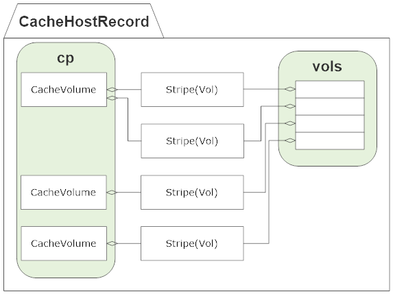
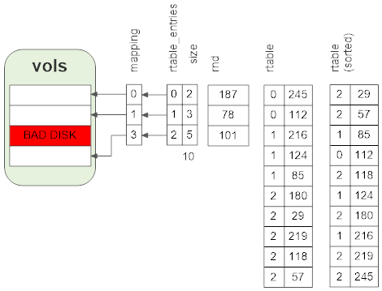
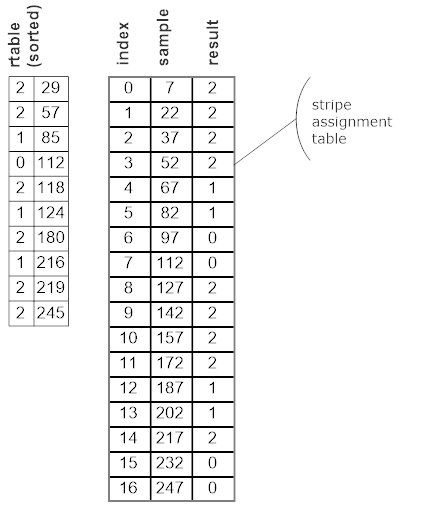
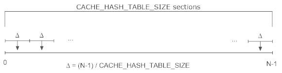
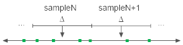
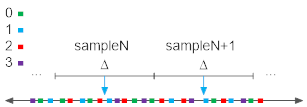
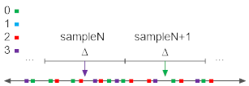

.. Licensed to the Apache Software Foundation (ASF) under one
   or more contributor license agreements.  See the NOTICE file
   distributed with this work for additional information
   regarding copyright ownership.  The ASF licenses this file
   to you under the Apache License, Version 2.0 (the
   "License"); you may not use this file except in compliance
   with the License.  You may obtain a copy of the License at

   http://www.apache.org/licenses/LICENSE-2.0

   Unless required by applicable law or agreed to in writing,
   software distributed under the License is distributed on an
   "AS IS" BASIS, WITHOUT WARRANTIES OR CONDITIONS OF ANY
   KIND, either express or implied.  See the License for the
   specific language governing permissions and limitations
   under the License.

.. include:: ../../common.defs
.. default-domain:: cpp
.. _cache-initialization:

Cache Initialization
********************

Initialization starts with an instance of :cpp:class:`Store` reading the storage
configuration file, by default :file:`storage.config`. For each valid element in
the file an instance of :cpp:class:`Span` is created. These are of basically
four types:

* File

* Directory

* Disk

* Raw device

After creating all the :cpp:class:`Span` instances, they are grouped by device
ID to internal linked lists attached to the :cpp:member:`Store::disk`
array [#store-disk-array]_. Spans that refer to the same directory, disk, or raw
device are coalesced in to a single span. Spans that refer to the same file
with overlapping offsets are also coalesced [#coalesced-spans]_. This is all done in
:func:`ink_cache_init` called during startup.

.. note::

   The span logic is also used by the HostDB and more than one otherwise
   inexplicable feature is provided by the span logic for that module.

After configuration initialization, the cache processor is started by calling
:cpp:member:`CacheProcessor::start()`. This does a number of things:

For each valid span, an instance of :cpp:class:`CacheDisk` is created. This
class is a :term:`continuation` and so can be used to perform potentially
blocking operations on the span. The primary use of these is to be passed to
the AIO threads as the callback when an I/O operation completes. These are then
dispatched to AIO threads to perform :term:`storage unit` initialization. After
all of those have completed, the resulting storage is distributed across the
:term:`volumes <cache volume>` in :func:`cplist_reconfigure`. The
:cpp:class:`CacheVol` instances are created at this time.

Stripe Assignment
=================

Every object that is stored in stored in a single, specific stripe. Stripe assignment is determing
for an object what stripe that is. The logic described here sets up the stripe assignment table maps
from the cache key to a specific stripe.

:term:`Cache stripe <cache stripe>` assignment setup is done once all stripes have initialized (that
is, all stripe header read operations have completed). There is an instance of
:cpp:class:`CacheHostRecord` for each line in :file:`hosting.config` and one generic instance
(:member:`Cache::hosttable`) for all cache volumes that are not explicitly assigned. If
:file:`hosting.config` is empty then all cache volumes will be in the generic record.

:func:`build_vol_hash_table` in :ts:git:`iocore/cache/Cache.cc` does the work of setting up the
stripe assignment and is called for each :class:`CacheHostRecord` and the generic host record. The
stripes to be assigned are in :member:`CacheHostRecord::vols`.

   :member:`CacheHostRecord::vols` is the union of all the stripes in the :class:`CacheVol` instances in :member:`CacheHostRecord::cp`.

An indirect index mapping is created to account for stripes that are not available. The total size
of the stripes is computed at the same time. The :code:`forvol` and :code:`getvol` arrays are used
for debugging, they are not essential to the assignment setup. :code:`rtable_entries` is filled with
stripe size divided by :code:`VOL_HASH_ALLOC_SIZE`. These values are used to determine the number of
assignment slots given to each stripe. For each stripe a seed for a 32 bit pseudo random number
generator is created based on stripe properties. Another array of pairs of value and stripe index is
filled using these. For each :code:`VOL_HASH_ALLOC_SIZE` amount of space in a stripe, a pair is
generated containing the stripe index and the next random number from that stripe's generator. This
array is then sorted in ascending order.

   In this example the total size of the stripes is 10 and an `8 bit pseudo random number generator
   <http://random.org>`__ is used.

The result is sampled in sections, the size of the sections selected to yield
:code:`VOL_HASH_TABLE_SIZE` sections. For each section the sample value is the midpoint of the
section.For the example, the number of sections is set to 17 (because the number of sections should
be a prime number). This yields 17 sections each of width 15 with a sample value equal to 7 more
than the initial value. The results of applying this to the :code:`rtable` is

   Sampling results.

This process can be viewed as dividing a number line in to sampling sections, each section corresponding
to a stripe assignment slot.

   Sample sections.

Each random value for a stripe in the :code:`rtable` array can be considered a node in this space.
For one stripe this might look like

   Random value nodes for a single stripe.

The full array contains random value nodes for all the stripes.

   Random value nodes for all (four) stripes.

The stripe for that section (assignment slot) is the first node at or past the sample value. This
can be seen as the arrow color in the previous figure. This provides a reasonably proportioned to
size assignment of slots to stripes. It is also a consistent hash in that if a stripe is removed,
the recomputation will tend to distribute assignments for the missing stripe across the other
stripes in proportion to their sizes while not changing the assignment of any slot not assigned to
the missing stripe. In essence for each sample point (assignment slot) a permuation of the stripes
is implied by the order of the random value nodes past that sample point. The randomization serves
to spread re-assigned slots to various stripes instead of a single one.

   Remove the blue stripe.

If the stripe is restored the assignments will be the same as before the stripe was removed. The
assignment is very sensitive to the properties of each stripe - changing a stripe size or location
will effectively be as if it were a new stripe. In the figure the two blue stripe assignments are
changed to purple and green respectively. If the blue stripe were added back those assignments and
only those would revert to blue. This is because for each stripe the node sequence as generated by
the pseudo random number generator depends only the properties of the stripes.

At runtime stripe selection is done by :func:`Cache::key_to_vol` which selects the
:class:`CacheHostRecord` instance then picks the stripe assignment slot in the array which
determines the stripe for the object.

.. rubric:: Footnotes

.. [#store-disk-array]

   `Work is under way <https://issues.apache.org/jira/browse/TS-2020>`_ on
   extending this to include objects that are in the memory cache.

.. [#coalesced-spans]

   This linked list is mostly ignored in later processing, causing all but one
   file or directory storage units on the same device to be ignored. See
   `TS-1869 <https://issues.apache.org/jira/browse/TS-1869>`_.
