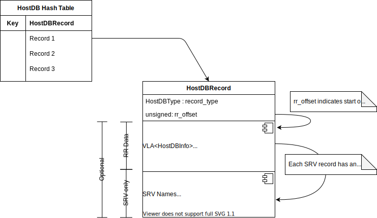

.. Licensed to the Apache Software Foundation (ASF) under one
   or more contributor license agreements.  See the NOTICE file
   distributed with this work for additional information
   regarding copyright ownership.  The ASF licenses this file
   to you under the Apache License, Version 2.0 (the
   "License"); you may not use this file except in compliance
   with the License.  You may obtain a copy of the License at

   http://www.apache.org/licenses/LICENSE-2.0

   Unless required by applicable law or agreed to in writing,
   software distributed under the License is distributed on an
   "AS IS" BASIS, WITHOUT WARRANTIES OR CONDITIONS OF ANY
   KIND, either express or implied.  See the License for the
   specific language governing permissions and limitations
   under the License.

.. include:: ../../common.defs

.. highlight:: cpp
.. default-domain:: cpp

.. _developer-doc-hostdb:

HostDB
******

HostDB is a cache of DNS results. It is used to increase performance by aggregating address
resolution across transactions. HostDB also stores state information for specific IP addresses.

Operation
=========

The primary operation for HostDB is to resolve a fully qualified domain name ("FQDN"). As noted each
FQDN is associated with a single record. Each record has an array of items. When a resolution
request is made the database is checked to see if the record is already present. If so, it is
served. Otherwise a DNS request is made. When the nameserver replies a record is created, added
to the database, and then returned to the requestor.

Each info tracks several status values for its corresponding upstream. These are

*  HTTP version
*  Last failure time

The HTTP version is tracked from responses and provides a mechanism to make intelligent guesses
about the protocol to use to the upstream.

The last failure time tracks when the last connection failure to the info occurred and doubles as
a flag, where a value of ``TS_TIME_ZERO`` indicates a live target and any other value indicates a
dead info.

If an info is marked dead (has a non-zero last failure time) there is a "fail window" during which
no connections are permitted. After this time the info is considered to be a "zombie". If all infos
for a record are dead then a specific error message is generated (body factory tag
"connect#all_dead"). Otherwise if the selected info is a zombie, a request is permitted but the
zombie is immediately marked dead again, preventing any additional requests until either the fail
window has passed or the single connection succeeds. A successful connection clears the last file
time and the info becomes alive.

Runtime Structure
=================

DNS results are stored in a global hash table as instances of ``HostDBRecord``. Each record stores
the results of a single query. These records are not updated with new DNS results - instead a new
record instance is created and replaces the previous instance in the table. The records are
reference counted so such a replacement doesn't invalidate the old record if the latter is still
being accessed. Some specific dynamic data is migrated from the old record to the new one, such as
the failure status of the upstreams in the record.

In each record is a variable length array of items, instances of ``HostDBInfo``, one for each
IP address in the record. This is called the "round robin" data for historical reasons. For SRV
records there is an additional storage area in the record that is used to store the SRV names.

The round robin data is accessed by using an offset and count in the base record. For SRV records
each record has an offset, relative to that ``HostDBInfo`` instance, for its own name in the name
storage area.

State information for the outbound connection has been moved to a refurbished ``DNSInfo`` class
named ``ResolveInfo``. As much as possible relevant state information has been moved from the
``HttpSM`` to this structure. This is intended for future work where the state machine deals only
with upstream transactions and not sessions.

``ResolveInfo`` may contain a reference to a HostDB record, which preserves the record even if it is
replaced due to DNS queries in other transactions. The record is not required as the resolution
information can be supplied directly without DNS or HostDB, e.g. a plugin sets the upstream address
explicitly. The ``resolved_p`` flag indicates if the current information is valid and ready to be
used or not. A result of this is there is no longer a specific holder for API provided addresses -
the interface now puts the address in the ``ResolveInfo`` and marks it as resolved. This prevents
further DNS / HostDB lookups and the address is used as is.

The upstream port is a bit tricky and should be cleaned up. Currently value in ``srv_port``
determines the port if set. If not, then the port in ``addr`` is used.

Resolution Style
----------------

.. cpp:enum:: OS_Addr

   Metadata about the source of the resolved address.'

   .. cpp:enumerator:: TRY_DEFAULT

      Use default resolution. This is the initial state.

   .. cpp:enumerator:: TRY_HOSTDB

      Use HostDB to resolve the target key.

   .. cpp:enumerator:: TRY_CLIENT

      Use the client supplied target address. This is used for transparent connections - the upstream
      address is obtained from the inbound connection. May fail over to HostDB.

   .. cpp:enumerator:: USE_HOSTDB

      Use HostDB to resolve the target key.

   .. cpp:enumerator:: USE_CLIENT

      Use the client supplied target address.

   .. cpp:enumerator:: USE_API

      Use the address provided via the plugin API.

   The parallel values for using HostDB and the client target address are to control fail over on
   connection failure. The ``TRY_`` values can fail over to another style, but the ``USE_`` values
   cannot. This prevents cycles of style changes by having any ``TRY_`` value fail over to a
   ``USE_`` value, at which point it can no longer change. Note there is no ``TRY_API`` - if a
   plugin sets the upstream address that is locked in.

Issues
======

Currently if an upstream is marked down connections are still permitted, the only change is the
number of retries. This has caused operational problems where dead systems are flooded with requests
which, despite the timeouts, accumulate in ATS until ATS runs out of memory (there were instances of
over 800K pending transactions). This also made it hard to bring the upstreams back online. With
these changes requests to dead upstreams are strongly rate limited and other transactions are
immediately terminated with a 502 response, protecting both the upstream and ATS.

Future
======

There is still some work to be done in future PRs.

*  The fail window and the zombie window should be separate values. It is quite reasonable to want
   to configure a very short fail window (possibly 0) with a moderately long zombie window so that
   probing connections can immediately start going upstream at a low rate.

*  Failing an upstream should be more loosely connected to transactions. Currently there is a one
   to one relationship where failure is defined as the failure of a specific transaction to connect.
   There are situations where the number of connections attempts for mark a failure is should be
   larger than the number of retries for a single transaction. For transiently busy upstreams and
   low latency requests it can be reasonable to tune the per transaction timeout low with no retries
   but this then risks marking down upstreams that were merely a bit slow at a given moment.

*  Parallel DNS requests should be supported. This is for both cross family requests and for split
   DNS.

*  It would be nice to be able to do the probing connections to an upstream using synthetic requests
   instead of burning actual user requests. What would be needed is a handoff from ATS to the probe
   to indicate a particular upstream is considered down, at which point active health checks are done
   until the upstream is once again alive, at which point this is handed off back to ATS.

History
=======

This version has several major architectural changes from the previous version.

*  The data is split into records and info, not handled as a variant of a single data type. This
   provides a noticeable simplification of the code.

*  Single and multiple address results are treated identically - a singleton is simply a multiple
   of size 1. This yields a major simplification of the implementation.

*  Connections are throttled to dead upstreams, allowing only a single connection attempt per fail
   window timing until a connection succeeds.

*  Timing information is stored in ``std::chrono`` data types instead of proprietary types.

*  State information has been promoted to atomics and updates are immediate rather than scheduled.
   This also means the data in the state machine is a reference to a shared object, not a local copy.
   The promotion was necessary to coordinate zombie connections to dead upstreams across transactions.

*  The "resolve key" is now a separate data object from the HTTP request. This is a subtle but
   major change. The effect is requests can be routed to different upstreams without changing
   the request. Parent selection can be greatly simplified as it become merely a matter of setting
   the resolve key, rather than having a completely different code path.
