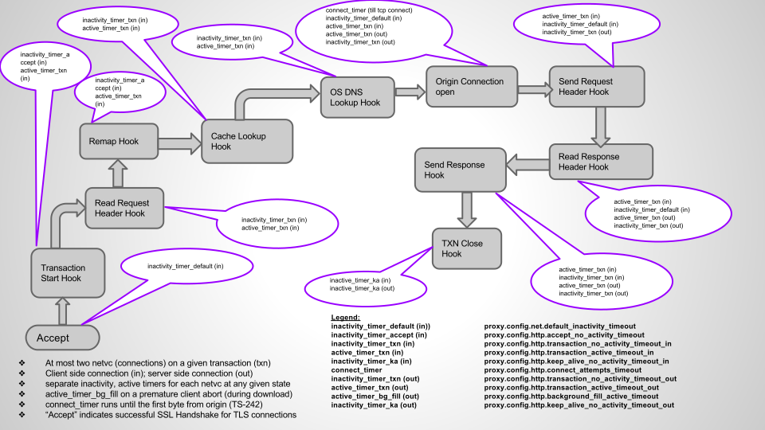

HTTP Transaction Timers
***********************

.. Licensed to the Apache Software Foundation (ASF) under one
   or more contributor license agreements.  See the NOTICE file
  distributed with this work for additional information
  regarding copyright ownership.  The ASF licenses this file
  to you under the Apache License, Version 2.0 (the
  "License"); you may not use this file except in compliance
  with the License.  You may obtain a copy of the License at
 
   http://www.apache.org/licenses/LICENSE-2.0
 
  Unless required by applicable law or agreed to in writing,
  software distributed under the License is distributed on an
  "AS IS" BASIS, WITHOUT WARRANTIES OR CONDITIONS OF ANY
  KIND, either express or implied.  See the License for the
  specific language governing permissions and limitations
  under the License.

Transaction Timers at various states
------------------------------------

Traffic Server runs a variety of timers at various states of a transaction. Typically,
a given transaction may include upto two connections (one on the UA/client side and the
other on the Origin side). Traffic Server supports two kinds of timers "Active" and
"Inactive" timers for each side respectively, as applicable at a given state. The below
picture illustrates the specific timers run at various states in the current implementation.
The picture only depicts the HTTP transaction level timers and does not include the TLS handshake
states and other more detailed/internal timers in each individual state.

   Transaction Timers in various states

