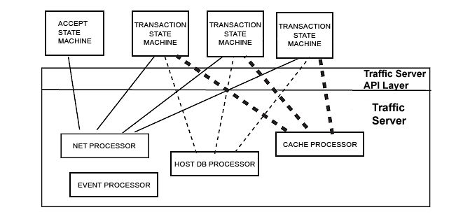

.. Licensed to the Apache Software Foundation (ASF) under one
   or more contributor license agreements.  See the NOTICE file
   distributed with this work for additional information
   regarding copyright ownership.  The ASF licenses this file
   to you under the Apache License, Version 2.0 (the
   "License"); you may not use this file except in compliance
   with the License.  You may obtain a copy of the License at

   http://www.apache.org/licenses/LICENSE-2.0

   Unless required by applicable law or agreed to in writing,
   software distributed under the License is distributed on an
   "AS IS" BASIS, WITHOUT WARRANTIES OR CONDITIONS OF ANY
   KIND, either express or implied.  See the License for the
   specific language governing permissions and limitations
   under the License.

.. include:: ../../common.defs

.. _developer-plugins-new-protocol-plugins:

New Protocol Plugins
********************

.. toctree::
   :maxdepth: 1

The new protocol APIs enable you to extend Traffic Server to be a web
proxy for any protocol. This chapter describes new protocol APIs and the
plugins that support new protocols. It also provides a detailed review
of code for a sample Protocol plugin that supports a very simple
artificial HTTP-like protocol.

.. _about-the-sample-protocol:

About the Sample Protocol
=========================

The sample protocol enables a client to ask a server for a file. Clients
send requests to a specific Traffic Server port (specified in
:file:`plugin.config`); each request has the following structure::

   server_name file_name

Using the Protocol plugin, Traffic Server can accept these requests,
parse them, and act as a proxy cache (i.e., request the file from the
origin server on the client's behalf and store copies of response
messages in cache). The Protocol plugin is a state machine that flows
through the states illustrated in the :ref:`Sample Protocol State
Diagram <SampleProtocolStDiag>`. This figure illustrates the steps
that Traffic Server and the Protocol plugin go through in order to
support the sample protocol.

In more specific terms, Traffic Server and the Protocol plugin must:

-  Listen for and accept client connections (on the accept port
   specified in :file:`plugin.config`)

-  Read incoming client requests

-  Look up the requested content in the Traffic Server cache

-  Serve content from cache if the request is a cache hit (this simple
   example does not do freshness checking)

-  Open a connection to the origin server if the request is a cache miss
   (on the server port specified in :file:`plugin.config`)

-  Forward the request to the origin server

-  Receive the origin server response

-  Cache the response and send it on to the client

**Sample Protocol State Diagram**

.. _SampleProtocolStDiag:

.. figure:: ../../static/images/sdk/Protocol_state_diagram.jpg
   :alt: Sample Protocol State Diagram

   Sample Protocol State Diagram

Protocol Plugin Structure
=========================

To see how the Protocol plugin works, you need to understand some
broader concepts. This section assumes you're familiar with the concepts
of :term:`continuation`, Traffic Server's **asynchronous event model**, and
basic Traffic Server **plugin structure**. If you are not familiar with
these concepts, then you may want to begin with the
:ref:`developer-plugins-getting-started` section.

Continuations in the Protocol Plugin
====================================

The Protocol plugin creates a static continuation that is an **"accept"
state machine** - that is, a state machine whose job is to accept client
connections on the appropriate port. When Traffic Server accepts a net
connection from a client on that port, the accept state machine is
activated. It then creates a new continuation: a transaction state
machine. The accept state machine creates one transaction state machine
for each transaction (where a :term:`transaction` consists of a client
request and Traffic Server's response). Each transaction state machine
lives until the transaction completes; then it is destroyed. If the
client's request for content is a cache miss, then a transaction state
machine might need to open a connection to the origin server. This is
illustrated in the :ref:`Protocol Plugin
Overview <ProtocolPluginOverview>` diagram below.

**Protocol Plugin Overview**

.. _ProtocolPluginOverview:

.. figure:: ../../static/images/sdk/protocol_sm_big.jpg
   :alt: Protocol Plugin Overview

   Protocol Plugin Overview

The first steps for writing the Protocol plugin are now clear: in
``TSPluginInit``, you must create a continuation that listens for net
connections on the client port specified in :file:`plugin.config` (this
continuation is the accept state machine).

Below is a summary of the continuations implemented for the Protocol
plugin:

-  An **accept state machine** that listens for client connections, and
   then creates transaction state machines whenever Traffic Server
   accepts a new client connection. The accept state machine lives as
   long as Traffic Server is running.

-  **Transaction state machines** that read client requests, process
   them, and are then destroyed when the transaction is finished.

Event Flow
==========

Implementing the rest of the Protocol plugin requires that you
understand the flow of events during the course of a transaction. Unlike
HTTP transaction plugins, this plugin must read data from network
connections and then read/write data to the Traffic Server cache. This
means that its continuations do not receive HTTP state machine events;
they receive events from Traffic Server's processor subsystems. For
example: the accept state machine is activated by an
``TS_EVENT_NET_ACCEPT`` event from Traffic Server's Net Processor; the
handler function for the accept state machine must therefore be able to
handle that event.

The transaction state machines are activated when the client connection
receives incoming request data. The **Net Processor** notifies the
transaction state machine of incoming data. The transaction state
machine reads the data; when finished, it initiates a cache lookup of
the requested file. When the cache lookup completes, the transaction
state machine is activated by the Traffic Server **Cache Processor**.

If the transaction state machine needs to open a connection to the
origin server to fetch content (in the case of a cache miss), then the
transaction state machine initiates a DNS lookup of the server name. The
transaction state machine is activated by a DNS lookup event from the
Traffic Server **Host Database Processor**. If the transaction must
connect to the origin server, then the transaction state machine
initiates a net connection and waits for an event from the Net
Processor.

**Protocol Plugin Flow of Events**

.. _ProtocolPluginFlow:

   Protocol Plugin Flow of Events

The flow of events is illustrated in the :ref:`Protocol Plugin Flow of
Events <ProtocolPluginFlow>` diagram above. The thin straight lines
show Net Processor event flow, the thin dashed lines represent Host
Database event flow, and the thick dashed lines show Cache event flow.

Notice that this flow of events is independent of the Protocol plugin's
design (i.e., whether you build **accept** or **transaction** state
machines). Any plugin that supports network connections uses the net
vconnection interfaces (:c:func:`TSNetAccept`, :c:func:`TSNetConnect`) and thus
receives events from the Net Processor. Any plugin that performs cache
lookups or cache writes uses :c:func:`TSCacheRead`, :c:func:`TSCacheWrite`,
:c:func:`TSVConnRead`, and :c:func:`TSVConnWrite` and thus receives events from the
Cache Processor and Traffic Server event system. Similarly, any plugin
that does DNS lookups receives events from the Host Database Processor.

.. _one-way-to-implement-a-transaction-state-machine:

One Way to Implement a Transaction State Machine
================================================

**Transaction state machines** (**TSMs**) in the Protocol plugin must do
the following:

-  Keep track of the state of the transaction

-  Handle events received (based on the state of the transaction and the
   event received)

-  Update the state of the transaction as it changes

Below is one way you can implement TSMs. Details about how the Protocol
plugin does this are provided in the next section.

-  Create a data structure for transactions that contains all of the
   state data you need to keep track of. In the Protocol plugin this is
   a struct, ``Txn_SM``.

-  When you create the TSM's continuation, initialize data of type
   ``Txn_SM``. Initialize the data to the initial state of a transaction
   (in this case, a net connection has just been accepted). Associate
   this data to the TSM continuation using ``TSContDataSet``.

-  Write state handler functions that handle the expected events for
   each state.

-  Write the handler for the TSM. Its job is to receive events, examine
   the current state, and execute the appropriate state handler
   function. In the Protocol plugin, the handler is ``main_handler``.
   ``main_handler`` calls the state handler functions to handle each
   state.

The steps below describe the flow of execution illustrated in :ref:`"How
Transaction State Machines are Implemented in the Protocol
Plugin" <ImplementTransStMachine>`.

1. The handler for the TSM, (called ``main_handler`` in the Protocol
   plugin) receives events from the TSM.

2. ``main_handler`` examines the state of the transaction-in
   particular, it examines the current handler.

3. ``main_handler`` calls the ``current_handler`` (which is one
   of the state handler functions), and then passes the current event to
   ``current_handler``. In :ref:`the image
   below <ImplementTransStMachine>` below, the current handler is
   called ``state2_handler``.

4. The ``current_handler`` handles the event and updates the data.
   In :ref:`the image below <ImplementTransStMachine>` below, the state is
   changed from ``state2`` to ``state3`` (and the current
   handler is changed from ``state2_handler`` to
   ``state3_handler``). The next time ``main_handler`` receives
   an event, it will be processed by ``state3_handler``.

5. ``state2_handler`` arranges the next callback of the TSM.
   Typically, it gives Traffic Server additional work to do (such as
   writing a file to cache) so that it can progress to the next state.
   The TSM (``main_handler``) then waits for the next event to
   arrive from Traffic Server.

**How Transaction State Machines are Implemented in the Protocol
Plugin**

.. _ImplementTransStMachine:

.. figure:: ../../static/images/sdk/txn_sm.jpg
   :alt: How Transaction State Machines are Implemented in the Protocol Plugin

   How Transaction State Machines are Implemented in the Protocol Plugin

Processing a Typical Transaction
================================

The code is contained in the following files:

-  ``Protocol.c`` and ``Protocol.h``

-  ``TxnSM.c`` and ``TxnSM.h``

Below is a step-by-step walk-through of the code that processes a
typical transaction.

#. The :c:func:`TSPluginInit` function is in the ``Protocol.c`` file. It
   checks the validity of the :file:`plugin.config` entries (there must be two: a client accept port
   and a server port) and runs an initialization routine, ``init``.

#. The ``init`` function (in ``Protocol.c``) creates the plugin's
   log file using :c:func:`TSTextLogObjectCreate`.

#. The ``init`` function creates the accept state machine using
   ``AcceptCreate``. The code for ``AcceptCreate`` is in the
   ``Accept.c`` file.

#. The ``init`` function arranges the callback of the accept state
   machine when there is a network connection by using
   :c:func:`TSNetAccept`.

#. The handler for the accept state machine is ``accept_handler`` in
   the ``Protocol.c`` file. When Traffic Server's Net Processor sends :c:macro:`TS_EVENT_NET_ACCEPT`
   to the accept state machine, ``accept_handler`` creates a transaction state machine (``txn_sm``)
   by calling ``TxnSMCreate``. Notice that ``accept_event`` creates a mutex for the transaction
   state machine, since each transaction state machine has its own mutex.

#. The ``TxnSMCreate`` function is in the ``TxnSM.c`` file. The
   first thing it does is initialize the transaction's data, which is of type ``TxnSM`` (as defined
   in ``TxnSM.h``). Notice that the current handler (``q_current_handler``) is set to
   ``state_start``.

#. ``TxnSMCreate`` then creates a transaction state machine using
   :c:func`TSContCreate`. The handler for the transaction state machine
   is ``main_handler``, which is in the ``TxnSM.c`` file.

#. When ``accept_event`` receives :c:macro:`TS_EVENT_NET_ACCEPT`, it
   calls the transaction state machine (
   ``TSContCall (txn_sm, 0, NULL);`` ). The event passed to
   ``main_handler`` is ``0`` (:c:macro:`TS_EVENT_NONE`).

#. The first thing ``main_handler`` does is examine the current
   ``txn_sm`` state by calling :c:func:`TSContDataGet`. The state is
   ``state_start``.

#. ``main_handler`` then invokes the handler for
   ``state_start`` by using the function pointer
   ``TxnSMHandler`` (as defined in ``TxnSM.h``).

#. The ``state_start`` handler function (in the ``TxnSM.c`` file)
   is handed an event (at this stage, the event is :c:macro:`TS_EVENT_NET_ACCEPT`) and a client
   vconnection. ``state_start`` checks to see if this client vconnection is closed; if it is not,
   then ``state_start`` attempts to read data from the client vconnection into an
   :c:type:`TSIOBuffer` (``state_start`` is handling the event it receives).

#. ``state_start`` changes the current handler to
   ``state_interface_with_client`` (that is, it updates the state of the transaction to the next
   state).

#. ``state_start`` initiates a read of the client vconnection
   (arranges for Traffic Server to send
   :c:macro:`TS_EVENT_VCONN_READ_READY` events to the TSM) by calling
   :c:func:`TSVConnRead`.

#. ``state_interface_with_client`` is activated by the next event
   from Traffic Server. It checks for errors and examines the read VIO
   for the read operation initiated by :c:func:`TSVConnRead`.

#. If the read VIO is the ``client_read_VIO`` (which we are
   expecting at this stage in the transaction), then
   ``state_interface_with_client`` updates the state to
   ``state_read_request_from_client`` .

#. ``state_read_request_from_client`` handles actual
   :c:macro:`TS_EVENT_VCONN_READ_READY` events and reads the client request.

#. ``state_read_request_from_client`` parses the client request.

#. ``state_read_request_from_client`` updates the current state to
   the next state, ``state_handle_cache_lookup`` .

#. ``state_read_request_from_client`` arranges for Traffic Server
   to call back the TSM with the next set of events (initiating the
   cache lookup) by calling :c:func:`TSCacheRead`.

#. When the :c:func:`TSCacheRead` sends the TSM either
   :c:macro:`TS_EVENT_CACHE_OPEN_READ` (a cache hit) or
   :c:macro:`TS_EVENT_CACHE_OPEN_READ_FAILED` (a cache miss),
   ``main_handler`` calls ``state_handle_cache_lookup``.
