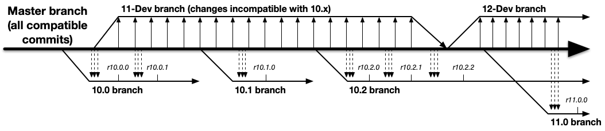

.. Licensed to the Apache Software Foundation (ASF) under one
   or more contributor license agreements.  See the NOTICE file
   distributed with this work for additional information
   regarding copyright ownership.  The ASF licenses this file
   to you under the Apache License, Version 2.0 (the
   "License"); you may not use this file except in compliance
   with the License.  You may obtain a copy of the License at

   http://www.apache.org/licenses/LICENSE-2.0

   Unless required by applicable law or agreed to in writing,
   software distributed under the License is distributed on an
   "AS IS" BASIS, WITHOUT WARRANTIES OR CONDITIONS OF ANY
   KIND, either express or implied.  See the License for the
   specific language governing permissions and limitations
   under the License.

.. include:: ../common.defs

.. _roadmap:

ATS Release Roadmap
===================

.. toctree::
   :maxdepth: 1

Apache Traffic Server is currently on a two year major release cycle. At any
given time, we guarantee to have two major versions supported. Please refer to
our `download page <https://trafficserver.apache.org/downloads>`_ to see the
current supported versions.

Versions, compatibility and schedules
-------------------------------------

1. We aim to make 1 major release every two years, but the RM and
   community can of course make more as necessary.
2. We cut LTS major and minor releases striaght off the master branch.
   We will make release branches in a timely manner before making any
   release candidates.
3. Master is always open for compatible changes.
4. Master is always stable, i.e. commits should be properly tested and
   reviewed before committed to master.
5. Incompatible changes must be made on the current ``-dev`` branch.
6. All releases are stable releases, following strict Semantic Versioning.
7. Minor and patch releases are made at the discretion of the community and
   the RM.
8. Minor releases can include new (small / safe) features, but must be
   compatible within the LTS major version.
9. The LTS cycle, approximately 4 years, does not reset when we make a minor
   release.
10. The goal is that within a major LTS version, only one minor version is
    continuously supported. For example, if we have made a v9.1.2, and the
    RM makes a v9.2.0 release, do not expect any more releases of v9.1.x.
    The exception here would be serious issues, or security problems.

Branch Management
-----------------

As of `v10.0.0`` and forward, we will cut all major and minor branches off
the main branch (master). The ``-Dev`` branch will be used for incompatible
changes, and will be merged into master when the next major release is
in progress.

The implication of this new process is that we will no longer cherry pick
PRs from master to a release branch. Rather, each major and minor release
is taken whole sale from the master branch. For managing your PRs, this means:

1. You do not need to nominate your PR for a backport to a minor release, unless
   the release branch has been cut. A goal here is that the release branches
   are stable in preparation of the minor release, while master is still open.
2. An exception for this are the older LTS releases and minor critical fixes.
   For such changes, always nominate your PR for backport to those Projects.
3. The default ``Milestone`` changes for every major and minor release. For
   example, if the current LTS release is `10.0.1`, the milestone for all new
   PRs will be `10.1.0` going forward.
4. We will create tags on the master branch regularly, for coordinating testing
   efforts. These are not releases!
5. We will regularly (weekly) merge master to the current ``-Dev`` branch,
   to keep them in sync.

It is absolutely critical that everyone sets the ``Milestone`` and ``Project``
fields appropriate in this process. This is how we will manage the releases!

Current Release Schedule and support
------------------------------------

Master is currently targeted for our first `v10.0.x` release. When this branch
is created, the new process kicks in and ``Milestones`` must follow the
next minor release number (e.g. `10.1.0`).

.. figure:: images/roadmap.png
   :align: left

**Note:** These are examples, only the first minor release number of each
major LTS branch is guaranteed to be made. The dates for point releases
are also for illustration.

Burning release numbers, or how our release process works
---------------------------------------------------------

When we upload a tar ball to VOTE on as a new release and it does not work
out, because something is broken and needs a code-change we will not reuse
the version number. The rationale behind this is the process which guarantees
that what we release and what's in the tree is also what everyone has seen so
far and no code is sneaked in.

If for instance we had a release candidate trafficserver-4.1.4-rc1.tar.bz2
(note the rc1 at the) end, and that vote passed, we'd re-roll the tar-ball to
make sure it will simply be called trafficserver-4.1.4.tar.bz2. But now all
sha1 and md5 sums as well as the GPG signature would also be different.
That's the perfect opportunity to smuggle in some code that no one will
bother to review any more.

Therefore when creating a new release the first thing we do is create a
signed tag and push it. That way everyone can compare that signed tag with
the signed tar-ball that we create from the tag and upload it (usually to
people.apache.org).

Now, when we notice an issue that needs a code-change, we make that on
master, cherry-pick it to the release-branch (optional), and create the new
tag.

Release Managers
----------------

=======  =======  =========  ===========  =========
Version  Primary  Secondary  1st Release  Supported
=======  =======  =========  ===========  =========
8.x      Evan     Leif       8/2018         3/2023
9.x      Evan     Bryan      1/2020         3/2025
10.x     Leif     Bryan      3/2023         3/2027
=======  =======  =========  ===========  =========

Each release manager is responsible for the primary, minor release, as well
as any patch releases within that minor release. Note that patch releases are
primarily for truly critical bugs, and security issues. Don't expect minor
fixes or feature additions in a patch release, those happens on each
quarterly release.
